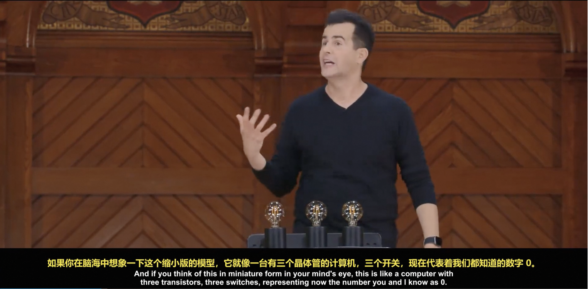
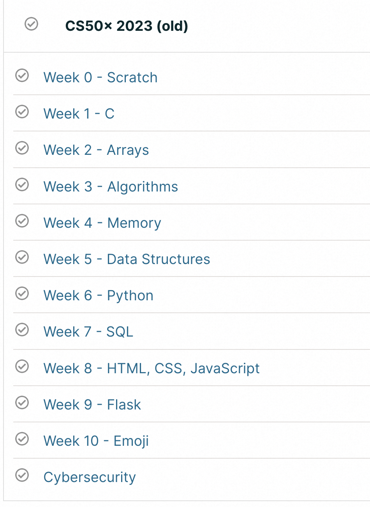
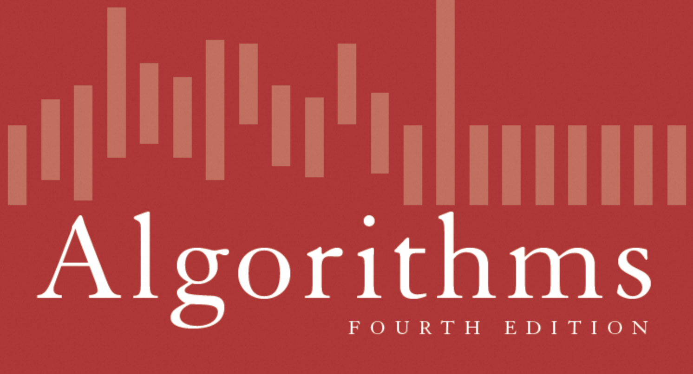
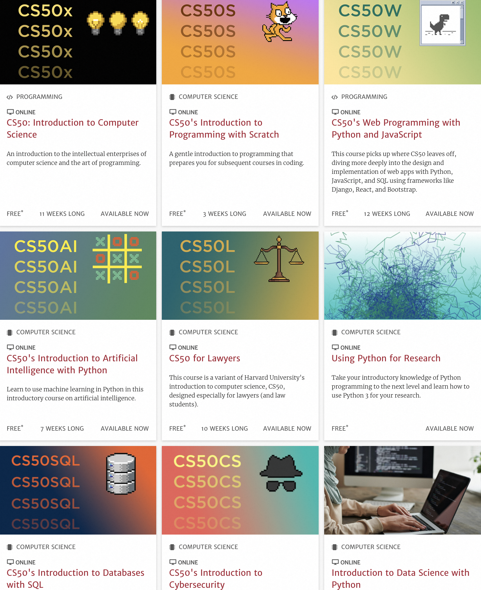

大学之前没摸过电脑的我被调剂到软件专业，第一节导论课听懵逼了，第一节C++课上抑郁了——当然咱不吐槽老师水平，只怪脑子笨听不懂。
彼时连打字都只会一指禅的我需要一门把台下听众当纯小白的导论课。

# 入门
首先强调一下，这里所谓的入门，也不是指电脑开关机、软件安装卸载这种使用入门，而是有兴趣了解“计算机理论和技术”的入门。

## Harvard-CS50
[Harvard-CS50: Intro to CS](https://pll.harvard.edu/course/cs50-introduction-computer-science) 就是这样一门课，出自哈佛大学，但完全小白友好型的一门计算机导论。
主讲是 David J. Malan，极富激情的授课风格，语速很快但吐字清晰(咳咳，本人需要配合中文字幕)。个人非常喜欢这门课的原因是，他真的一直在用浅显易懂且能给人留下印象的方式在解读计算机。比如讲到二进制，先从一进制着手，再到人类惯用的十进制，再来到计算机的二进制，直接拿出三个灯泡，从0到7一遍一遍实际操作来解释计算机里面的数字表达形式，可能是为了加深学生们的印象，又换一种方式邀学生上台实操一遍。到这里真就是，我觉得没上过高中的我妈也能听懂。要知道，这可是哈佛的讲堂，下面随便喊起来一个，智商恐怕都是同龄人的佼佼者。

当然可能会有人觉得这太繁琐了，二进制这么简单的东西犯得着这么讲解吗——但这门课是“导论”。私以为类似导论的课程，如果能力上做不到用最短的时间让台下的学生们喜欢上这门课，至少底线是不应该让他们对这门课产生任何的负面情绪。
Malan的开场很好地消除了像我这样的小白在面对一个完全陌生的专业时那种又惊又喜中夹杂着的茫然无措感：噢~原来教授当年也是怀着同样的心情，走进这门课的。
相信我，第一节课的两个小时，你就会发现，计算机，是有趣的、实用的、且笨拙的，一点也不神秘，一点也不高深莫测。有了这样的开端，你不会觉得课程枯燥，反而是带着探索的乐趣继续推进。

### 课程大纲
课程大纲如下，每节的主题很明确，从一个图形化编程工具入手(可以看成是一个零代码平台，不过是MIT开发的，教授还吐槽来着)，到C语言(没办法这课绕不开C语言)，紧接着是三块重磅内容: 数组/数据结构，算法，存储，然后转到更高级一点的编程语言: python，再概要地了解一下数据库和SQL，以及前端和一些语言框架、网络空间安全的内容。总共12节大课，每节内容都很满，导论课都是这样的性质：宽但不深，基本把计算机理论和基础的东西都囊括进来了。不过对小白来说，过程中可能会有不少疑问，暂时无法消化也正常，带到进阶课程里去寻找答案。

## 其他入门课
### UCB-CS61A
[UCB-CS61A: SICP](https://cs61a.org/)
伯克利 CS61 系列第一门课程，Python 入门首选。

说到Python入门，这里留一个本人学生时代发现的一个宝藏网址，感兴趣的可以挑战一下，看你能闯到第几关:
[python challenge](http://www.pythonchallenge.com/)

### UCB-CS10
[UCB-CS10: The Beauty and Joy of Computing](https://cs10.org/sp22/)
伯克利另一门计算机入门课，偏重计算机理论讲解和实践，浅显易懂，内容也比较宽泛。

# 基础
同样，这里的基础可以理解为，深入理解计算机技术的必备知识。比如CS61B这门课，学好这门课，基本就可以叩开大厂码农岗了——这两年可能要求又提高了。

## Princeton-Algorithms
[Princeton-Algorithms](https://online.princeton.edu/algorithms-part-i)
主讲是 Robert Sedgewick 教授和 Kevin Wayne，教材嘛也是他俩编写的，就是这本红宝书(对CS学生来说大名鼎鼎级别的人物和著作)。Sedgewick以及这门课是本人最喜欢的。

## UCB-CS61B
[UCB-CS61B: Data Structures and Algorithms](https://fa23.datastructur.es/)
数据结构和算法，个人觉得讲解非常易懂，深入浅出。大作业设计非常用心，不过确实很痛苦。

个人觉得关于数据结构和算法，这两门课足矣，不过它俩也是重叠的，选一门即可。

# 进阶与扩展
这部分内容就比较宽广了，看个人感兴趣的方向，资源是很充足的。比如大家可能想入门一下最近很火的AI相关的课程，那么上面提到的 CS50 系列里就有一门: [CS50's Introduction to Artificial Intelligence with Python](https://pll.harvard.edu/course/cs50s-introduction-artificial-intelligence-python)。实际上 CS50 也是个系列课程，甚至包括一个专门给法律学生/从业者的入门课，当然也有给数据工程师的等等：

感兴趣的可以在主页查看: https://pll.harvard.edu/subject/computer-science

除上面的哈佛公开课网址，还有几个好去处：
* USB-CS：
https://www2.eecs.berkeley.edu/Courses/CS/

* MIT-CS:
https://ocw.mit.edu/

* CMU-CS:
https://www.cs.cmu.edu/

* EDX-CS:
https://www.edx.org/search?q=computer+science

个人经验是，先考虑好要学习的方向，再宽泛地搜索一下有哪几门相关课程，能找到公开课的尽量都搜罗对比一下，根据随堂资料获取难易程度等因素综合考虑，对学生党来说，选中某一门课跟着节奏走就行了，尤其是要想办法把家庭作业、大作业跟上，这很重要；对工作党来说，主要是为了充电，作业不重要(不过作业确实很考察掌握程度)，找一个已经完结的版本，比如前一年的，合理安排时间学习即可。