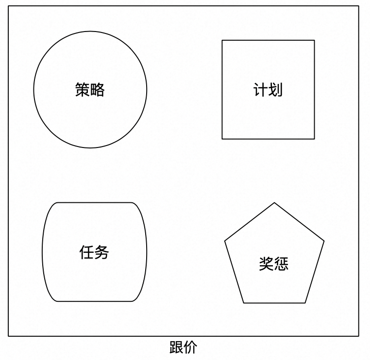
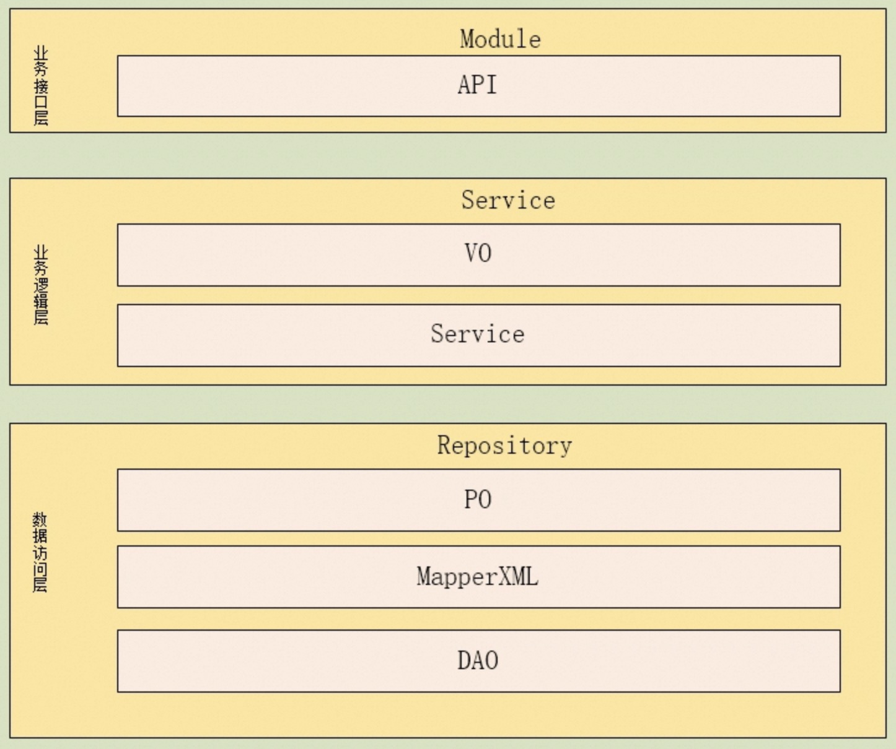
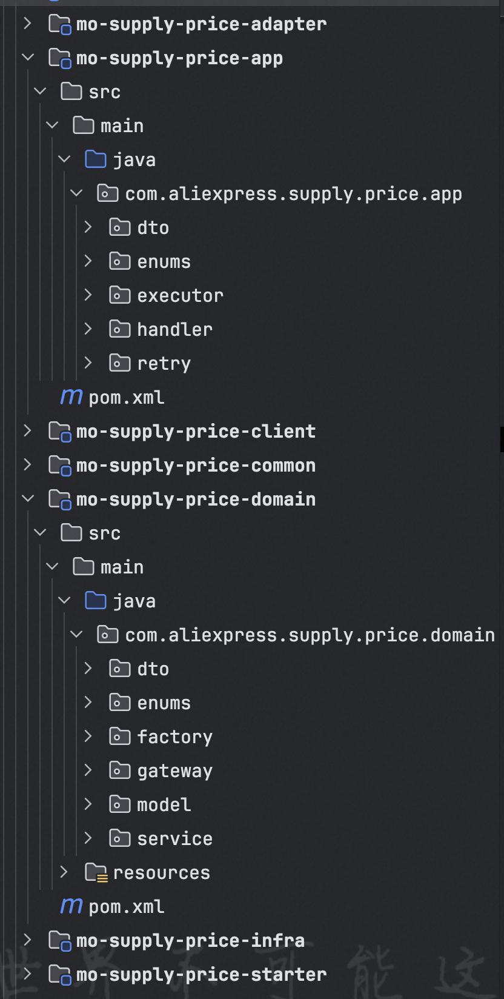
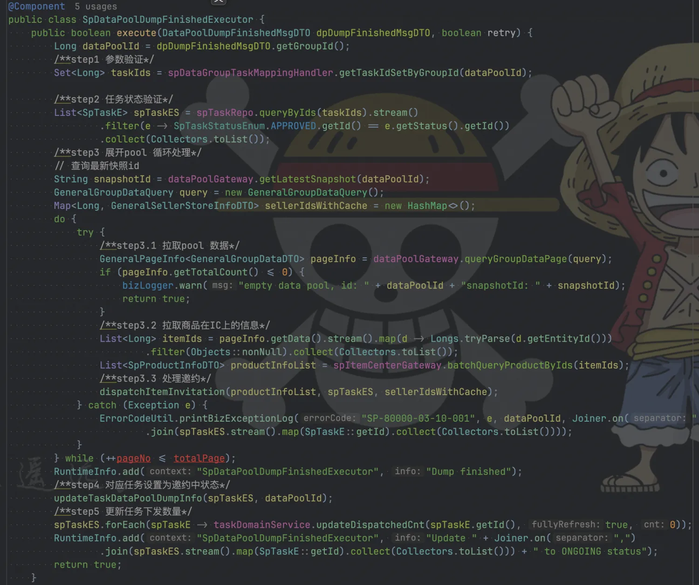
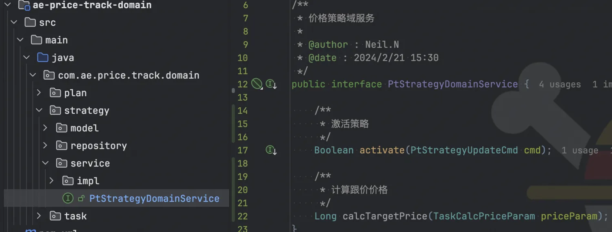
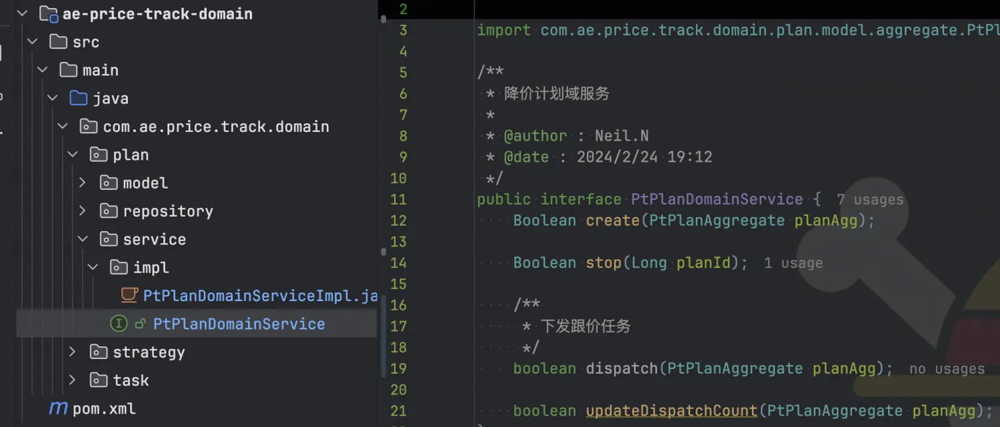
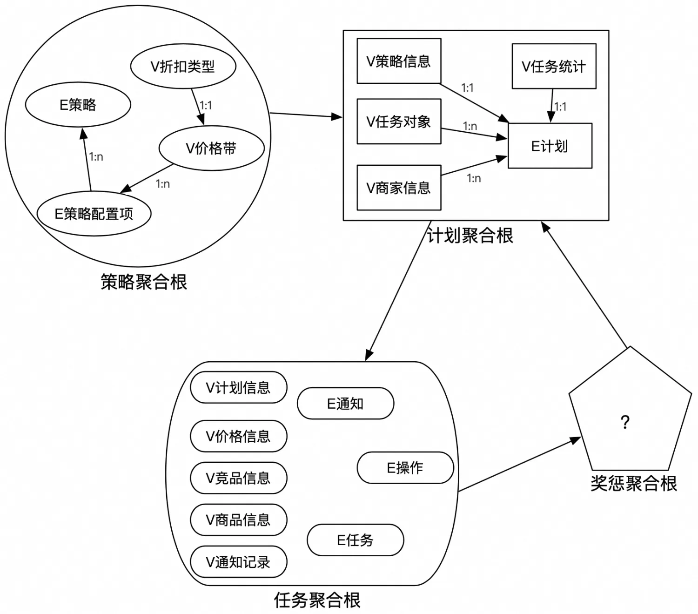
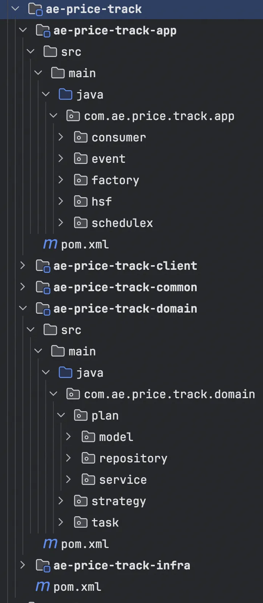
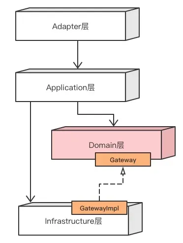
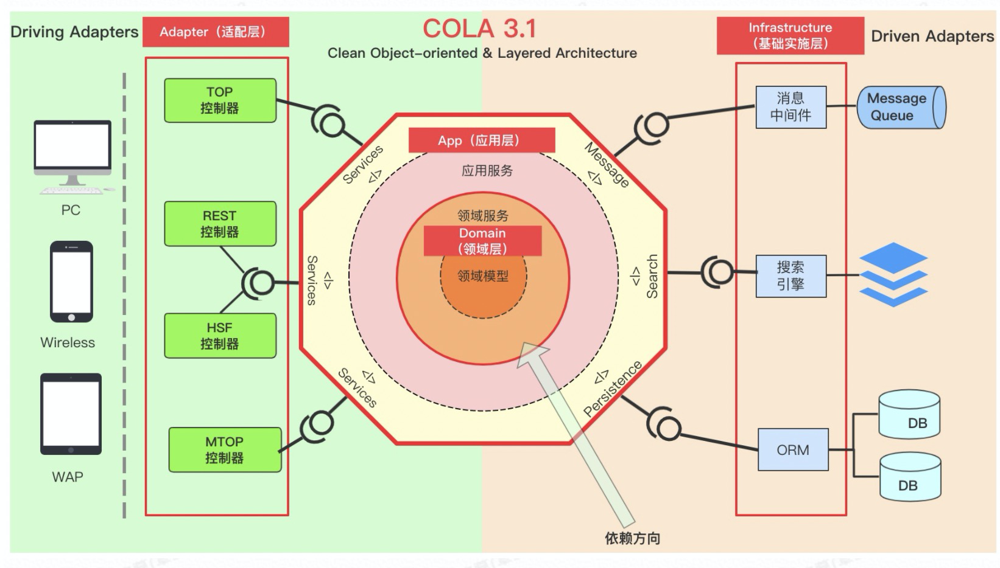

# 工程实践
闲话少叙，先把沉淀的DDD工程架构实践讲清楚。
## 基础模型规范
<p align = "left">

</p>

每一层定义相应接口和基类，目的是规范代码：
* app: CRQS模式，AppCmdService是command，AppQueryService是query
* service: 领域服务规范，定义DomainService
* model: 聚合根，实体，值对象规范
    * BaseAgg: 聚合根定义
    * BaseEntity: 实体定义
    * BaseValue: 值对象定义
    * BaseParam：领域层的参数定义，用于域服务，聚合根和实体的方法入参
* repo
    * Repo: 仓库定义
    * AggRepo: 聚合根仓库，定义聚合根存储和查询方法
* event: 事件处理
* exception: 各层异常
    * AggException: 聚合根抛出的异常
    * RepoException: 基础层抛出的异常
    * EventException: 事件处理抛出的异常

## 工程结构
典型的Java工程结构如下：
<p align = "left">

</p>

依赖关系如下：
<p align = "left">

</p>

其中adapter模块主要用于处理不同来源的请求，如HTTP、RPC、MQ等入口，infra模块主要用于封装DB读写、二方&三方服务等，model模块定义一些出入参，client模块用于对外接口/服务，必要时可增加sdk模块。重点是domain模块和app模块的内容。

### domain模块
POM依赖规范
* 仅可依赖工具类二方包如util，不依赖其他任何二方包，以及自身其他模块，包括infra模块。

内部可细分为DomainService和Aggregate两块内容
#### DomainService
职责
* 只提供写操作和计算类的方法，不提供查询类的操作如查询、获取聚合根等；
* 可调用聚合根方法、repo提供的方法；

写/计算类操作规范
* 接口：聚合根名+DomainService，例如聚合根叫OrderAggregate，那么命名为OrderDomainService，必须继承DomainService
* 接口实现：聚合根名+DomainServiceImpl，例如聚合根叫OrderAggregate，那么命名为OrderDomainServiceImpl
* 方法名：表达业务行为的动词，domain提供的方法相比app提供的方法维度更细或者相等
* 参数命名：方法名+聚合根名+Param，例如方法名为pay，那么命名为PayOrderParam，必须继承Param
* 返回值：ResultDO<Void>或ResultDO<聚合根>

#### Aggregate
职责
* 只提供写方法、判断方法、查询方法，外部代码只能访问聚合根的这些方法，而不能直接访问聚合根内部的结构和属性，同样地，聚合根方法也不可以直接访问实体和值对象属性，只能访问实体和值对象提供的方法
* 聚合根方法必须符合单一职责
* 可以调用repo的读方法，不可以调用写方法
* 抛出AggException

命名规范
* 类名：名词+Aggregate，名词具有业务含义，是从一个实体里面找到一个根实体，基于该实体的名字命名。例如Order，那么命名为OrderAggregate，必须继承BaseAggregate
* 方法名：是这个名词在现实世界具有的行为，必须是动词。主要分为三种场景
    * 写操作，如saveXXX
    * 判断操作，如is+名词
    * 查询操作，如find+名词，聚合根内部结构复杂，不能让外部感知内部结构，仅对外提供各种查询方法，可以把聚合根类比成一个repo
* 参数命名：与domainService方法参数相同
* 返回值
    * 写操作：一般是void
    * 判断操作：boolean
    * 查询操作：值对象或者实体，single或者list

控制方法的无序膨胀
* 与状态相关的写操作大部分情况是比较稳定的，因为写操作一般跟实体的状态相关，是推进状态的，状态机是稳定的所以写操作方法不会膨胀变多。所以要注意当新增写操作方法时要问自己到底合不合理，要基于现实业务来思考，往往新增方法都是基于技术角度的思考而增加的方法。例如：协同单的状态机，大家可以去了解下。
* 非状态相关的写操作：一般是补充数据，与状态无关。相比与状态相关的操作来说稍微不稳定，会增加。但这个增加也要符合现实业务，例如：退票业务之前就有一个更新银行卡号，更新费用信息等等，我们可以搞一个update方法来完成所有信息的补充，但是这种方法不能表达业务概念，是纯技术方法。那么我们可以新增回填费用方法，更新支付信息方法。那么会不会出现还有一些其他字段的更新呢，这种不确定会导致新增很多这种方法，但是大家要注意的是我们要站在实际业务角度思考的时候可以把不同场景的更新不同字段的抽象成一种业务操作。例如：当时只是更新银行卡号，我们改成更新支付信息。如不这么抽象会出现更新银行卡号的方法，更新支付类型的方法，甚至笛卡尔积后会出现更多的方法.
* 判断方法和查找方法会膨胀，所以导致聚合根的代码行增加。一般的做法可以把一个聚合根拆成两个类，基类和子类。把写操作和读操作分开放，可以避免所有代码都放在一起，同时分开放更清晰。
* 不要把所有实体和值对象的方法在聚合根里面都实现并对外提供服务。我们可以利用查找方法让调用方找到某个实体或者值对象，让调用方访问找到的对象的方法来完成业务。这样的好处是可以避免聚合根的方法膨胀，但不是所有的都要这么操作，视情况而定，需要大家在实际业务中慢慢体会。

#### Entity
职责
* 只提供写方法、判断方法、查询方法，外部代码包括聚合根只能访问这些方法，不能直接访问内部实体和值对象属性
* 可以调用repo的读方法，不可以调用写方法
* 方法必须符合单一职责
* 抛出AggException

命名规范
* 类名：名词+Entity，名词具有业务含义。例如Order，那么命名为OrderEntity，必须继承BaseEntity
* 方法名：是这个名词在现实世界的具有的行为。类似聚合根，一般有三种场景：
    * 写操作，动词
    * 判断操作，如is+名词
    * 查询操作，find+名词，实体可能同样复杂，所以不能让聚合根感知内部结构，需要提供各种查询方法。
* 参数：与domainService方法参数相同
* 返回值
    * 写操作：一般是void
    * 判断操作：boolean
    * 查询操作：值对象或者实体，single或者list

#### Value
职责
* 作为只读对象，只提供读方法，没有写方法，JDK21场景可以用‘record’实现只读对象，更安全
* 方法必须符合单一职责
* 可以调用repo的读方法，不可以调用写方法

命名规范
* 类名：名词+Value，名词具有业务含义。例如Passenger，那么命名为PassengerValue，必须继承BaseValue
* 方法名：是这个名词在现实世界的具有的行为，动词。只有一种操作就是读操作，不能提供写操作。因为值对象是整体替换的。
* 参数：与domainService方法参数相同
* 返回值：属性

#### Repo
命名规范
* 接口类名：名词+Repo，名词具有业务含义。例如Order，那么命名为OrderRepo，必须继承Repo
* 接口实现：在infra层实现，domain层只有定义
* 方法：动词，读和写
* 写方法参数：只能是聚合根
* 读方法参数：聚合根+方法名
* 返回值：single或者list

### app模块
核心内容：
* CRQS模式: commad和query分离
* 处理跨域编排工作，不处理业务逻辑

职责
* 消费消息，例如:
    * 监听：XXXXXListener extends MetaQEventListenerConcurrently<XXXEvent>
    * 消息体：XXXEvent implements Event 
    * 消息处理器：XXXXEventProcessor implements EventProcessor<XXXEvent>，调用appService完成业务操作
* 分布式任务调度处理，例如 XXXXJob，同样调用appService完成业务操作
* mapper，如hibernateMapper或者工厂方法均可，用于DTO和聚合根的互转；
* 除以上内容，其他内容尤其是业务处理代码，都不应出现在app层。且仅可调用：
    * XXXXdomainService方法
    * XXXXAggregate方法
    * repo提供的读方法

写规范
* 接口：聚合根+AppService。如聚合根叫OrderAggregate，则命名为OrderAppService，必须继承ApplicationCmdService
* 接口实现：聚合根+AppServiceImpl。如OrderAppServiceImpl
* 参数命名：方法名+聚合根名称+RequestDTO。如方法名是create，聚合根叫OrderAggregate，那么命名为CreateOrderRequestDTO
* 返回值：ResultDO<方法名+聚合根名称+ResponseDTO>。如方法名是create，聚合根叫OrderAggregate，那么命名为ResultDO<CreateOrderResponseDTO>

读规范
* 接口：聚合根名称+QueryAppService。如聚合根叫OrderAggregate，那么命名为OrderQueryAppService，必须继承ApplicationQueryService
* 接口实现：聚合根名称+QueryAppServiceImpl。例如：聚合根叫OrderAggregate，那么命名为OrderQueryAppServiceImpl
* 参数命名、返回值命名参考写操作

POM依赖规范
可以依赖的内容：
* 自身的model、client、domain

不可以依赖的内容：
* 其他业务系统的二方包，比如oss这种调用oss提供的文件读写服务，这种依赖要在infra层来依赖并提供服务；
* 不能依赖自身的infra层，仅可使用domain定义的repo，因为app与infra属于同一层，这样app也不会间接依赖二方包。

### infra模块
POM依赖规范
* 自身内只能依赖domain层
* 可以依赖任何业务二方包、中间二方包

职责
* 聚合根与DTO或PO的转换，无业务逻辑
* 对domain做技术上屏蔽作用，以及三方服务调用，让domain只关注业务逻辑

Repo命名规范
* domain repo的实现：名词+RepoImpl，名词具有业务含义。例如Order，那么命名为OrderRepositoryImpl
* 三方服务的封装，如 ItemCenterRepoImpl

# 原起
## 从业务实例出发
这里先不讲概念，从实际场景出发，模拟一个需求拆分的大致过程：我们要做一个跟价业务。所谓跟价，即基于同款数据，通过算法得出一个更具有“竞争力”的价格(所谓的价格力)，给到商家去调整，即所谓的“跟价”，从而给C端消费者提供价格力更好的商品。
ok，略去商业目标，一个粗粒度的MRD就描述完了，这里先不引入PRD，直接开始需求分析。

## 业务“域”定义
* 跟价是商品维度的概念，称之为一个跟价任务：一个商品在一段时期内建议以某个价格定价供货。它是一个商品维度的实体；
* 跟价“跟”的基准，即价格计算逻辑，来自跟价策略，比如by类目的跟价策略，类似女装类商品一律5% off这样子，都是跟价策略内部的逻辑，对外只需要告知具体跟价策略的基本信息，这个是可以抽象的实体；
* 圈品下发跟价任务，并且可以发起多次，定义为一个计划，那可以定义一个计划实体，绑定一个跟价策略，所谓的圈品可以来自棱镜/商品id集合/odps，外部并不关心；
* 跟价任务的结果会关联相应的奖惩措施，这些措施可能是跟C端营销相关、供应链相关、搜推相关等，同一个计划内的任务奖惩措施一致的，那么可以把具体的奖惩项拆分为原子能力，抽象为奖惩实体，把具体的奖惩实体绑定在具体的计划上，通过任务实体的领域事件触发；
* 其他

## “域”行为定义
从跟价策略出发，其提供的核心能力是一个接口：
* 当前商品经过该策略计算出来的价格是多少；

当然以类目策略为例，可能要考虑是否命中配置的类目等情况，这是具体实现阶段需要考虑的问题，从“领域专家”或者系统设计者视角，跟价策略作为一个子域/模块，它核心关注的就是“任何商品在该策略下的价格”。

再看跟价计划，它需要管理的内容包括：当前计划的生命周期(商家哪段时间可以操作等)、圈选的商品信息，关联的信息包括跟价策略(这里假定计划和策略1:1绑定)。提供的核心能力：
* 商品维度的跟价任务下发(计算价格、写数据库)；

然后是跟价任务，一个跟价任务的生成关联很多内容：商品信息、跟价计划信息、跟价策略信息等，它是怎么被创建的已经被我们用“跟价计划”这个黑盒给封装起来了，内部怎么实现的“我”并不关心。同样地，跟价计划在下发某个跟价任务时价格怎么计算出来的，跟价计划也不关心，它只负责按要求提供参数给到跟价策略即可。那么跟价任务关心什么呢？状态流转以及流转过程中的事件。这很好理解：
* 商家愿意接受这个价格，即“同意”，则xxx；
* 商家不愿意接受这个价格，即“拒绝”，则xxx；

我们可以在“xxx”上关联很多措施，来“鼓励/惩罚”商家的操作，这里不再展开。于是这里又出现一个：奖惩，这些措施之间可能有关联(比如可能含有先后拓扑关系，简单起见下文统一认为各个措施之间都是独立的)，也可能没有关联，跟价任务本身不应该关心这些细节。那么把“奖惩”抽象成一个子域也是合适的，它包含一系列原子操作，即具体的“措施”，跟价计划可以选择性地关联其中的某些措施，跟价任务“无脑”调用跟价奖惩去执行这些措施。即：
* 跟价任务通过状态流转“事件”通知跟价奖惩执行措施。

至此，一个简单的模块化需求拆分就完成了，划分出4个子域，以及各自的核心能力。这个过程不一定是产品与业务的沟通过程，开发同样可以直接参与其中，各方收起各自的专业术语，让大家在业务概念和关键行为上达成一致，即所谓统一语言，说白了就是，业务、产品、开发一致认为这个东西应该怎样运转。

<p align = "left">

</p>

# 技术选型
## MVC优劣
到这里，下一步可以直接是编程实现，基于以上拆分定义好核心接口，然后把工作量拆给4个人干完全没有问题。似乎并不需要所谓的DDD或者别的概念，反而有可能会因为这些概念间接引入更多的复杂性。出于KISS或奥卡姆剃刀原则，在一些“短平快”的项目上，快速拆分敏捷迭代是常态，也是优选项。下面以“跟价计划审批通过，开始下发跟价任务”这个具体用例，来用伪代码描述一下采用三层结构(MVC框架)实现的大致情况。

<p align = "left">


```java
public class PlanApprovedEventService {
    public void handle(long planId) {
        // step 1. 预处理，处理入参，获取所有信息以组合后续步骤参数
        get planInfo;
        // step 2. 从planInfo中分页获取待跟价itemInfo及其他信息
        foreach itemInfo in itemsPage:
            dispatch(itemInfo, planInfo, otherInfo) {
                // step 3. 计算跟价价格
                get strategyInfo;
                calcPrice(itemInfo, planInfo, strategyInfo);
                // step 4. 下发跟价任务，写db
                doDispatch(...);
            }
        // step 5. 后处理
    }
}
```
这是项目倒排背景下非常容易出现的代码结构。它在“一期”阶段可以满足需求指标，结构简单直接，开发上线速度快，且看上去没有什么大的问题
......吗？

我们设想一下业务迭代方向。
1. 某天业务说我们的跟价计划要支持不同形式的商品集来源。
方案：很正常的业务诉求，把商品集来源信息记录在plan维度，在step 2处扩展即可，哪怕用最简单的if...else也能解决。(且不说合不合理，当前这样的代码结构也只能这么搞下去)
2. 策略也需要支持不同形态，比如by类目、by爆品等级、by价格带......
方案：有点麻烦，但同样地，在step 3处扩展即可，把关联的策略都捞出来，一一处理，择最优(优先级)。
......
随着时间推移，即便尝试各种设计模式，干掉一串又一串if...else，这坨代码依然不可避免地会成为后来者口中的“Shit Mountain”。为什么？
因为，没有人能讲清楚service到底是个什么神仙，整个“下发任务”过程中，“service”类完全是上帝视角，plan、strategy内部的细节都得展露给service才能顺利进行。举个最简单的例子，为什么要让service分页处理plan涉及的商品集，而不是plan内部自己处理？再者，dispatch不应该由plan内部处理吗？calcPrice不应该由strategy内部处理吗......service完全破坏了封装，职责众多，一点也不OOP，简直就是一条完整的流水线，input是沙子，output是CPU，而且一旦需求变更，牵一发而动全身，代码几百行还好，膨胀到几千行的时候简直就是灾难......
是的，MVC的一个很大问题(这或许不是MVC本身的问题，但多数开发路径最终会走到这样的结果)是，service包揽所有的逻辑，致使整个工程毫无封装可言，为数不多的所谓复用代码段也会被塞进去各种分支，变得“不可读”——工程性的坏指标。

问题出在哪里？首先我们从上面的代码和假设的演进，来看一下所谓的复杂性问题及其来源。

## 复杂性
主观上，我们会认为某个代码逻辑很难改动，某些代码很清晰易懂，这本质上就是软件复杂性的体现。《软件设计哲学》作者认为**复杂性就是任何使得软件难以理解、修改的因素**，这些因素有一些明显特征：
* 变更放大（Change amplification）：看似简单的变更需要在很多不同地方进行代码修改；
* 认知负荷（Cognitive load）：学习与理解成本高，开发人员研发效率大大降低。软件是对现实世界的模拟，在系统分析和设计的过程中，将软件世界与现实世界紧密地联系到一起，软件将更加真实地还原事物本质的规律。这样的设计，认知负荷就会比较低；
* 未知的未知（Unknown unknowns）：不知道修改哪些代码才能使功能正确运行，也不知道这行代码的改动是否会引发其他问题。这是复杂性中最糟糕的形式。

分布式场景下关于高可用、高性能、扩展性、成本、安全等方面又会带来各种复杂性问题，简言之，随着业务迭代、规模演进，项目的软件工程也面临极大的复杂性问题，且在不同的阶段有不同的表现。更令人沮丧甚至悲观的是，《人月神话》早已断言，没有银弹。或许这就是为何设计原则、设计模式等等软件工程领域的概念层出不穷的原因吧。

怎么办？抛开宏观叙事，先打扫庭院。

回到代码本身，显然，它就是面向过程编程的一种典型现场：哪一步需要什么，就原地获取什么，组装，下一步，最终完成整个逻辑。流水线没问题，但现实世界的流水线不是从沙子到CPU，而是从沙子到硅锭，再到晶圆，再到光刻蚀刻电镀，再到测试封装成CPU，主打一个各司其职。硬件尚且不能单一流水线从头干到尾，软件就更不能了，它是“软”的，任一节点都有可能被热插拔甚至替换，因此良好的“封装”至关重要。

## 封装 封装 还是封装
从设计模式6大原则，到阿里基于自身电商业态提出的TMF框架(开源版lattice)，以及包括DDD在内的各种设计模式，无一不在尝试降低(特定)软件开发领域的复杂性问题。但是随着各种概念、约束堆叠其上，私以为，理解障碍，反而一定程度上，成了新的复杂性来源。
但是另一角度，我们观察这些概念，都离不开的一点是：封装！无论是强调解耦、职责、隔离等等，本质上是讲“对象应该做什么，不应该做什么”。现实生产环境我们也容易从直观上得出一个结论：OOP面向对象编程，多数时候我们在关注封装，至于继承、多态，则可以认为是更抽象的能力，且用得也要少很多。

## 重构
我们再回到“域”行为定义一节，跟价任务下发应该由跟价计划负责，商品集、跟价策略是跟价计划的属性信息。从“OO”的视角重构上述代码。
```java
public class PlanApprovedEventService {
    public void handle(long planId) {
        get planInfo;
        // step 1. 跟价计划处理跟价任务下发
        planInfo.dispatch();
    }
}

public class PlanInfo {
    public void dispatch() {
        // 预处理
        // 跟价策略信息也是跟价计划的属性，这里可以直接获取
        get strategyInfo;
        // 商品集信息本就在plan维度自身来维护，这里是内部自行处理，无论来自哪种渠道
        foreach itemInfo in itemsPage:
            // step 2. 组装跟价策略计算价格所需参数，由跟价策略完成跟价价格计算，跟价计划不关心其内部逻辑，只负责按要求提供入参
            assembly cacl price input: CalcPricaInputCmd;
            strategyInfo.calcPrice(CalcPricaInputCmd);
            // step 3. 下发跟价任务，写db
            doDispatch(...);
    }
}
```
看上去代码量是不会有什么大的变化，但相比于MVC版本，service的作用被大大削弱，或者说service层不再负责所有的逻辑实现，而是把具体的职责封装在最初我们定义的对象里，service只负责按业务动线组合调用这些对象方法，并为之组装所需入参，这个过程中无需展开任何对象的内部细节，即达到实质意义上的“封装”。比如，跟价策略计算价格时，入参仅需要商品的当前价格、所属类目等几个必须信息，并不需要整个商品详情，甚至不关心是具体哪个商品，当然，跟具体是哪个跟价计划也没有关系，正所谓高内聚、低耦合。

## everything is tradeoff
私以为到这里，基于良好的“OO”设计原则，我们已然能应付大部分短平快的业务项目，同时保持代码工程良好的可读性和可扩展性，当然所谓的可扩展性可能还需要对诸如24种设计模式有比较好的落地能力。但这个前提是作为开发同学有足够的时间做架构设计并实现——且不谈能力问题，时间往往都是不够的。这时候怎么办？掀桌子啊。
不是不是(把掀了的桌子扶好)，我们从头捋捋啊——

MVC非常适合MVP阶段，通过敏捷开发快速拉起一个可用于验证的最小可用版本，但它不适合长期迭代和维护。出于共同的商业目标考量，快速验证版本自然是越快越好，这在技术同学视角也成立。但技术同学todo的一个优先事项是，在充分验证了可行性之后，越早越好地推动长期项目架构落地——所谓的长期当然要视业务生命周期而定。这时候的最大阻力是：
* 业务方和产品同学不关心：这是技术细节，不用跟我讲；
* 测试、架构同学质疑：能跑，别动；
* 不一定能说服老板甚至自己和其他开发同学：有什么业务价值？有什么提升？干嘛瞎卷？

加之以上所用跟价业务实例场景确实不复杂，一开始就做好OO设计并实现不难，说服力不太够，去类似交易链路那样庞杂的工程里全局搜一把“恶心”或许能窥见部分开发同学在尝试改动相关逻辑时内心的汹涌澎湃与不得不在此处打个标以警示后来者的心酸。
跑偏了与主题无关，这里按下不表。回到上面重构后的代码，继续聊封装。前面也提到了，对常规的生命周期可能也就半年到一两年的项目而言，良好的“OO”设计和实现足够应对其复杂性，我个人也并没有在这类项目上进一步探寻诸如DDD等设计的足够动力。但出于“你要进步”的whatever，还是通过实践来真实体验一下这套“架构设计指导思想”所带来的利弊。

# arch
## 概念
诚然，"DDD只是架构设计指导思想"，本身并不提供架构，更不约束编程。其涉及的概念很多，比如统一业务语言、实体、聚合、领域事件等等，下面仅对概念做概述。

### 统一业务语言
可以简单理解为上面“行为定义”一节提到的业务、产品、开发测试用同一套术语来定义业务，这可以最大限度地减少因角色不同导致的需求理解偏差。

### 实体
有唯一标识的、有生命周期的对象，比如一个跟价计划，跟价任务，都是实体；

### 值对象
没有唯一标识，可以是多个属性值的集合，作为实体的属性存在，比如一个跟价计划，其周期信息，起止时间等，可以定义一个值对象，作为跟价计划实体的一个属性；

### 聚合&聚合根
高内聚的多个实体和值对象组成聚合，其中有且仅有一个是聚合根，聚合根作为整个聚合的唯一访问入口。说白了就是这些实体&值对象合在一起对外屏蔽内部细节，可以看成一个大对象，就叫xxx聚合根。

### 领域 子领域
抽象概念，我个人理解为划分聚合的过程就是拆分子域的过程，比如跟价计划就是一个子域，这几个子域共同组成“跟价业务”这个领域。

### 领域服务
作用在多个实体上的业务行为，放在其中任一实体上都不合适，此时使用领域服务来定义该业务行为，比如上面的例子，跟价任务下发，它需要关联策略、计划等信息，即可定义一个领域服务。

### 领域事件
子域内已发生的事，可能需要其他子域关注，用于子域间解耦。

### 其他
诸如限界上下文、核心域/支撑域/通用域等，其从属关系大概是，领域包含限界上下文，限界上下文包含子域，子域包含聚合，聚合包含实体和值对象。这里不再展开。

## 现状
上面这堆概念，很多内外部图文视频都有比较详细的讲解，看一圈似懂非懂，再看一遍依然如此，并且伴随着它们一个困惑慢慢浮现：代码咋写？工程结构是啥样子？没有。再问就是DDD只是个架构设计指导思想，不提供框架和约束。众所周知，程序员不关注warning，也不看“推荐用法”，只关注“最佳实践”，可惜，DDD却在工程落地上留一个大大的空白，这很不友好，技术选型最终还是要呈现一个完整的框架出来，DDD作为一个复杂模型的建模方案，没理由不能沉淀出一个带有遵循规范的工程模板。
组内TL有一套自己的落地方案，实操在一定程度上可行，以过往项目举例，结构如下：

<p align = "left">

</p>

* client: 对外接口(hsf、mtop、网关等)，仅包含interface；
* adapter: 处理不同渠道数据，web、hsf、定时器、消息等，只负责参数转换，无业务逻辑，调用app层；
* app: 所有的业务逻辑基本都放在executor/handler，而handler是executor的共用方法抽取；
* domain: 完全的贫血模型，仅定义了域实体，无聚合根，很少的域服务；
* infra: 接口实现、二方三方 repo，以及db层；
* common: 主要是client的出入参dto，也提供给infra层使用；
* starter: 启动配置；

乍一看挺DDD的，但实际上这套工程框架和普通MVC没有任何本质区别：app层的executor/handler取代了service层的位置，在domain层加了一些实体完整性校验——除此之外domain层再没什么实质性作用——本质上还是数据模型+面向过程编程。
为什么说和普通面向过程编程的MVC没有本质区别？除了domain层比较弱之外，我们从DDD应满足哪些基础设计出发来看上述结构：
* 实体聚合为聚合根，聚合内任何一个实体要更新，必须通过聚合根操作--高内聚；

那我们看上述实现，依然是数据模型+service层的逻辑，以商品邀约下发为例，简化后的代码如下：

<p align = "left">

</p>

1. 进入邀约下发的executor；
2. 分页拉取品池商品，拼装各种参数；
3. foreach 下发商品邀约(写DB)；
4. 完成下发后更新一些数据；

整个过程缺了基于“聚合根/领域服务”的设计实现，徒增一层param->dto->entity->po的转换。executor依然处于上帝视角，让所有pojo/dto/entity展开内部实现，用于组装“面向过程编程的”每一个过程所需的入参，破坏了“高内聚低耦合”。

## 探索
关于以上框架结构，内部做过一些探讨，但碍于彼时我对DDD确实没有多少研究，且个人彼时观点主要在于，代码里的bug和逻辑混乱主要是OO设计不够，而且DDD最大的困难不在于项目规模而是所有参与方的认知要高度一致。不过这似乎被认为是“不思进取”的表现。ok，开始进取。在翻了很多内外部以及英语区的一些文章后(后者对这玩意儿的落地也很少)，开始了上述跟价业务的DDD实践，首先便是开篇的子域定义过程，其实就是“领域专家”这个角色在拆解所有场景用例的过程：
1. 是否应该定义一个子域；
2. 进一步地，如何围绕这个需求点设计领域事件、领域方法/聚合根方法。

基于此，先定义domain层，领域方法：

<p align = "left">

</p>

<p align = "left">

</p>

由领域方法构建实体、值对象、聚合、聚合根(部分对外方法由聚合根提供)：
<p align = "left">

</p>

再基于domain层构建app层，以及基建层infra的所有二方三方依赖：
* domainService的具体实现就是业务逻辑，这里的实现依赖infra层；
* 通过依赖倒置的方式使得domain层是干净无依赖的，其他层按需依赖domain层；
* adapter、app层个人看法是可以合并为app层，处理所有入口，但不应该有业务逻辑，只组合调用各种domain层服务或者聚合根方法；
* 所有的读接口单独通过CQRS实现，游离在domain层之外，方便适应业务层view的变化。

至此，整个代码框架是这样：

<p align = "left">

</p>

整个架构是这样(来自cola框架)：

<p align = "left">

</p>

<p align = "left">

</p>


## 总结
一套可以落地的DDD架构，总还是有迹可循的，个人在整个探索过程中的笔记概述如下(不一定对，仅供参考，欢迎指点)：
* 通常我们并没有领域专家这个角色，业务和产品也不关心我们提供的术语，从MRD/PRD到技术方案，以“领域专家”视角，输出完整的“场景用例”，这是后续划分子域、实体的关键；
* 先根据用例大致划分几个子域，全部使用域服务接口定义每个用例(后面可能会有调整，比如某些用例只用聚合根方法就可以覆盖)；
* 注意，上述域服务是指有业务行为的部分，比如创建跟价计划、下发跟价任务、根据策略计算价格、商家接受跟价等，不包含列表、详情这种纯读接口读接口通常通过CQRS实现，简单讲就是读服务直连各种repo，在app层完成BO/VO组装，不经过domain层；
* 基于域服务接口，定义子域里的实体、值对象、聚合根、可能的领域事件，值对象一开始如果不清晰怎么定义没关系，平铺到实体里，后面再视情况调整，总之就是别卡住先一股脑写下去，回头看不合适再改；
* 再根据以上内容输出完整版用例详情——也就是带有接口实现细节的技术方案。这里个人认为技术方案是否过关的评估标准是，把任一用例实现方案给到其他同学(包括外包)，对方可以完全按照这个方案实现这个接口，比如需要调用哪些外部接口、需要落库哪些数据等等细节。当然如果开发就只有自己，那简单写写“了然于胸”也可以。这个过程中会发现域服务接口的定义、实体的划分是否合理，以及如何调整。技术方案设计好，domain层实际上也就定义完整了；
* 技术方案评审之后，根据完整的domain层，填充实现，这个过程会完成infra层的建设，需要啥二方包就直接引入并构建；
* 根据技术方案里的端侧交互协议(mtop、http等)，实现app层；
* 开发完成，自测提测。

## 挑战
这里举个非常常见的bad case来解释下所谓的OO设计不合理：多数业务场景里，对象一般有一个状态机，随着状态转移，附带一系列操作，比如跟价计划，可能是，创建->审核中->审批通过(任务下发中)->跟价中->已结束/废弃、关闭。
开发同学经常会从repo层提供一个updateStatus方法给上层使用，对该方法的滥用就是一种破坏OO的行为，从OOP视角，业务逻辑层永远不应该直接调用repo层updateStatus方法，只应该提供类似createXXX、approveXXX、finishXXX、cancelXXX、stopXXX之类的方法，在这些方法内部实现所有逻辑、状态校验和转移。

前文所述“DDD最大的困难不在于项目规模而是所有参与方的认知要高度一致”，是多数DDD项目逐渐腐化的原因：后来者并不遵循其开发规范，甚至这个项目只是有名义上的规范，比如域服务入参永远只能有聚合根或者行为参数的子类这种约束，本应该作为强制规范存在，可惜很难达成一致，所有非强制规范处，都会腐化——墨菲定律在这里尤为明显，不对，这应该是破窗理论的体现。

**规范是必需的**
如果一个工程——无论它是基于什么架构，都应该有一套开发规范，我们默认的就是阿里巴巴代码规范，DDD必然也应该有它自己的规范，从工程结构，到出入参形式，各种实体、值对象概念的具象化，都需要规范来保障所有开发者的行为一致性，所谓的工程性很大程度上就需要规范来保障。私以为DDD使用不广泛以及现存DDD项目的腐化也多是因为它压根没有工程规范。当然我们可以看到有些团队定义了团队内部的规范，且运行良好，非常值得借鉴，参见文末部分文章。

## 最后
至此，本文更多是作为学习探索落地DDD的记录，其视角也是从业务场景和OOP出发。其中最大的收获反而是开头对业务需求拆解这一过程，作为开发或者说技术PM，如何与PM甚至业务同学有效沟通的过程。当然，以上内容并没有展开到域服务接口入参形式、领域事件的处理等等细节，个人还是更喜欢“有规范”的工程框架。而且，这种开发模式确实会比MVC面向数据/过程编程要慢很多，甚至开发起来需要反复调整(可能是因为经验不足)，其收益是否足够就需要权衡了。
综上，个人对生产环境上DDD模式持保留意见，但上面的需求拆解方式和cola工程结构是可以脱离于DDD存在的，并且很好用，结合恰当的OO设计，即可满足多数业务场景。

ref:
Domain-driven design: https://en.wikipedia.org/wiki/Domain-driven_design

Domain-Driven Design: https://www.geeksforgeeks.org/domain-driven-design-ddd/

领域驱动设计DDD在B端营销系统的实践: https://tech.meituan.com/2024/05/27/ddd-in-business.html

DDD在大众点评交易系统演进中的应用: https://tech.meituan.com/2024/05/09/ddd-practice-trading-system.html

领域驱动设计在互联网业务开发中的实践: https://tech.meituan.com/2017/12/22/ddd-in-practice.html

设计模式在外卖营销业务中的实践: https://tech.meituan.com/2020/03/19/design-pattern-practice-in-marketing.html

谷歌: https://groups.google.com/g/dddcqrs?pli=1

DDD的知与行-记一次完整的DDD系统实践: https://ata.atatech.org/articles/11000249472?spm=ata.23639746.0.0.6d4d35650eE6xU#WiJ16WXw

从软件复杂度的角度去理解DDD: https://ata.atatech.org/articles/11000263309