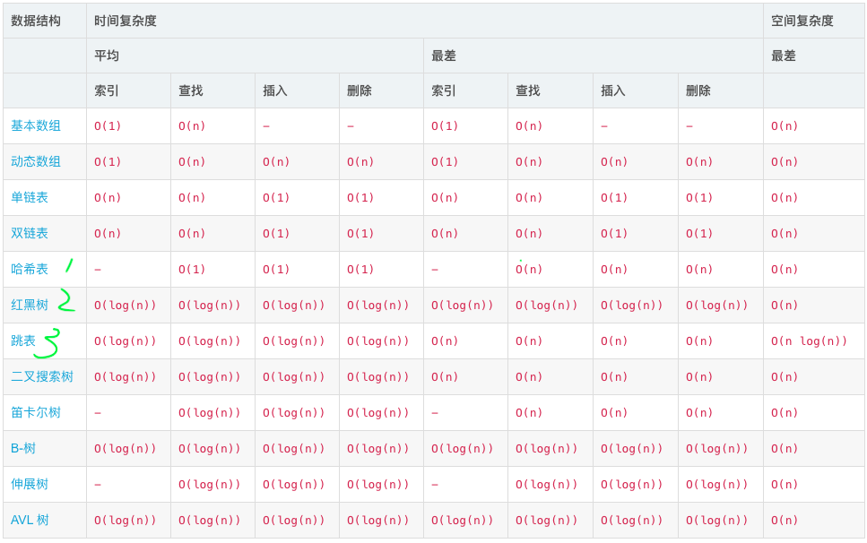

# sort
## 初级排序
几种基础排序算法，时间复杂度为O(n^2)。
### 冒泡排序
冒泡排序是最简单基础的排序算法：
1. 比较相邻的元素。如果第一个比第二个大，就交换他们两个；
2. 对每一对相邻元素作同样的工作，从开始第一对到结尾的最后一对。这步做完后，最后的元素会是最大的数；
3. 针对所有的元素重复以上的步骤，除了最后一个；
4. 持续每次对越来越少的元素重复上面的步骤，直到没有任何一对数字需要比较；
其时间复杂度为O(n^2)，在原地交换，不需要额外的空间开销。是一种稳定排序。
C++实现：
```cpp
void BubbleSort(int *a, int length) {
    for (int i = 0; i < length; ++i)
        for (int j = 0; j < length - 1 - i; ++j)
            if (a[j] > a[j + 1])
                swap(a[j], a[j + 1]);
}
```

### 插入排序
来源于整理扑克牌的排序算法：将每一个元素插入到已经有序的序列中合适的位置，即前向交换使之到达正确位置。
```cpp
void InsertionSort(int *a, int length) {
    for (int i = 1; i < length; ++i)
        for (int j = i; j > 0; --j)
            if (a[j] > a[j - 1])
                swap(a[j], a[j - 1]);
}
```

### 选择排序
每次(第 i 次：0..N-1)都选择出剩余元素的最小值，将其置换到 i 的位置上去。
```cpp
void SelectionSort(int *a, int length) {
    for (int i = 0; i < length; ++i) {
        int min = i;  // 最小元素的索引
        for (int j = i + 1; j < length; ++j)
            if (a[j] > a[min])
                min = j;
            swap(a[i], a[min]);
    }
}
```

### 希尔排序
思想：使数组中任意间隔为 h 的元素都是有序的。类似于插入排序，只不过插入排序是交换相邻(间隔为1)元素，而希尔排序是交换间隔为 h 的元素。
```cpp
void ShellSort(int *a, int length) {
    int h = 1;
    while (h < length / 3)
        h = 3 * h;
    while (h >= 1) {
        // 将数组变为h有序
        for (int i = h; i < length; ++) {
            // 将a[i]插入到a[i-h]，a[i-2*h]，a[i-3h]...中
            for (int j = i; j >= h && a[j] < a[j - h]; j -= h)
                swap(a[j], a[j - h]);
        }
        h = h / 3;
    }
}
```

## 快排
采用分治策略，(两路快排)将一个序列分成两个子序列，独立排序。
与归并排序互补：归并排序将序列分成两个部分分别排序，并将有序的子序列归并以将整个序列排序，递归调用发生在处理整个序列之前；而快排则是，当两个子序列都有序时，整个序列也就自然有序了，递归调用发生在处理整个序列之后。

```java
void sort(Comparable[] a, int lo, int hi) {
    if (lo >= hi) return;

    int j = partition(a, lo, hi);
    sort(a, lo, j - 1);
    sort(a, j + 1, hi);
}

int partition(Comparable[] a, int lo, int hi) {
    int i = lo, j = hi + 1;  // 左右扫描指针
    Comparable v = a[lo];  // 切分元素，主元
    while (true) {
        // 扫描左右，检查扫描是否结束并交换元素
        while (less(a[++i], v)) if (i == hi) break;
        while (less(v, a[--j])) if (j == lo) break;
        if (i >= j) break;
        exch(a, i, j);
    }
    exch(a, lo, j);  // 将v=a[j]放入正确位置
    return j;  // a[lo..j-1]<=a[j]<=a[j+1..hi]达成
}
```
优点
* 实现简单，适用于各种不同输入数据；
* 原地排序，只需要 O(1) 的辅助空间；

缺点
实现中要避免低劣性能的影响：
划分是否相对均衡，即主元的选取；

优化
* 小规模子序列(7 ~ 15)改用插入排序；
* 三取样切分：使用子序列一小部分元素的中位数作主元，取样大小为 3 时效果较好；

## 堆排
两步操作：堆化、下沉(或上浮)。
```java
public static void sort(Comparable[] pq) {
    int n = pq.length;
    // 构造堆
    // 从最下层一个非叶节点开始作为根节点，构造子堆
    // 这样能够保证对该节点的父节点堆化时，下沉动作不会扩散到它的子节点
    for (int k = n / 2; k >= 1; k--) {
        sink(pq, k, n);
        show(pq);
    }

    // 堆排序过程
    // 依次下沉当前最大元素，保持堆
    while (n > 1) {
        exch(pq, 1, n--);
        sink(pq, 1, n);
    }
}

// 下沉，使得以 k 位置为根节点，构造一个堆
private static void sink(Comparable[] pq, int k, int n) {
    while (2 * k <= n) {
        int j = 2 * k;
        if (j < n && less(pq, j, j + 1)) j++;
        if (less(pq, j, k)) break;
        exch(pq, k, j);
        k = j;
    }
}
```

## 归并排序
将已有序的子序列合并，得到完全有序的序列的过程，i.e. 先使子序列有序，再使序列段间有序。
* 时间复杂度： O(NlogN) ;
* 空间复杂度：辅助空间：O(N);
* 稳定排序，常使用递归实现。

```java
void merge(Comparable[] a, int lo, int mid, int hi) {
    int i = lo, j = mid + 1;

    for (int k = lo; k <= hi; k++)
        aux[k] = a[k];

    for (int k = lo; k <= hi; k++) {
        if (i > mid)
            a[k] = aux[j++];
        else if (j > hi)
            a[k] = aux[i++];
        else if (less(aux[j], aux[i]))
            a[k] = aux[j++];
        else
            a[k] = aux[i++];
    }
}

// 自顶向下递归：
void sort(Comparable[] a, int lo, int hi) {
    if (lo >= hi) return;
    int mid = lo + (hi - lo) / 2;
    sort(a, lo, mid);
    sort(a, mid + 1, hi);
    merge(a, lo, mid, hi);
}

// 自底向上循环：
void sort(Comparable[] a) {
    int N = a.length;
    aux = new Comparable[N];
    for (int sz = 1; sz < N; sz = sz + sz) {
        for (int lo = 0; lo < N - sz; lo += sz + sz)
            merge(a, lo, lo + sz - 1, Math.min(lo + +sz + sz - 1, N - 1));
    }
}
```

优化
* 小规模子序列(7 ~ 15)改用插入排序/选择排序；
* 测试子序列是否已经有序：a[mid] <= a[mid]，则这两个子序列无需调用接下来的 merge() ，直接拷贝即可；
* 不将元素复制到辅助空间：将辅助空间也带入 sort()、merge() 方法，每次递归变换二者的位置，从而无需反复拷贝子序列到辅助空间，而是临时将辅助空间用于排序和归并。

## 线性时间排序
比较排序的时间复杂度下限 O(n*logn) 是确定的。在这篇博客里有[各种比较排序的对比](http://www.cnblogs.com/gaochundong/p/comparison_sorting_algorithms.html "各种比较排序的对比")。
还有一类非比较排序算法，适用于一些特定情况。这种特定情况一般是对集合的范围界定：当集合满足一定条件，可以不使用比较的方式实现排序，从而获得优于比较排序下限的时间复杂度：线性时间复杂度内完成排序。
常见的线性时间复杂度排序算法有：
1. 计数排序(Counting Sort)
2. 基数排序(Radix Sort)
3. 桶排序(Bucket Sort)

### 计数排序
限制条件：取值范围在 [m, n] 之间的整数，wiki解释集合分布在 [0, 100] 时最适合使用计数排序。
原理：对每一个输入元素x，确定出小于x的元素个数，有了这一信息，就可以把x直接放在它在最终输出数组的位置上，例如，如果有17个元素小于x，则x就是属于第18个输出位置。当几个元素相同是，方案要略作修改。
时间复杂度：O(n)。
空间复杂度：O(n)。
这是一种稳定排序。
伪代码：
```java
COUNTING-SORT(A;B; k)
let C[0..k] be a new array
for i = 0 to k
	C[i] = 0;
for j = 1 to A.length
	C[A[j]] = C[A[j]] + 1
// C[i] now contains the number of elements equal to i .
for i = 1 to k
	C[i] = C[i] + C[i-1]
// C[i] now contains the number of elements less than or equal to i .
 for j = A.length downto 1
 	B[C[A[j]]] = A[j]
 	C[A[j]] = C[A[j]] - 1
```

### 基数排序
原理：以十进制数组n为例，k=10，最大数字的位数是d。把元素从个位排好序，然后再从十位排好序，，，，一直到元素中最大数的最高位排好序，那么整个元素就排好序了。
时间复杂度：O(d(n+r))。
空间复杂度：O(n+r)。
这是一种稳定排序。
伪代码：
```java
RADIX-SORT(A, d)
for  i = 1 to d
	use a stable sort  to sort array A on digit i.
```

### 桶排序
假定数据服从均匀分布，均匀独立分布在[0， 1)区间。假设有m个桶，即将区间划分为m个大小相同的子区间。将n个元素分别存放到相应的桶中，再对各个桶进行排序，如插入排序。最后遍历每个桶，按照次序列出所有元素即可。
时间复杂度：平均为O(n)。
空间复杂度：O(n)。
伪代码：
```java
BUCKET-SORT(A)
n = A.length
let B[0.. n-1] be a new array
for i = 0 to n-1
	make B[i] an empty list
for i = 1 to n
	insert A[i] into B[⌊A[i]⌋]
for i = 0 to n-1
	sort list B[i] with insertion sort
concatenate the lists B[0], B[i],...B[n-1] together in order.
```


# dp
与分治相似：都是通过组合子问题的解来求解原问题。而，分治将问题划分为互不相交的子问题，递归地(思路上)求解子问题，再将它们的解组合起来，得到原问题的解；与之不同地，动态规划应用于子问题重叠的情况，i.e. 不同的子问题具有公共的子子问题(递归求解子问题，将其划分为更小的子子问题)。这种情况下，分治算法将做许多不必要的工作——反复求解公共子子问题；而动态规划对每个子问题只求解一次，将结果保存在一个表格(programming 的由来)中，从而避免重复计算子子问题，i.e. 剪枝。
典型的时空权衡(time-memory trade-off)问题：以空间换时间。
通常用来求解 **最优化问题(Optimization Problem)**，即在很多可行解中寻找 **(一个/多个)最优解** 的过程。

## 设计步骤
1. 刻画一个最优解的结构特征；
2. 递归地定义最优解的值；
3. 计算最优解的值——同常采用自底向上的方法；
4. 利用计算的信息构造一个最优解。

**两种实现方法**
* 带备忘录的自顶向下方法(top-down with memoization)。用数组/散列表保存递归过程中子问题的解，当要求解一个子问题时，先检查是否已保存过此解，无则计算之；
* 自底向上方法(bottom-up method)。需要恰当定义子问题“规模”的概念，使得任何子问题的求解都只依赖于“更小的”子问题的解。因而可以将子问题按规模排序，从小到大进行求解，当求解某个子问题时，它所依赖的更小的子问题已经求解完毕，结果已经保存。这样可以保证每个子问题只求解一次，并且求解它时，它所有的前提子问题都已完成。

## 原理和适用条件
适用场景：
* **最优子结构；**
* **子问题重叠；**


# 贪心算法(greedy algorithm)
**每一步都做出当前看起来最佳的选择**。即，总是做出 **局部最优的选择**。理论上，适用于贪心算法的问题，同样能用动态规划方法解决。

## 设计步骤
首先是基于动态规划的设计方式：
1. 确定问题的最优子结构；
2. 设计一个递归算法；
3. 证明如果做出一个贪心的选择，则只剩下一个子问题；并且，证明贪心选择总是安全的；
4. 设计一个递归算法实现贪心策略；
5. 将递归算法转换为迭代算法。

更一般地，通过贪心选择改进最优子结构，使得选择后只剩下一个子问题：
1. 最优化问题转换为：做出一次选择后，只剩下一个子问题需要求解；
2. 证明做出贪心选择后，原问题总是存在最优解，即贪心选择总是安全的(没有因为这一次的选择而丢失客观的最优解)；
3. 证明做出贪心选择后，剩余的子问题满足性质：其最优解与贪心选择组合即可得到原问题的最优解，即得到了最优子结构。

## 能否使用贪心的两个要素
**贪心选择性质(greedy-choice property)**
通过做出局部最优(贪心)选择来构造全局最优解。与动态规划不同，贪心算法进行选择时可能依赖之前做出的选择，但不依赖任何将来的选择或子问题的解。

**最优子结构**
同动态规划。

## 与动态规划的差别
考虑 0-1 背包问题和分数背包问题，显然，后者能够使用贪心算法解决，而 0-1 背包问题则只能使用动态规划。

# KMP算法
经典的字符串匹配算法。但实现起来并不复杂。
首先一个概念是：
## 部分匹配表 The Partial Match Table
参考这篇博文：[The Knuth-Morris-Pratt Algorithm](http://jakeboxer.com/blog/2009/12/13/the-knuth-morris-pratt-algorithm-in-my-own-words/)
当弄清楚了什么是部分匹配表之后，接下来就是怎么使用它，在匹配失败的时候进行适当的跳跃。
使用参考这部分内容[从头到尾彻底理解KMP](https://blog.csdn.net/v_july_v/article/details/7041827)

最后给出一个[实现](https://blog.csdn.net/biaobiaoqi/article/details/8975536)

# 跳表
## 算法 & 数据结构
$$程序 = 算法 + 数据结构$$
TAOCP中，Donald并没有直接给出“算法”的定义，而是在用了几页的篇幅追溯了一番“Algorithms”这个词的起源以尝试让读者理解它的含义之后，用了欧几里得求解两个正整数最大公因子的例子做阐述：
<p align = "left">

</p>

其中最重要的是→，赋值/代替。
他的学生、红皮算法书的作者-Robert Sedgewick沿用这个例子并尝试给出了一个定义：The term algorithm is used in computer science to describe a **finite**, **deterministic**, and **effective** problem-solving method suitable for implementation as a computer program.
同时指出了二者之间的关系：大多数算法需要适当地组织数据，**为了组织数据就产生了数据结构**。一脉相承的观点是，数据结构是算法的副产品/结果(data structures exist as the byproducts or end products of algorithms)。
<details>
  <summary>数据结构的作用</summary>

## 数据结构的作用
前面说算法需要组织数据，所谓组织，其实就是操作(增、删、改、查)。有关数据结构和算法的课程对中所涉及到的数据结构：数组、链表；以及以前面两者为基础的高级数据结构：堆、树、图；延展开到特定领域/方向上优化的数据结构：各种队列，红黑树，B、B+树，拓扑图等等。
所有的数据结构的目的都是在特定场景下，优化数据的操作效率。可以用算法书给的demo跑一遍十几条排序算法的效率，便能直观感受到，即使在现在这样高性能的计算机面前，$n^2$ → $n\log(n)$所带来巨大效率的提升；而在特定场景下，采用位图、$O(n)$复杂度的排序算法所能带来的更可观的空间、时间上的节省。
绝大多数场景下，我们期待的数据结构是：在保持“有序”的前提下，满足高效的增、删、查操作。其中“有序”是一个相对的概念，堆、单端/双端队列、查找树、拓扑图等，都满足以我们所期待的方式的有序性、或者我们所关心的那部分数据的有序性。

</details>

## 哈希、红黑树、跳表
这里关注K-V型数据结构。
### 合适的数据结构
关注以下速查表数据。
<p align = "left">

</p>

其中，常用的key-value数据结构有三种：
* Hash表：插入、查找最快，为$O(1)$；如使用链表实现则可实现无锁；数据有序化需要显式的排序操作
* 红黑树：插入、查找为$\log(n)$，但常数项较小；无锁实现的复杂性很高，一般需要加锁；数据天然有序
* SkipList：插入、查找为$\log(n)$，但常数项比红黑树要大；底层结构为链表，可无锁实现；数据天然有序。

首先，如果能确定某些数据是静态的，以ACA为例，我们的文案数据目前就可以看成是静态的：可能有描述上的调整，但频次很低，并且数据量不大。这部分数据如果采用直接加载到内存或是中间缓存的话，结构化为HashMap是不错的选择；
如前所述，大部分数据操作场景是需要增删改操作的，而非仅仅只有读操作。这里不再讨论堆、队列等使用场景，专注通常情况下的**数据的存取操作**，此时需要兼顾读取、和操作后恢复有序的效率，此时Hash表不再是好的选择：迭代、修改操作的时间复杂度比较高，而红黑树则能很好地满足功能需求；

## 为什么还要有跳表
作为平衡树的一种替代实现，跳表主要拥有以下优势：
* **更简单的实现**
  红黑树增删改元素需要进行旋转、变色，实现起来比较复杂，需要考虑的细节也比较多，到了并发场景下更难以写出可用且高效的红黑树实现；而跳表实现原理相当简单，就是升级版的链表，把链表的某一些元素随机抽出来再组成一个链表，作为一级索引，在该索引集中再次进行抽取，再做一级索引，依次实现多级链表索引，就组成了一个跳表。
  
* **为了解决在高并发下，红黑树的锁实现导致的可能的死锁和并发度降低问题**。
  首先这句话意味着，在单线程、低线程数场景下，红黑树可能是更好的选择：以jdk11为例，ConcurrentHashMap存取速度是ConcurrentSkipListMap的4倍左右，而随着并发的线程数增多，后者的性能优势会逐渐体现出来，它的存取时间复杂度几乎和线程数无关，且无锁开销。

### 特点
上述可见跳表也是一种典型的“空间换时间”的数据结构。其底层采用二维链表，而非通常采用的数组实现。基本特点：
* 由很多层结构组成；
* 每一层都是一个有序的链表；
* 最底层(Level 1)的链表包含所有元素；
* 如果一个元素出现在 Level i 的链表中，则它在 Level i 之下的链表也都会出现；
* 每个节点包含两个指针，一个指向同一链表中的下一个元素，一个指向下面一层的元素。
<p align = "left">

</p>

## 跳表实现
### 构造
考虑一个链表：
<p align = "left">

</p>

从该有序表中搜索元素< 23, 43, 59>，需要比较的次数分别为< 2, 4, 6 >，总共比较的次数为 2 + 4 + 6 = 12 次。
有没有优化的算法？链表是有序的，但不能使用二分查找。类似二叉搜索树，我们把一些节点提取出来，作为索引。得到如下结构：
<p align = "left">

</p>

这里把< 14, 34, 50, 72 >提取出来作为一级索引，这样搜索的时候就可以减少比较次数了。还可以再从一级索引提取一些元素出来，作为二级索引，变成如下结构：
<p align = "left">

</p>

<details>
  <summary>节点类</summary>

```java
    static final class Node<K,V> {
        final K key; // currently, never detached
        V val;
        Node<K,V> next;
        Node(K key, V value, Node<K,V> next) {
            this.key = key;
            this.val = value;
            this.next = next;
        }
    }
```

redis 使用C实现，详见：https://github.com/antirez/redis/blob/unstable/src/server.h
</details>

### 搜索元素
查找元素 117：
<p align = "left">

</p>

1. 比较21，比 21 大，往后面找
2. 比较37，比 37大，比链表最大值小，从 37 的下面一层开始找
3. 比较71，比 71 大，比链表最大值小，从 71 的下面一层开始找
4. 比较85，比 85 大，从后面找
5. 比较117，等于 117， 找到了节点。

<details>
  <summary>搜索</summary>

```java
    private Node<K,V> findNode(Object key) {
        if (key == null)
            throw new NullPointerException(); // don't postpone errors
        Comparator<? super K> cmp = comparator;
        Node<K,V> b;
        outer: while ((b = findPredecessor(key, cmp)) != null) {
            for (;;) {
                Node<K,V> n; K k; V v; int c;
                if ((n = b.next) == null)
                    break outer;               // empty
                else if ((k = n.key) == null)
                    break;                     // b is deleted
                else if ((v = n.val) == null)
                    unlinkNode(b, n);          // n is deleted
                else if ((c = cpr(cmp, key, k)) > 0)
                    b = n;
                else if (c == 0)
                    return n;
                else
                    break outer;
            }
        }
        return null;
    }
```
</details>

### 新增元素
先确定该元素要占据的层数 K(丢硬币，随机)，然后在 Level 1 ... Level K 各个层的链表都插入元素：
插入 119， K = 2
<p align = "left">

</p>

其中，然随机变量 K 满足参数为 $p = 1/2$ 的几何分布，期望值 $E[K] = 1/p = 2$。即各个元素的层数，期望值是 2 层。
<p align = "left">

</p>

<details>
  <summary>插入</summary>

```java
    private V doPut(K key, V value, boolean onlyIfAbsent) {
        if (key == null)
            throw new NullPointerException();
        Comparator<? super K> cmp = comparator;
        for (;;) {
            Index<K,V> h; Node<K,V> b;
            VarHandle.acquireFence();
            int levels = 0;                    // number of levels descended
            if ((h = head) == null) {          // try to initialize
                Node<K,V> base = new Node<K,V>(null, null, null);
                h = new Index<K,V>(base, null, null);
                b = (HEAD.compareAndSet(this, null, h)) ? base : null;
            }
            else {
                for (Index<K,V> q = h, r, d;;) { // count while descending
                    while ((r = q.right) != null) {
                        Node<K,V> p; K k;
                        if ((p = r.node) == null || (k = p.key) == null ||
                            p.val == null)
                            RIGHT.compareAndSet(q, r, r.right);
                        else if (cpr(cmp, key, k) > 0)
                            q = r;
                        else
                            break;
                    }
                    if ((d = q.down) != null) {
                        ++levels;
                        q = d;
                    }
                    else {
                        b = q.node;
                        break;
                    }
                }
            }
            if (b != null) {
                Node<K,V> z = null;              // new node, if inserted
                for (;;) {                       // find insertion point
                    Node<K,V> n, p; K k; V v; int c;
                    if ((n = b.next) == null) {
                        if (b.key == null)       // if empty, type check key now
                            cpr(cmp, key, key);
                        c = -1;
                    }
                    else if ((k = n.key) == null)
                        break;                   // can't append; restart
                    else if ((v = n.val) == null) {
                        unlinkNode(b, n);
                        c = 1;
                    }
                    else if ((c = cpr(cmp, key, k)) > 0)
                        b = n;
                    else if (c == 0 &&
                             (onlyIfAbsent || VAL.compareAndSet(n, v, value)))
                        return v;

                    if (c < 0 &&
                        NEXT.compareAndSet(b, n,
                                           p = new Node<K,V>(key, value, n))) {
                        z = p;
                        break;
                    }
                }

                if (z != null) {
                    int lr = ThreadLocalRandom.nextSecondarySeed();
                    if ((lr & 0x3) == 0) {       // add indices with 1/4 prob
                        int hr = ThreadLocalRandom.nextSecondarySeed();
                        long rnd = ((long)hr << 32) | ((long)lr & 0xffffffffL);
                        int skips = levels;      // levels to descend before add
                        Index<K,V> x = null;
                        for (;;) {               // create at most 62 indices
                            x = new Index<K,V>(z, x, null);
                            if (rnd >= 0L || --skips < 0)
                                break;
                            else
                                rnd <<= 1;
                        }
                        if (addIndices(h, skips, x, cmp) && skips < 0 &&
                            head == h) {         // try to add new level
                            Index<K,V> hx = new Index<K,V>(z, x, null);
                            Index<K,V> nh = new Index<K,V>(h.node, h, hx);
                            HEAD.compareAndSet(this, h, nh);
                        }
                        if (z.val == null)       // deleted while adding indices
                            findPredecessor(key, cmp); // clean
                    }
                    addCount(1L);
                    return null;
                }
            }
        }
    }
```
</details>


### 删除元素
采用标准的链表删除即可。
删除 71
<p align = "left">

</p>

<details>
  <summary>删除</summary>

```java
    final V doRemove(Object key, Object value) {
        if (key == null)
            throw new NullPointerException();
        Comparator<? super K> cmp = comparator;
        V result = null;
        Node<K,V> b;
        outer: while ((b = findPredecessor(key, cmp)) != null &&
                      result == null) {
            for (;;) {
                Node<K,V> n; K k; V v; int c;
                if ((n = b.next) == null)
                    break outer;
                else if ((k = n.key) == null)
                    break;
                else if ((v = n.val) == null)
                    unlinkNode(b, n);
                else if ((c = cpr(cmp, key, k)) > 0)
                    b = n;
                else if (c < 0)
                    break outer;
                else if (value != null && !value.equals(v))
                    break outer;
                else if (VAL.compareAndSet(n, v, null)) {
                    result = v;
                    unlinkNode(b, n);
                    break; // loop to clean up
                }
            }
        }
        if (result != null) {
            tryReduceLevel();
            addCount(-1L);
        }
        return result;
    }
```
</details>

## 适用场景
1. jdk从1.6开始引入了两个跳表相关的实现类：ConcurrentSkipListMap、ConcurrentSkipListSet(基于ConcurrentSkipListMap)，在jdk中主要是用于高并发场景下代替红黑树的实现，不过从jdk8开始，线程安全的Hash表：ConcurrentHashMap采用了CAS、取消分段锁改用大数组、哈希碰撞超过阈值时树化(红黑树)等手段进一步提升了线程安全Hash表相关实现，性能上也有了很大提升。

2. redis：redis的有序集合zset是采用跳表实现的。分析一下zset所支持的操作就不难理解为啥采用跳表而非红黑树了：
* 插入元素
* 删除元素
* 查找元素
* 有序输出所有元素
* 查找区间内所有元素
  除了易于实现这个因素外。zset所支持的操作中，前4项红黑树都可以完成，且时间复杂度与跳表一致。但是，最后一项，红黑树的效率就没有跳表高了。在跳表中，要查找区间的元素，我们只要定位到两个区间端点在最低层级的位置，然后按顺序遍历元素就可以了，非常高效。而红黑树只能定位到端点后，再从首位置开始每次都要查找后继节点，相对来说是比较耗时的。

3. LevelDB：Google 开源的 key/value 存储引擎 LevelDB 以及 Facebook 基于 LevelDB 优化的 RocksDB 都是 LSM Tree 结构的数据库，内部的 MemTable 使用跳表实现。HBase MemStore 内部存储数据就使用的跳表。为什么呢？HBase 属于 LSM Tree 结构的数据库，LSM Tree 结构的数据库有个特点，实时写入的数据先写入到内存，内存达到阈值往磁盘 flush 的时候，会生成类似于 StoreFile 的有序文件，而跳表恰好就是天然有序的，所以在 flush 的时候效率很高，而且跳表查找、插入、删除性能都很高，这应该是 HBase MemStore 内部存储数据使用跳表的原因之一。HBase 使用的是 java.util.concurrent 下的 ConcurrentSkipListMap()。

4. ES：Lucene核心数据结构采用了跳表实现倒排表。使用FST保存词典，FST可以实现快速的Seek，这种结构在当查询可以表达成自动机时(PrefixQuery、FuzzyQuery、RegexpQuery等)效率很高。(可以理解成自动机取交集)此种场景主要用在对Query进行rewrite的时候。FST可以表达出Term倒排表所在的文件偏移。倒排表使用SkipList结构。从上面的讨论可知，求倒排表的交集、并集、差集需要各种SeekTo(docId)，SkipList能对Seek进行加速。


ref：

https://stackoverflow.com/questions/256511/skip-list-vs-binary-search-tree

https://en.wikipedia.org/wiki/Skip_list

https://blog.csdn.net/sunxianghuang/article/details/52221913

https://www.iteye.com/blog/imtinx-1291165