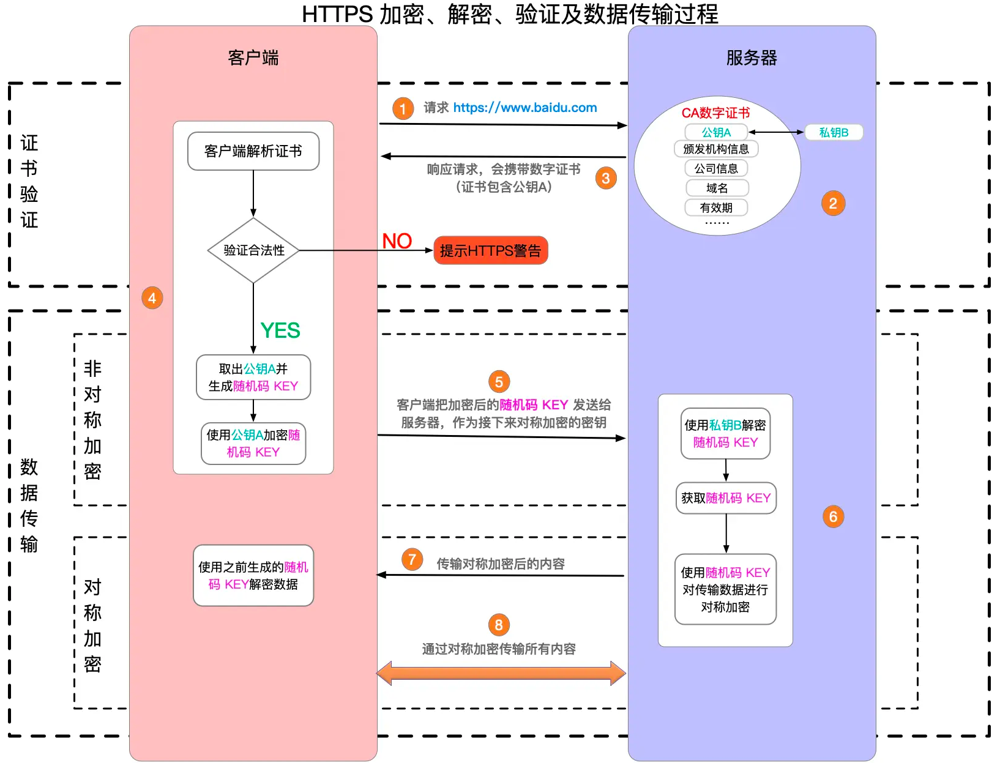
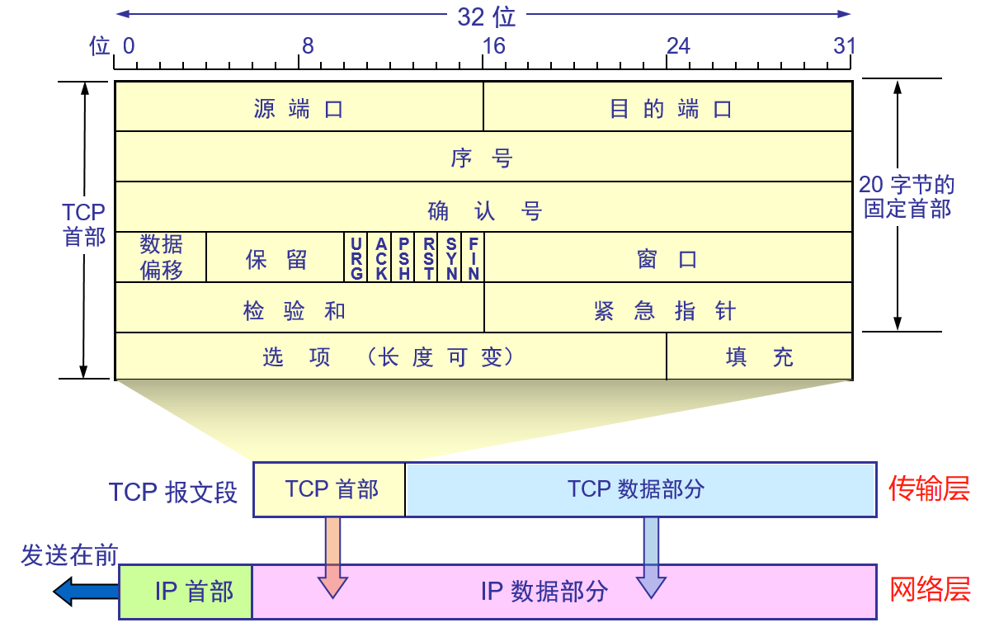

# 层次网络模型

应用层 HTTP、FTP、SMTP、远程登陆协议(TELNET、Rlogin)
运输层 TCP、UDP 
网络层 IP、ICMP、IGMP、RIP 有路由器
链路层 有网桥、交换机
物理层 有中继器、集线器

OSI(Open System Interconnect，开放式系统互联) 7 层模型：

# URL请求全过程
整体步骤包括：
* URL解析
* DNS解析
* TCP连接
* 发送HTTP请求
* 处理网络响应
* 浏览器渲染
* 断开连接

## URL解析
浏览器判断输入的 URL 是否合法，如果含有非法字符，浏览器会对其进行转义；
检查强缓存，如果命中直接使用；
开启一个网络线程发送请求；

## DNS解析
1. 检查浏览器缓存；
2. 检查本地hosts；
3. 向“本地DNS服务器(比如网络配置中的DNS解析配置)”发送解析请求(UDP)；
4. 向根DNS服务器请求解析；
5. 根DNS服务器返回给本地DNS域名服务器一个顶级DNS服务器地址，国际顶级域名服务器，如.com、.cn、.org等；
6. 本地DNS服务器再向上一步获得的顶级DNS服务器发送解析请求；
7. 顶级DNS服务器查找并返回此域名对应的NameServer域名服务器的地址。这个NameServer服务器就是要访问的网站域名提供商的服务器，其实该域名的解析任务就是由域名提供商的服务器来完成；
8. NameServer服务器查询域名和IP映射关系表，把域名和IP等信息连同一个TTL值返回给本地DNS服务器；
9. 本地DNS服务器返回该域名对应的IP和TTL值给操作系统，并做缓存，缓存时间由TTL值控制；
10. 操作系统将IP地址返回给浏览器，并将 IP 地址缓存；
11. 浏览器进行后续请求，并缓存IP；

### 递归查询
主机向本地域名服务器的查询一般都是采用递归查询：如果主机查询的本地域名服务器不知道被查询的域名的IP地址，那么本地域名服务器就以DNS客户端的身份，向其它根域名服务器继续发出查询请求报文(即替主机继续查询)，而不是让主机自己进行下一步查询。因此，递归查询返回的查询结果或者是所要查询的IP地址，或者是报错，表示无法查询到所需的IP地址。

### 迭代查询
当根域名服务器收到本地域名服务器发出的迭代查询请求报文时，要么给出所查询的IP地址，要么告诉本地服务器：“下一步应当向哪一个域名服务器进行查询”。然后让本地服务器进行后续的查询。根域名服务器通常是把自己知道的顶级域名服务器的IP地址告诉本地域名服务器，让本地域名服务器再向顶级域名服务器查询。顶级域名服务器在收到本地域名服务器的查询请求后，要么给出所要查询的IP地址，要么告诉本地服务器下一步应当向哪一个权限域名服务器进行查询。最后，本地域名服务器要么查询到IP，要么报错，然后把这个结果返回给发起查询的主机。

本地域名服务器向根域名服务器的查询一般是迭代查询，主机向本地域名服务器的查询一般是递归查询。

# HTTP
## 头部
[HTTP头部结构](https://xie.infoq.cn/article/6f7af61d2f01eee65cee5fdcf)

## 版本对比
http 1.0
* 不支持长连接，每次发送请求都要进行TCP连接；
* 队头阻塞，下一个请求必须在前一个请求响应到达才能发送；
* 不支持断点续传;

http 1.1
* 支持长连接，默认开启  keep-alive 默认两小时
* 支持管道传输，即同一个 TCP 连接，客户端可以发起多个请求，只要第一个请求发出去了，不必等其回来，就可以发第二个请求出去，可以减少整体的响应时间；解决了请求的队头阻塞，但是没有解决响应的队头阻塞；

http 2.0
* 基于HTTPS，更加安全；
* 头部压缩，如果同时多个请求其头部一样或相似，那么协议会消除重复部分；
* 二进制格式；
* 多路复用，流传输，实现了真正的并行传输，它能够在一个TCP上进行任意数量的HTTP请求，可以在一个连接中并发多个请求或回应，而不用按照顺序一一对应；
* 服务端推送，改善了传统的「请求 - 应答」工作模式，服务端不再是被动地响应，可以主动向客户端发送消息、推送额外的资源；
* 仍然存在TCP队头阻塞问题，TCP面向字节流传输，而且保证传输可靠性和数据的完整性，只有TCP拿到完整连续的数据时，内核才会将数据从缓冲区交给HTTP应用，而只要前一个字节没有收到，HTTP就无法从内核缓冲区中得到数据，直到其到达，所以在此过程仍然会导致队头阻塞；

http 3.0
* 基于 UDP 的 QUIC 协议，可以看做是一个 UDP 之上的伪 TCP + TLS + HTTP/2 的多路复用的协议；

## https
在http的基础上加入SSL/TLS协议，加密数据包。
大致可以分为两个阶段，证书验证 & 数据传输，步骤如下：
1. 客户端请求 HTTPS 网址，连接到服务器的 443 端口 (HTTPS 默认端口)；
2. 采用 HTTPS 协议的服务器必须要有一套数字证书，CA (Certification Authority)。需要申请，由专门的数字证书认证机构通过严格审核之后颁发(收费，安全级别越高价格越贵)。颁发证书同时会产生一个私钥和公钥。私钥由服务端自己保存，不可泄漏。公钥附带在证书的信息中，可公开。证书也附带一个电子签名，用来验证证书的完整性和真实性，防止证书被篡改；
3. 服务器响应客户端请求，将证书传递给客户端，包含公钥和其他信息，比如证书颁发机构信息，公司信息和有效期等。浏览器点击地址栏的锁标志再点击证书就可以看到证书详细信息；
4. 客户端解析证书并验证：
    * 如果证书没有问题，客户端从证书中取出公钥A，用它加密随机生成的key；
    * 如果证书不是可信机构颁布，或者证书中的域名与实际域名不一致，或者证书已经过期等情况，就会向访问者显示一个警告。浏览器会出现一个警告标识⚠️；
5. 客户端把加密后的随机码KEY发送给服务器，作为后面对称加密的密钥；
6. 服务器在收到随机码KEY之后使用私钥B解密。至此，客户端和服务器建立安全连接，接下来用对称加密通信；
7. 服务器使用密钥对数据进行对称加密并发送给客户端，客户端使用相同的密钥解密；

### 缺点
* 在相同网络环境中，HTTPS相比HTTP无论是响应时间还是耗电量都有大幅度上升；
* 安全是有范围的，在黑客攻击、服务器劫持等情况下几乎起不到作用；
* 在现有证书机制下，中间人攻击依然有可能发生；
* 需要更多的服务器资源，导致成本升高；

## 常见状态码
2XX 成功
* 200 ok(请求成功)

3XX 重定向
* 301 move permanently (永久性重定向)
* 302 found (临时性重定向)
* 303 see other (示由于请求对应的资源存在着另一个 URI，应使用 GET方法定向获取请求的资源)
* 304 not modified (客户端采用带条件的访问某资源时，服务端找到了资源，但是这个请求的条件不符合。跟重定向无关)

4XX 客户端错误
* 400 bad request (请求报文存在语法错误)
* 401 unauthorized (需要认证(第一次返回)或者认证失败(第二次返回))
* 403 forbidden (请求被服务器拒绝了)
* 404 not found (服务器上无法找到请求的资源)
* 405 method not allowed (客户端请求中的方法被禁止)
* 408 Request Time-out (服务器等待客户端发送的请求时间过长，超时)
* 415 Unsupported Media Type (服务器无法处理请求附带的媒体格式)

5XX 服务器错误
* 500 internal server error 服务器内部错误，无法完成请求
* 502 Bad Gateway (充当网关或代理的服务器执行请求时，从远程服务器接收到了一个无效的响应)
* 503 service unavailable (服务器正在超负载或者停机维护，无法处理请求)
* 504 Gateway Time-out (充当网关或代理的服务器，未及时从远端服务器获取请求)
* 505 HTTP Version not supported (服务器不支持请求的HTTP协议的版本)

## 请求方法
**GET**
请求一个指定资源的表示形式，使用 GET 的请求应该只被用于获取数据。

**HEAD**
请求一个与 GET 请求的响应相同的响应，但没有响应体。

**POST**
通常用于创建新的资源或提交数据到服务器进行处理。

**PUT**
更新或替换服务器上的资源。

**DELETE**
删除指定的资源。

**CONNECT**
建立一个到由目标资源标识的服务器的隧道。

**OPTIONS**
用于描述目标资源的通信选项。

**TRACE**
沿着到目标资源的路径执行一个消息环回测试。

**PATCH**
用于对资源应用部分修改。

### PUT vs POST
* 语义不同：PUT 通常用于更新或替换服务器上的资源，而 POST 通常用于创建新的资源或提交数据到服务器；
* 客户端发送的数据不同：PUT 需要发送完整的资源内容，而 POST 可以只发送部分资源内容；
* 响应不同：PUT 成功后通常返回 200 OK 状态码，而 POST 成功后通常返回 201 Created 状态码，并返回表示新资源的 URI；
* 幂等性不同：PUT 具有幂等性，即执行多次 PUT 请求的结果应该相同，而 POST 不具有幂等性；

# TCP
## 首部
[tcp首部解析](https://blog.csdn.net/lzj2504476514/article/details/116272839)

## 三次握手
**第一次 客户端发起请求(发送请求SYN+数据包当前序列号seq，无需应答)**
客户端创建传输控制块TCB，进入监听LISTEN状态
设置SYN=1，表示这是握手报文，并发送给服务器
设置发送的数据包序列号seq=x
此时客户端处于同步已发送SYN-SENT状态

**第二次 服务器确认(发送应答ACK+请求SYN+确认收到上一个数据包的确认号ack+当前数据包序列号seq)**
设置ACK=1，表示确认应答。
设置ack=x+1，表示已收到客户端x之前的数据，希望下次数据从x+1开始
设置SYN=1，表示握手报文，并发送给客户端
设置发送的数据包序列号seq=y
此时服务器处于同步已接收SYN-RCVD状态

**第三次客户端确认(发送应答ACK+确认收到上一个数据包的确认号ack+当前数据包序列号seq，连接已建立，无需请求)**
设置ACK=1，表示确认应答。
设置ack=y+1，表示收到服务器发来的序列号为seq=y的数据包，希望下次数据从y+1开始
设置seq=x+1，表示接着上一个数据包seq=x继续发送
至此三次握手结束，连接建立。

### SYN攻击/洪泛攻击
攻击端发送完第一次握手的数据后，然后就"消失"了，服务器就会不断的发送第二次握手的数据,于是，服务器的资源大量被消耗，直到死机为止。

**[防范](https://blog.csdn.net/bandaoyu/article/details/109400717#t2)**

## 四次挥手
**第一次 FIN, Seq=x**
客户端发送一个FIN标记的包，告诉服务器需要关闭连接，表示自己不再发送数据，但是还可以接收数据。发送完成后，客户端进入FIN_WAIT_1状态。

**第二次 ACK, ACK=x+1**
服务端发送一个ACK的确认包，告诉客户端接收到关闭的请求，但是还没有准备好。发送完成后，服务端进入CLOSE_WAIT状态，客户端收到这个包后，进入FIN_WAIT_2，等待服务器关闭连接。

**第三次 FIN, Seq=y**
服务端准备好关闭连接时，发送FIN标记的包，告诉客户端准备关闭。发送完成后，服务端进入LAST_ACK状态，等待客户端确认。

**第四次 ACK, ACK=y+1**
客户端接收到服务端的关闭请求，再发送ACK标记的确认包，进入TIME_WAIT状态，等待服务端可能请求重传的ACK包。服务端接收到ACK包后，关闭连接，进入CLOSED状态。
客户端在等待固定时间(两个最大段生命周期 2MSL Maximum Segment LifeTime)后，没有接收到服务的ACK包，认为服务器已关闭连接，自己也关闭连接，进入CLOSED状态。

**why 2MSL？** 
这个时间是从客户端接收到FIN后发送ACK开始计时的。如果在这个时间段内，服务器没有收到ACK应答报文段，会重发FIN报文段。防止已失效的连接请求报文段出现在本连接中。保证客户端最后发送的ACK能够到达服务器，帮助其正常关闭。
[TIME_WAIT & CLOSE_WAIT](https://blog.csdn.net/weixin_37841366/article/details/109271982)

# TCP拥塞控制 
**[拥塞控制](https://www.cnblogs.com/tuyang1129/p/12439862.html)** 在发生网络拥塞时，降低向网络发送数据的速度，防止恶性循环；同时在网络空闲时，提高发送数据速度，最大限度利用网络资源。
**网络拥塞** 在分组交换网络中传送分组的数目太多时，由于存储转发节点资源有限造成网络传输性能下降。
TCP采用端到端拥塞控制，即自行判断网络拥塞情况。

超时重传，确认应答，滑动窗口，拥塞控制。

## 如何限制数据发送速率
TCP采用流水线方式发送数据，每个数据段都有一个序号，并且维护一个发送窗口，所有序号位于这个窗口内的数据段会被一次性发送，无需等待之前发送的数据段被确认。每当最早发送出去的数据段被确认，窗口就会向前移动，直到移动到第一个没有被确认的序号，这时候又会有新的数据段序号被包含在窗口中，然后被发送出去。即所谓的滑动窗口。TCP发送方维护的叫做 拥塞窗口/cwnd，所有已发送但还没收到确认的数据段落在这个窗口中，当网络拥塞时，TCP将减小cwnd，网络通畅时，增大cwnd，以此控制数据发送速率。

## 如何检测网络是否拥塞
TCP通过数据发送的一些现象(有没有丢包)来推测网络是否拥塞：
* 发送一条数据段后，成功接收到接收方的确认报文，则认为网络没有拥塞；
* 发送一条数据段后，在规定时间内没有收到确认报文(丢失或时延太大)，则认为网络出现了拥塞；
* 连续收到接收方对同一条报文的三次冗余确认(也就是四次确认)，则推测报文丢失，发生拥塞；

第三条和**快速重传**机制有关。
TCP不保证数据按顺序到达接收端，所以可能出现序号大的数据先到达的情况。而接收方并不是接收到哪一条报文，就向发送方发送哪条报文的确认，它是通过发送当前应接收的最小序号报文进行确认。举个例子：
1. 发送方发送1，2，3，4，5五个序号的报文，接收方接收到序号1的报文，发送一个确认号为2的确认报文，告诉发送方已经收到2之前的报文，下一条报文我想要2，发送方通过确认号来判断接收方已接收到序号2之前的报文；
2. 接收方接收到2号报文后，发送确认号3，告诉发送方已接收到了3之前的所有报文；
3. 因为网络不确定性等原因，3号没有到达，4号报文先到达，接收方接收到后，将它放入缓存，并依旧回复确认号3，表示它需要3号报文，可是，之后到达的了5号，于是继续将5号放入缓存，并依旧回复3；
4. 直到3迟到，这时接收方接收3，同时发现缓存中存在4和5，于是回复确认号6，表示已经接收到6号之前的全部报文，下一条需要6号。

这里，发送方一共接收到了三条确认号为3的确认报文，第一条正常，后面两条冗余。所谓快速重传是指：若发送方接收到对同一条报文的三次冗余确认(也就是四次确认)，就认为这条报文已经丢失，于是不管计时器是否超时，都直接重传这条报文。例子中2号报文冗余确认两次，还不构成快速重传条件。而为什么是三次，其实就是概率和时间长短的折中选择。

## 如何调整数据发送速率
在没有丢包时慢慢提高拥塞窗口cwnd大小，当发生丢包事件时，减小cwnd。

**MSS** 最大报文段长度，TCP双方发送的报文段中，数据部分的最大字节数；
**RTT** 往返时间，发送方发送一个报文，到接收这个报文的确认报文所经历的时间；
**ssthresh** 慢启动阈值，慢启动阶段，如果cwnd的大小达到这个值，将转换到拥塞避免模式；

### 慢启动
指数增长尽快找到上限。慢启动是建立TCP连接后，采用的第一个调整发送速率的算法(或叫模式)，这个阶段，cwnd通常被初始化为1MSS，这个值比较小，此时网络一般还有富余，发送方每接收到一个确认报文，就会将cwnd扩充为原来的两倍，于是：
* 初始cwnd=1MSS，可以发送一个TCP最大报文段，成功确认后，cwnd = 2 MSS；
* 此时可以发送两个TCP最大报文段，成功接收后，cwnd = 4 MSS；
* 此时可以发送四个TCP最大报文段，成功接收后，cwnd = 8 MSS......

由于TCP是一次性将窗口内所有报文发出，所以所有报文都到达并被确认的时间，近似等于一个RTT。所以慢启动阶段，拥塞窗口长度将在每个RTT后翻倍，也就是发送速率将以指数级别增长。直到某些现象发生：
1. 如果发生数据传输超时，此时将 ssthresh 设置为 cwnd/2 ，然后将cwnd重置为1MSS，重新开始慢启动过程，这个过程可以理解为试探上限；
2. cwnd 值增加到 >= ssthresh 时，结束慢启动，改为拥塞避免模式；
3. 如果发送方接收到某个报文的三次冗余确认(即触发快速重传)，则进入到快速恢复阶段；同时，ssthresh = cwnd/2，cwnd = ssthresh + 3MSS；

### 拥塞避免
线性增长。刚进入这个模式时，cwnd近似等于上次拥塞时的一半，每经历一个RTT，cwnd增加1MSS。直到：
1. 如果发生数据传输超时，则表示网络拥塞，此时，ssthresh = cwnd/2，cwnd=1MSS，进入慢启动阶段；
2. 如果发送方接收到某个报文的三次冗余确认(即触发快速重传)，此时也认为发生拥塞，ssthresh = cwnd/2，cwnd=ssthresh + 3MSS，进入快速恢复模式；

可以看到，慢启动和拥塞避免在接收到三个冗余确认报文时，处理方式是一样的：判断发生拥塞，减小ssthresh的大小。但是cwnd的大小却不见得有减小多少，这一点让人疑惑，可能是，虽然发送方通过接收三次冗余确认报文，判断可能存在拥塞，但是既然可以收到冗余的确认报文，表示拥塞不会太严重，甚至已经不再拥塞，所以对cwnd的减小不是这么剧烈。

### 快速恢复
TCP规范中不强制要求实现。在快速恢复阶段，每接收到一个冗余的确认报文，cwnd就增加1MSS，其余不变。直到：
1. 计时器超时，此时，ssthresh = cwnd / 2，cwnd = 1MSS，进入慢启动阶段；
2. 如果发送方接收到一条新的确认报文(不是冗余确认)，cwnd=ssthresh，进入到拥塞避免模式；

这里有一个疑问，进入到此模式的条件就是接收到三次冗余的确认报文，判断报文丢失，那为什么再次接收到冗余确认报文时，cwnd还是要增长呢？可能是，此时再次收到一条冗余的确认报文，表示发送端发出的报文又有一条离开网络到达了接收端(虽然不是接收端当前想要的一条)，这说明网络中腾出了一条报文的空间，所以允许发送端再向网络中发送一条报文。但是由于当前序号最小的报文丢失，导致拥塞窗口cwnd无法向前移动，于是只好将cwnd增加1MSS，于是发送端又可以发送一条数据段，提高了网络的利用率。

# cookie & session
## cookie
“小型文本文件”，网站为了辨别用户身份，进行Session跟踪而储存在用户本地的数据，通常是加密的，由用户端暂时或永久保存，在生成时指定一个Expire值，就是Cookie的生存周期，设置为“0”或负值，在关闭浏览器时就马上清除。
web程序使用HTTP协议传输，无状态的协议，对于事务处理没有记忆能力。缺少状态意味着如果后续处理需要前面的信息，必须重传，可能导致每次连接传送的数据量增大。

**缺陷**
* 数据量有限，一个浏览器能创建的 Cookie 数量最多为 300 个，并且每个不能超过 4KB，每个 Web 站点能设置的Cookie 总数不能超过 20 个；
* 浏览器可以禁止；
* 且有安全风险(可伪造)

## session
浏览器端第一次发送请求到服务端，服务端创建一个Session，同时会创建一个特殊的Cookie（name为JSESSIONID的固定值，value为session对象的ID），然后将该Cookie发送至浏览器；
浏览器端再次访问服务器端时就会携带该name为JSESSIONID的Cookie对象。
一般来说，session的生命周期是半小时，保存在服务器。

# UDP
## 首部

# SSO
在多个应用系统中，只需要登录一次，就可以访问其他相互信任的应用系统。
https://developer.aliyun.com/article/636281

# 负载均衡
https://blog.csdn.net/wanghangzhen/article/details/118554304