# X
## ConcurrentHashMap
### put()线程安全
jdk8开始使用 CAS + Synchronized，底层采用数组+链表/红黑树。
插入操作流程：
1. 校验(是否为null)，取hashcode
2. 校验底层数组是否需要初始化
3. 通过hashcode找到数组中需要存放的节点
    * 这个节点为空，CAS直接添加
    * 不为空，但节点的hash值是MOVED(-1)，表示当前正在对这个数组进行扩容，复制到新的数组，则当前线程也去帮助复制
    * 不为空，也不在扩容，通过synchronized来加锁，进行put操作
        * 节点为链表，遍历，如果存在相同key，覆盖value，否则添加到链表末尾
        * 节点为树，调用putTreeVal方法把这个元素添加进去
4. 添加完成，判断该节点处共有多少个元素，如果达到8个及以上，调用treeifyBin方法尝试将此节点的链表转为树，或者扩容数组

### 为什么放弃jdk7的分段锁
jdk7使用的是 Segment + ReentrantLock
通过源码和官方文档，弃用分段锁的原因：
* 加入多个分段锁浪费内存空间：每个锁控制的是一个Segment，当分段很多，并且加锁的分段不连续时，内存空间的浪费比较严重；
* 生产环境中， map 在放入时竞争同一个锁的概率非常小，分段锁反而会造成更新等操作的长时间等待
* ReentrantLock始终还是api级别的，synchronized则是JVM直接支持。JVM能够在运行时作出相应的优化措施：锁粗化、锁消除、锁自旋等等。这就使得synchronized能够随着JDK版本的升级而不改动代码的前提下获得性能上的提升
* 为了提高 GC 的效率

ArrayList 扩容为1.5倍

关于try-catch-finally中，finally的作用，finally设计之初就是为了关闭资源，如果在finally中使用return语句，会覆盖try或者catch的返回值，最常见的就是覆盖异常，即便catch往上抛了异常，也会被覆盖，返回finally中return语句的返回值。


## Hashmap
### put()
1. 计算hashCode；
2. 如果底层table(数组)为空或者长度为0，则扩容(2倍)；
3. 通过hashCode找到索引位置，称之为桶，如果当前桶为空，则新建节点并放入table；
4. 如果桶中没有其他键值对，则直接将键值对存储在该位置上；
5. 如果桶中已经存在其他键值对，则发生了“哈希冲突”：使用链表或红黑树来解决冲突。如果当前桶还是链表的状态，插入尾部并校验是否要树化(阈值8)，如果已经是红黑树，直接放入树中；
6. 将键值对存储在哈希表中，并返回先前关联的值（如果存在）。如果该索引位置上已经存在其他键值对，则需要遍历链表或红黑树，找到对应的键值对，并更新其值。

### hash计算优化
jdk1.8开始，put()的key取值方式做了一些调整：
1. 如果 key 为 null，hash == 0，否则：
2. 先取出 key 的 hashCode 值，得到 h1
3. 然后对 h1 右移 16 位，得到 h2
4. 最后将 h1 和 h2 进行异或运算，得到最终的 hash 值
```java
static final int hash(Object key) {
    int h;
    return (key == null) ? 0 : (h = key.hashCode()) ^ (h >>> 16);
}
```
好处是：
* 最终结果是将 h 的高 16 位 和低 16位进行异或运算；
* 效果是混合原始hashCode的高位和低位，以此来加大随机性；
* 顺带的，低 16 位可以同时拥有高 16 位的信息。

而在jdk1.7中是：
```java
final int hash(Object k) {
    int h = hashSeed;
    if (0 != h && k instanceof String) {
        return sun.misc.Hashing.stringHash32((String) k);
    }
    h ^= k.hashCode();
    h ^= (h >>> 20) ^ (h >>> 12);
    return h ^ (h >>> 7) ^ (h >>> 4);
}
```
对比发现主要是扰动函数的变化，jdk1.8在方法说明里提到了原因：
* 纳入高位的影响，加大随机性；
* 速度、实用性、质量的平衡；
* 许多常见的哈希已经合理分布，以代价更小的方式做位异或运算，减少系统损失；

### 加载因子
HashMap加载因子为 .75，不是因为这样“符合泊松分布”，随机哈希的存放数据方式本身就是满足泊松分布的，加载因子只是会影响到分布的PMF(概率质量函数probability mass function)。关于为什么是 .75，类开头的注释是：作为一般规则，默认的负载因子在时间和空间成本上提供了很好的折衷。扩容为原来容量的2倍。


## private方法可以通过反射访问，那private的意义是什么
private是OOP的封装的概念，用于隐藏部分实现的细节，而只暴露接口，它并不是设计来解决安全问题的，代码的安全问题由别的方法解决。但setAccessible()显然会破坏类的访问规则，产生安全隐患。
一些观点：
1. public/protected/default/private，要做的是不暴露内部实现，但在一些特殊情况下，需要关注甚至修改内部实现(性能/测试环境/使用场景)，这种例外的存在并不影响封装的理念，更多的是表达一种“知道这么多就够客户端使用者使用了”，而不是为了表达“这是机密，绝不能让外人看到”；


## 4种引用类型
**强引用**
默认引用实现，会尽可能长时间的存活于 JVM 内，内存不足时，JVM只能抛出OOM，无法通过回收强引用对象来释放内存；

**软引用**
尽可能保留直到内存不足时才会被回收(虚拟机保证)，这一特性使得 SoftReference 非常适合缓存应用；

**弱引用**
拥有更短暂的生命周期，下次GC时就会被回收；

**虚引用**
用来跟踪对象被垃圾回收的活动。get()永远返回 null, 这也正是它名字的由来，与其他几种引用不同，虚引用并不决定对象的生命周期。如果一个对象仅持有虚引用，那么它就和没有任何引用一样，在任何时候都可能被垃圾回收。必须和引用队列（ReferenceQueue）联合使用。

### 引用队列
当创建一个非强引用的引用对象时，可以传一个引用队列对象给Reference构造函数。引用队列是GC通知程序某个对象不可达的信号，装载这个不可达对象引用的容器。

# 锁
## Java锁分类
[一般按照是否含有某一特性来定义锁](https://tech.meituan.com/2018/11/15/java-lock.html)
<p align = "left">

</p>

## Synchronized
无锁 偏向锁 轻量级锁 重量级锁 这四种锁是指锁的状态，专门针对Synchronized。
**无锁**
不对资源进行锁定，所有的线程都能访问并修改同一个资源，但同时只有一个线程能修改成功。
无锁的特点就是修改操作在循环内进行，线程会不断的尝试修改共享资源。如果没有冲突就修改成功并退出，否则就会继续循环尝试。如果有多个线程修改同一个值，必定会有一个线程能修改成功，而其他修改失败的线程会不断重试直到修改成功。

**偏向锁**
假设当前场景只有一个线程，并没有线程竞争关系，不仅不存在多线程竞争，而且总是由同一线程多次获得，那么此时这个线程如果获取到锁资源，锁状态就是偏向锁，此时Synchronized修饰的锁对象会把当前线程的ID存入到MarkWord中，以后只要不发生竞争，这个对象就归该线程所有。

**轻量级锁**
当锁是偏向锁的时候，被另外的线程所访问，偏向锁就会升级为轻量级锁，其他线程会通过自旋的形式尝试获取锁，不会阻塞，从而提高性能。

**重量级锁**
重量级锁的使用场景就是多个线程竞争同一个锁资源，如果在尝试加轻量级锁的过程中，CAS操作无法成功，这时一种情况就是有其它线程为此对象加上了轻量级锁(有竞争)，此时需要进行锁膨胀，将轻量级锁变为重量级锁。

### 优化
**锁膨胀**
jdk1.6之前，synchronized 是重量级锁。jdk1.6引入锁膨胀/锁升级，即：
无锁 -> 偏向锁 -> 轻量级锁 -> 重量级锁
有了锁膨胀机制之后，synchronized 的状态就多了无锁、偏向锁以及轻量级锁，这时候在进行并发操作时，大部分的场景不再需要用户态到内核态的转换，从而大幅的提升 synchronized 的性能。

**锁消除**
JIT编译器在编译的时候，进行逃逸分析，分析synchronized锁对象是不是只可能被一个线程加锁，不存在其他线程来竞争加锁的情况。
比如StringBuffer对象，属于一个局部变量，并且不会从该方法中逃逸出去，那么此时就可以使用锁消除(不加锁)，替换为StringBuilder，来消除锁。

**锁粗化**
锁粗化是指，将多个连续的加锁、解锁操作连接在一起，扩展成一个范围更大的锁。
比如for循环内对某个对象连续加锁。

**自适应自旋**
检测到重量级锁并进入阻塞状态的开销比较大。jdk1.4引入自旋锁，即当前线程先不进入阻塞状态，而是进行一定次数的忙循环，也就是所谓的自旋，来等待获取当前共享资源的锁，期间不让出CPU资源，如果获取失败，再进入阻塞。
jdk1.6引入自适应自旋锁，所谓的自适应，即不再自旋固定的次数，而是一个动态的次数，一个实践中的规则是：
自旋次数通常由前一次在同一个锁上的自旋时间及锁的拥有者的状态决定。如果线程【T1】自旋成功，自旋次数为17次，那么等到下一个线程【T2】自旋时，也会默认认为【T2】自旋17次；如果【T2】自旋了5次就成功了，那么此时自旋次数就会缩减到5次。

## ReentrantLock
ReentrantLock继承自Lock，有三个内部类，关系如下：
<p align = "left">
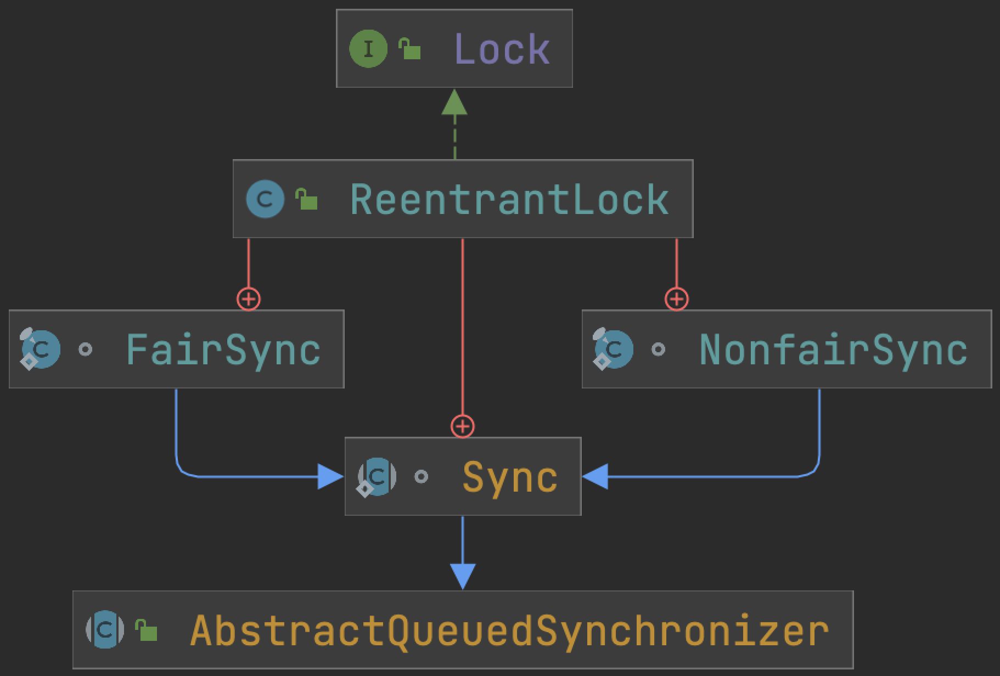
</p>

ReentrantLock 类内部总共存在Sync、NonfairSync、FairSync三个类，NonfairSync与 FairSync类继承自 Sync类，Sync类继承自 AbstractQueuedSynchronizer抽象类。
[ReentrantLock详解](https://blog.csdn.net/zhengzhaoyang122/article/details/110847701)

## AQS
AbstractQueuedSynchronizer，抽象队列同步器，使用原生java代码实现了并发访问控制语义，定义出一套多线程访问共享资源的同步器框架，提供原子式管理同步状态、阻塞和唤醒线程功能以及队列模型的简单框架。是整个JUC包的基石，Lock、ReadWriteLock、CountDownLatch、CyclicBarrier、Semaphore、ThreadPoolExecutor等都是在其基础上实现的。
**并发控制的核心是锁的获取与释放**，AQS核心思想是，如果被请求的共享资源空闲，那么就将当前请求资源的线程设置为有效的工作线程，将共享资源设置为锁定状态；如果共享资源被占用，就需要一定的阻塞等待唤醒机制来保证锁分配。这个机制主要用CLH队列的变体实现，将暂时获取不到锁的线程加入到队列中。

[从ReentrantLock的实现看AQS的原理及应用](https://tech.meituan.com/2019/12/05/aqs-theory-and-apply.html)

## ReentrantLock vs Synchronized
<p align = "left">

</p>

## CAS
乐观锁中，经常用到CAS，Compare And Swap，比较并替换，这是硬件/底层层面，而在java等语言层面的表述是 Compare And Set，一种无锁算法，如典型的Unsafe类、JUC很多同步类、以及原子类中的递增操作也是通过CAS自旋实现。
CAS机制使用3个基本操作数：内存地址V，旧的预期值A，要更新的值B：更新一个变量的时候，只有当变量的预期值A和内存地址V当中的实际值相同时，才会将内存地址V对应的值修改为B，这个过程在硬件层面保证是原子性的。

**缺点**：
* ABA问题；
* CPU开销较大，在高并发场景下，很多线程反复尝试更新某个变量，竞争过多，自旋会给CPU带来比较大的压力；
* 并不保证代码块的原子性，它只能保证一个变量的原子性，无法保证多个，不过这个问题可以转用AtomicReference，把多个变量封装在一个对象里：[举个例子](https://blog.csdn.net/weixin_42146366/article/details/87822781)


# volatile
关键字volatile可以被认为是jvm提供的最轻量级的同步机制。volatile变量在各个线程的工作内存中不存在一致性问题：在各个线程的工作内存中，volatile变量也可以存在不一致的情况，但由于每次使用之前都要先刷新，执行引擎看不到不一致的情况，因此可以认为不存在一致性问题。
当一个变量被定义为volatile后，它具备两个特性：
## 保证变量对所有线程可见
这里的“可见性”是指当一条线程修改了这个变量的值，新值对于其他线程来说是可以立即得知的。(回想普通变量，其值在线程间传递均需要通过主内存来完成，例如，线程 A 修改一个普通变量的值，然后向主内存进行回写，另外一条线程 B 在线程 A 回写完成了之后再从主内存进行读取操作，新变量值才会对线程 B 可见)。但可见性并不意味着线程安全，事实上，volatile 并不是线程安全的，它并不能保证操作符合原子性。所以在一些有依赖的运算中，仍然要通过加锁(使用 synchronized 或 java.util.concurrent 中的原子类)来保证原子性。
## 禁止指令重排序优化
普通变量仅保证在该方法的执行过程中所有依赖赋值结果的地方都能获取到正确的结果，而不保证变量赋值操作的顺序与程序代码中的执行顺序一致。而在一个线程的方法执行过程中无法感知到这点，这也就是 JMM 描述的所谓“线程内表现为串行的语义”(Within-Thread As-If-Serial Semantics)。
从硬件上讲，指令重排不是以指令顺序任意执行，而是CPU在正确处理**依赖情况**的前提下，可能会将没有依赖关系的指令(来自于代码汇编的字节码)不按程序中代码顺序分开发送给相应电路单元进行处理，并且保证在后续有对之前的操作结果有依赖的地方能够取到正确的值，这样从最终结果上看依然是像有序执行的结果；而有依赖关系的代码指令之间不能重排。
volatile能够禁止指令的重排优化，通过汇编代码可见，有volatile修饰的变量在执行操作后，会多执行一句“lock addl $0x0，(%esp)”指令(把 ESP 寄存器的值加 0，显然是一个空操作)，这相当于一道内存屏障使得指令重排序无法逾越，关键就在于其lock前缀，它的作用是使得本CPU的Cache写入内存，同时该写入动作会引起别的CPU或者别的内核无效化(Invalidate)其Cache，即相当于对Cache中的变量做了一次JMM中的“store和write”操作。所以通过这样一个空操作，可让volatile变量的修改对其他CPU立即可见。

## volatile vs lock
显然，volatile并不等同于安全的锁，它也无法在多线程中保证安全性，但在特定场景下依然能够提供“足够的安全性”且比锁(synchronized 关键字或 java.util.concurrent 包里面的锁)效率更高。但随着 jvm 对锁的各种优化策略的进步——锁消除、锁粗化等，已无法简单定量分析究竟孰优孰劣。而如果让 volatile 自身对比，那可以确定一个原则：volatile 变量读操作的性能消耗与普通变量几乎没有什么差别，但是写操作则可能会慢一些，因为它需要在本地代码中插入许多内存屏障指令来保证处理器不发生乱序执行。不过即便如此，大多数场景下volatile的总开销仍然要比锁低，我们在volatile与锁之中选择的唯一依据应该是**volatile的语义能否满足使用场景的需求**。
**使用场景(满足以下条件时使用)**
* 对变量的写操作不依赖变量的当前值或其他的变量，或者能确保只有单个线程更新变量值；
* 该变量不会与其他状态变量一起纳入不变性条件中；
* 在访问变量时不需要加锁。


# ThreadLocal
线程变量，ThreadLocal中的变量属于当前线程，对其他线程隔离，即当前线程独有。ThreadLocal为变量在每个线程中创建一个副本，每个线程访问自己内部的副本变量，所以不存在多线程间共享的问题，或者说它的提出就是为了解决这个问题。适用于每个线程需要独立的实例且该实例需要在多个方法中被使用，即变量在线程间隔离而在方法或类间共享的场景。

## 结构
每个Thread线程内部有一个ThreadLocalMap，Map里存储的是ThreadLocal对象的弱引用(key)和变量副本(value)，且Map是ThreadLocal的静态内部类，由ThreadLocal负责set()、get()，当前线程只能获取到自己的变量副本。
ThreadLocalMap的构成主要是Entry，用来保存数据，Entry内部使用ThreadLocal作为key，且是ThreadLocal的弱引用，但value是强引用。
<p align = "left">
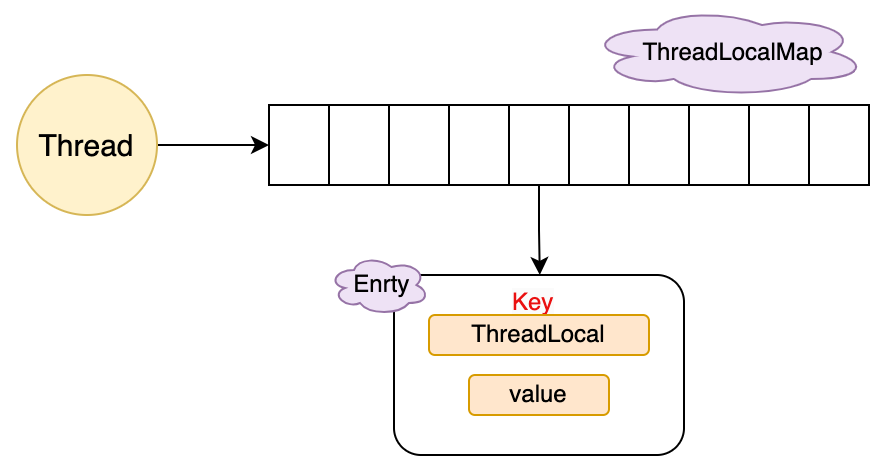
</p>


# GC
## GC roots 根对象
目前所有收集器在根节点枚举这一步骤时都是STW的。一般根节点包括：
* 当前活跃线程的栈桢里指向堆中对象的引用，即当前所有正在被调用方法的引用类型参数、局部变量等。
* 类的引用类型静态变量，这里指的是引用类型，像 int 等基本数据类型的静态变量肯定不能作为 GC Roots。
* 当前所有已被加载的Java类和类加载器。
* 所有被同步锁 ( synchronized关键字 ) 持有的对象引用。
* 在方法区中常量引用的对象，如字符串常量池里的引用。

## CMS
“Mostly Concurrenct Mark and Sweep Garbage Collector”（最大-并发-标记-清除-垃圾收集器），基于标记清除算法，分代的，以获取最短回收停顿时间为目标的收集器。

### 过程
1. 初始标记(CMS initial mark) STW，仅标记一下GC Roots能直接关联到的对象，速度很快；
2. 并发标记(CMS concurrent mark)，进行GC Roots Tracing的过程，在整个过程中耗时最长；
3. 重新标记(CMS remark) STW，为了修正并发标记期间因用户程序继续运作而导致标记产生变动的那一部分对象的标记记录，这个阶段的停顿时间一般会比初始标记阶段稍长一些，但远比并发标记的时间短；
4. 并发清除(CMS concurrent sweep)。

问题
* 对处理器资源非常敏感；
* 无法处理“浮动垃圾”；
* 空间碎片；

### 新生代
分为一个Eden区和两个Survivor区（分别叫From和To），大小占比8:1:1，Minor GC/Young GC，采用复制算法，GC过程：
* 初始状态，对象只存在于Eden区和From区，To是空的；
* GC开始，Eden区中所有存活的对象都会被复制到To，而在From区中，仍存活的对象会根据他们的年龄值来决定去向；
* 每次Minor GC，对象年龄+1，年龄达到一定值(年龄值可以通过-XX:MaxTenuringThreshold来设置，默认15)的对象会被移动到年老代中；
* 没有达到阈值的对象会被复制到To区；
* 然后，Eden区和From区清空；
* 此时From和To会交换角色，始终保持To Survivor为空；
* 新分配的对象直接在Eden区，注意，大对象会直接进入老年代，很长的字符串以及大数组；
* 重复这样的过程，直到To区被填满，To区被填满之后，会将所有对象移动到老年代中。

### 老年代
老年代GC(Major GC/Full GC)，速度一般会比Minor GC慢10倍以上。

4种情况对象进入老年代：
* 大对象直接进入老年代。通过-XX:PretenureSizeThreshold设置，要创建的对象大于这个参数值，比如分配一个大字节数组，此时就直接把这个大对象放到老年代；
* 长期存活的对象将进入老年代。通过-XX:MaxTenuringThreshold设置，默认15，最大也就这么大；
* 动态年龄判断。当前放对象的Survivor，一批对象的总大小大于这块Survivor内存的50%，那么大于等于这批对象最大年龄的对象，可以直接进入老年代。这个规则是希望那些可能是长期存活的对象，尽早进入老年代；
* 老年代空间分配担保机制。每次minor gc之前JVM会计算老年代剩余可用空间，如果这个可用空间小于年轻代里现有的所有对象大小之和(包括垃圾对象)，如果设置了“-XX:-HandlePromotionFailure”这个参数，就会看看老年代的可用内存大小，是否大于之前每一次minor gc后进入老年代的对象的平均大小。如果上一步结果是小于或者参数没有设置，那么就会触发一次Full gc，如果回收完还是没有足够空间存放新的对象就会发生"OOM"。当然，如果minor gc之后剩余存活的需要挪动到老年代的对象大小还是大于老年代可用空间，也会触发full gc，之后如果还是没有足够空间存放存活的对象，也会发生“OOM”。


## G1
### target
做出一款能够建立起“停顿时间模型”(Pause Prediction Model)的收集器。停顿时间模型是能够支持指定在一个长度为M毫秒的时间片段内，消耗在垃圾收集上的时间大概率不超过N毫秒这样的目标。G1并非纯粹追求低延迟，而是在延迟可控的情况下获得尽可能高的吞吐量。

### how
G1之前所有其他收集器，包括CMS在内，垃圾收集的目标范围要么是整个新生代(Minor GC)，要么就是整个老年代(Major GC)，再要么就是整个堆(Full GC)。而 G1 跳出了这个樊笼，它可以面向堆内存任何部分来组成回收集(Collection Set，简称 CSet)进行回收，衡量标准不再是它属于哪个分代，而是哪块内存中存放的垃圾
数量最多，回收收益最大，这就是 G1 的 Mixed GC 模式。
G1开创的基于 Region 的堆内存布局是它能够实现这个目标的关键。G1不再坚持固定大小以及固定数量的分代区域划分，而是把连续的堆划分为多个大小相等的独立区域(Region)，每一个 Region 都可以根据需要，扮演新生代的 Eden 空间、Survivor 空间，或者老年代空间，Region 也是单次回收的最小单元。收集器能够对扮演不同角色的 Region 采用不同的策略处理，这样无论是新创建的对象还是已经存活了一段时间、熬过多次收集的旧对象都能获取很好的收集效果。
具体处理思路是让 G1 跟踪各个 Region 里面的垃圾堆积的“价值”大小，价值即回收所获得的空间大小以及回收所需时间的经验值，然后在后台维护一个优先级列表，每次根据用户设定允许的收集停顿时间(使用参数-XX：MaxGCPauseMillis指定，默认 200 毫秒)，优先处理回收价值收益最大的那些 Region，这也就是“Garbage First”名字的由来。这种使用 Region 划分内存空间，以及具有优先级的区域回收方式，保证了 G1 收集器在有限的时间内获取尽可能高的收集效率。

1. 初始标记(Initial Marking) STW
2. 并发标记(Concurrent Marking)
3. 最终标记(Final Marking) STW
4. 筛选回收(Live Data Counting and Evacuation) STW

## ZGC
[基于可变大小Region的并发整理回收器](https://tech.meituan.com/2020/08/06/new-zgc-practice-in-meituan.html)
STW时间与堆容量、对象数量没有正比例关系。在可管理最大16T堆内存下实现停顿时间不超过1ms的目标。

### 内存多重映射
[内存多重映射](https://blog.csdn.net/cxyxysam/article/details/136565793)

### 读屏障(load barriers)
### 读屏障(store barriers)
### 染色指针


# 多线程
## 核心参数
<p align = "left">
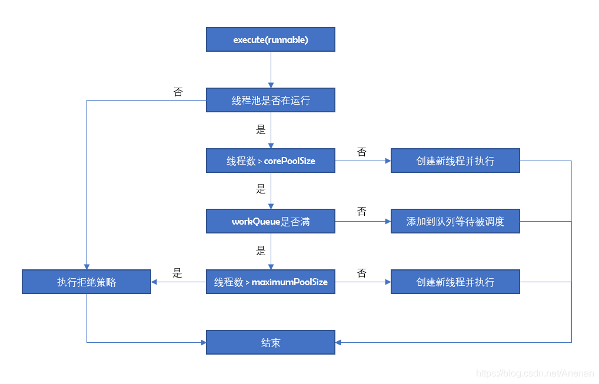
</p>

ThreadPoolExecutor类的构造方法共有7个参数：corePoolSize、maximumPoolSize、keepAliveTime、timeUnit、workQueue、threadFactory、handler，都通过volatile修饰
* corePoolSize：核心线程数
线程池维护的最小线程数量，核心线程创建后不会被回收，设置allowCoreThreadTimeout=true后，空闲的核心线程超过存活时间也会被回收。大于核心线程数的线程，在空闲时间超过keepAliveTime后会被回收。
* maximumPoolSize：最大线程数
当添加一个任务时，核心线程数已满，工作队列已满的情况下，线程池还没达到最大线程数，并且没有空闲线程，创建一个新线程并执行。
* keepAliveTime：空闲线程存活时间
当一个可被回收的线程的空闲时间大于keepAliveTime，就会被回收。
* timeUnit：时间单位 纳秒-天
* workQueue：工作队列
存放待执行任务的队列，实现了BlockingQueue接口。当提交的任务数超过核心线程数大小后，再提交的任务就存放在工作队列，任务调度时再从队列中取出任务，仅用来存放被execute()方法提交的Runnable任务。jdk 5种工作队列：
    * ArrayBlockingQueue 数组型阻塞队列：数组结构，初始化时传入大小，有界，FIFO，使用一个重入锁，默认使用非公平锁，入队和出队共用一个锁，互斥；
    * LinkedBlockingQueue 链表型阻塞队列：链表结构，默认初始化大小为Integer.MAX_VALUE，有界(近似无解)，FIFO，使用两个重入锁分别控制元素的入队和出队，用Condition进行线程间的唤醒和等待；
    * SynchronousQueue 同步队列：容量为0，添加任务必须等待取出任务，这个队列相当于通道，不存储元素；
    * PriorityBlockingQueue 优先阻塞队列：无界，默认采用元素自然顺序升序排列；
    * DelayQueue 延时队列：无界，元素有过期时间，过期的元素才能被取出。
* threadFactory：线程工厂 创建线程的工厂，可以设定线程名、线程编号等
* handler：拒绝策略
当线程池线程数已满，并且工作队列达到限制，新提交的任务使用拒绝策略处理。可以自定义拒绝策略，拒绝策略需要实现RejectedExecutionHandler接口。jdk 4种拒绝策略：
    * AbortPolicy：丢弃任务并抛出RejectedExecutionException异常；
    * DiscardPolicy：丢弃任务，但是不抛出异常。可能导致无法发现系统的异常状态；
    * DiscardOldestPolicy：丢弃队列最前面的任务，然后重新提交被拒绝的任务；
    * CallerRunsPolicy：由调用线程处理该任务。


# Proxy 代理
为其他对象提供一种代理以控制对该对象的访问。
可以简单理解成“中介”。代理模式可以在不修改被代理对象的基础上，通过扩展代理类，控制被代理对象的访问，也可以为代理类添加新的操作/行为。这在 AOP 中经常见到。一般使用工厂模式实现代理，这样可以将代理包装等操作实现封装在工厂的实现中。
主要分为静态代理和动态代理两种，二者在功能上没有区别，这个划分依据是字节码的创建时机，前者在程序运行前就已经存在代理类的字节码文件，代理类和目标类的关系在运行前就确定了；后者的源码是在程序运行期间由JVM通过反射等机制动态生成的，在运行前并不存在代理类的字节码文件。
要和“装饰者模式”区别开，装饰者模式是 **为对象增加行为**，代理模式是 **控制对象的访问**；同时和“适配器模式”的区别是：适配器会改变对象的接口，而代理使用相同的接口(业务接口不变)。

## jdk静态代理
一般是代理对象包装被代理对象。所谓静态，是指代理对象和目标对象都实现了相同的接口：
<details>
  <summary>静态代理步骤</summary>

1. 定义业务接口
```java
public interface HelloService {
    String hi(String msg);
}
```
2. 实现业务接口
```java
public class HelloServiceImpl implements HelloService{
    @Override
    public String hi(String msg) {
        return "Hi, " + msg;
    }
}
```
3. 定义代理类并实现业务接口
```java
public class HelloServiceProxy implements HelloService {
    private HelloService helloService;

    public HelloServiceProxy(HelloService helloService) {
        this.helloService = helloService;
    }

    @Override
    public String hi(String msg) {
        System.out.println("预处理...");
        String result = helloService.hi(msg);
        System.out.println("后处理...");
        return result;
    }
}
```
</details>

## jdk动态代理
使用JDK API，动态地在JVM中构建出一个代理对象，底层是反射机制，封装了实现细节，格式固定，直接调用 java.lang.reflect.Proxy静态方法 newProxyInstance即可
限制在于，被代理的对象必须实现一个或多个接口，这是java语言本身决定的：java只支持单继承，而代理类本身已经继承了Proxy类，因此只能通过实现(被代理对象也实现了的)接口的方式。
<details>
  <summary>动态代理</summary>

```java
// 生成代理类的class对象
Class<?> clazz = Proxy.getProxyClass(helloService.getClass().getClassLoader(), helloService.getClass().getInterfaces());
// 创建InvocationHandler
InvocationHandler myInvocationHandler = new MyInvocationHandler(helloService);
// 获取代理类的构造器对象
Constructor constructor = clazz.getConstructor(new Class[] {InvocationHandler.class});
// 反射创建代理对象
HelloService proxy = (HelloService)constructor.newInstance(myInvocationHandler);

// 或一步到位
HelloService proxy = (HelloService)Proxy.newProxyInstance(HelloService.class.getClassLoader(),
helloService.getClass().getInterfaces(), new MyInvocationHandler(helloService));

```
</details>

## cglib动态代理
如果某个类原本就没有实现任何接口，可以考虑cglib代理。它通过继承被代理的类，并覆写方法的方式，这就意味着，cglib不能代理final修饰的类。
CGlib是一个强大的高性能的代码生成包，它可以在运行期扩展Java类与实现Java接口。底层采用ASM字节码生成框架，使用字节码技术生成代理类，比使用 Java 反射效率要高。
[cglib demo](https://blog.csdn.net/sco5282/article/details/121866799)

## 对比
* 静态代理实现较简单，只要代理对象对目标对象进行包装，即可实现增强功能，但静态代理只能为一个目标对象服务，如果目标对象过多，则会产生很多代理类。
* 静态代理在编译时产生class字节码文件，可以直接使用，效率高。
* 动态代理必须实现InvocationHandler接口，通过反射代理方法，比较消耗系统性能，但可以减少代理类的数量，使用更灵活。
* cglib代理无需实现接口，通过生成类字节码实现代理，比反射稍快，不存在性能问题，但cglib会继承目标对象，重写方法，所以目标对象不能为final类。

## spring AOP与代理
Spring AOP是基于动态代理实现的，包括jdk动态代理和cglib代理：如果目标对象有接口，默认用JDK动态代理；也可以通过配置(@EnableAspectJAutoProxy(proxyTargetClass = true)强制使用CGlib代理；如果目标对象没有实现接口，必须采用CGlib代理。
1. 在切面定义的类上加上@Aspect的注解，通过@Pointcut注解来申明“切点”，这个切点即标注了委托类和委托方法的路径(也可以是方法名匹配、注解匹配等)；
2. 有了这些信息就足够获取委托类，这里用到Java反射，先找到包含@Aspect注解的类，然后找到该类下的@Pointcut注解，读取所定义的委托类和委托方法路径，就完全能拿到委托类对象；
3. 因为Spring AOP只代理目标方法，这里的代理类可以被替换成代理方法；在@Aspect注解的切面定义类中，用@Around、@Before、@After修饰的方法，就是我们想要的代理方法；
4. 通过BeanFactoryPostProcessor的实现类，完成对所有BeanDefinition的扫描，找出我们定义的所有的切面类，然后循环里面的方法，找到切点、以及所有的通知方法，然后根据注解判断通知类型(也就是前置，后置还是环绕)，最后解析切点的内容，扫描出所有的目标类；这样就获取了委托类和代理方法；
5. 在Bean的生命周期中，Bean加载执行到初始化方法initializeBean()时，会执行BeanPostProcessor的方法；可以把它理解成一个增强方法，可以将原始的Bean经过“增强”处理后加载到IOC容器中；正是在此处通过原委托类的对象生成其代理类对象，再将代理对象加载进IOC容器。


# JVM
## 字节码

## 类加载
JVM 把 class 文件加载到内存，并对数据进行校验、转换解析和初始化的过程。
加载、连接和初始化过程都是在程序运行期间完成的，这种策略为应用程序提供了高度的灵活性。
细化的过程如下，其中，验证、准备、解析3部分统称为连接。加载、验证、准备、初始化、卸载这 5 个阶段的顺序是确定的(并非串行，通常是交叉混合式进行，只是开始执行的顺序是确定的)，而解析在某些情况下可能在初始化阶段之后再开始：为了支持 java 的运行时绑定(也称动态绑定/晚期绑定)。
<p align = "left">
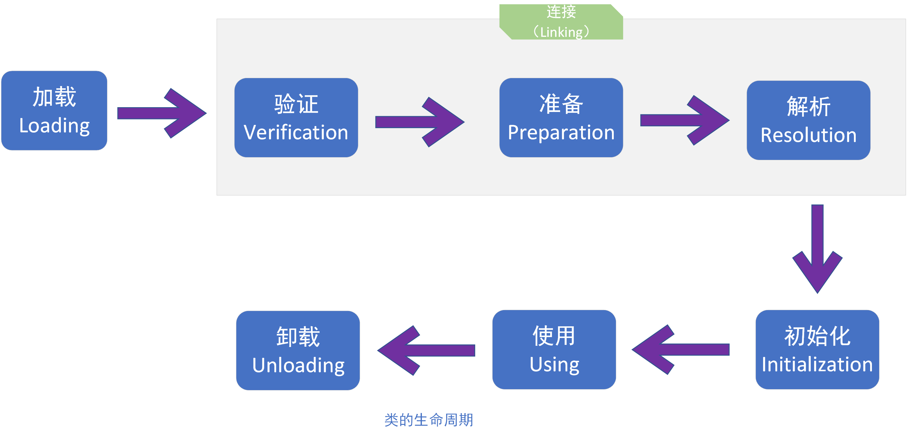
</p>

**加载**
“类加载(Class Loading)”的一个阶段，jvms 要求这一阶段需要完成以下工作：
1. 通过一个类的全限定名来获取定义此类的二进制字节流；
2. 将这个字节流所代表的静态存储结构转化为方法区的运行时数据结构；
3. 在内存中生成一个代表这个类的 java.lang.Class 对象，作为方法区这个类的各种数据的访问入口。

该阶段用户应用程序可以通过自定义类加载器参与，类加载其余过程由 JVM 主导并控制。

**验证**
为确保 class 文件的字节流中包含的信息符合当前 JVM 的要求，并且不会危害 JVM 自身的安全。是连接阶段的第一步。
主要包括：
1. 文件格式验证，魔数、版本、常量池中常量是否被支持、是否含有 utf-8 以外的编码格式...
2. 元数据验证，对字节码描述信息进行语义分析校验，可能包括：该类是否有父类；父类是否继承了不允许继承的类(final 修饰的类)；如果不是抽象类，是否实现了父类/接口必须实现的所有方法；字段、方法是否与父类产生矛盾...
3. 字节码验证，最复杂的验证阶段：通过数据流和控制流分析，确保程序语义合法、合乎逻辑；
4. 符号引用验证，JVM 将符号引用转化为直接引用，该校验发生在解析阶段。

**准备**
正式为类变量分配内存并设置类变量初始值(一般就是零值)，这些变量所使用的内存都在方法区中分配：仅包括类变量(static 修饰)而不包括实例变量，实例变量将在对象实例化时随着对象一起分配在 java 堆中。

**解析**
JVM 将常量池内的符号引用替换为直接引用的过程。解析阶段的两者含义：
* 符号引用(Symbolic References)：以一组符号来描述所引用的目标，符号可以是任何形式的字面量，只要使用时能无歧义地定位到目标即可。符号引用与虚拟机实现的内存布局无关，引用的目标并不一定已经加载到内存中。各种虚拟机实现的内存布局可以各不相同，但是它们能接受的符号引用必须都是一致的，因为符号引用的字面量形式明确定义在Java虚拟机规范的Class文件格式中。
* 可以是直接指向目标的指针、相对偏移量或是一个能间接定位到目标的句柄。直接引用是和虚拟机实现的内存布局相关的，同一个符号引用在不同虚拟机实例上翻译出来的直接引用一般不会相同。如果有了直接引用，那引用的目标必定已经在内存中存在。

**初始化(类初始化)**
类加载过程的最后一步。准备阶段已经为类变量赋了零值，这一步是执行类构造器<clinit\>()方法，执行static域代码(静态类变量显式赋值代码和静态代码块)：
1. 编译器会在将 .java 文件编译成 .class 文件时，收集所有类初始化代码和 static {} 域的代码，收集在一起成为 <clinit\>() 方法；
2. 子类初始化时会首先调用父类的 <clinit\>() 方法；
3. JVM 会保证 <clinit\>() 方法的线程安全，保证同一时间只有一个线程执行；

注意，这里仅指类的初始化，跟实例的初始化阶段不是一回事。jvms 规定了 5 种情况下，才能对类立即进行“初始化”：
* 遇到 new、getstatic、putstatic、invokestatic 这4条字节码指令时，如果类没有进行过初始化，则先触发其初始化。常见场景是：使用 new 关键字实例化对象、读取或设置一个类的静态字段(被final修饰、已在编译期把结果放入常量池的静态字段除外)、调用一个类的静态方法；
* 使用 java.lang.reflect 包的方法对类进行反射调用时，如果类没有进行过初始化，则先触发其初始化；
* 初始化一个类时，如果发现其父类没有进行过初始化，则先触发其父类的初始化；
* JVM 启动时，用户需要指定一个要执行的主类，JVM 会先初始化该主类；
* 使用JDK 1.7+ 的动态语言支持时，如果一个 java.lang.invoke.MethodHandle 实例最后的解析结果是 REF_getStatic、REF_putStatic、REF_invokeStatic 的方法句柄，并且这个方法句柄所对应的类没有进行过初始化，则先触发其初始化。

## 实例化
一个对象在可以被使用之前必须要被正确地初始化，一个Java对象的创建过程包括初始化和实例化两个阶段。在实例化一个对象时，JVM首先会检查相关类是否已经加载并初始化，如果没有，则JVM立即进行加载并调用类构造器完成类的初始化。在类初始化过程中或初始化完毕后，根据具体情况对类进行实例化。

所谓的实例化，以下面一行代码为例：
```Demo demo = new Demo();```
这条语句的动作就是创建一个对象，也就是实例化，它包含四个动作：
1. 右边的```new Demo```，是以Demo类为模板，在堆空间里创建一个Demo类对象(也简称为Demo对象)；
2. 末尾的```()```意味着，在对象创建后，立即调用Demo类的构造函数，对刚生成的对象进行初始化；
3. 左边的```Demo demo```创建了一个Demo类引用变量，所谓Demo类引用，就是以后可以用来指向Demo对象的对象引用。
4. ```=```操作符使对象引用指向刚创建的那个Demo对象。

## 类加载器
类加载器(Class Loader)是 java 语言的一项创新。在类加载的第一阶段“加载”过程中，需要通过 **类的全限定名** 来获取定义此类的二进制字节流，完成这个操作的模块就是 **类加载器**。这一操作是在 JVM 外部实现的，以便让应用程序自己(开发者)决定如何获取所需的类。jvms 并没有指明类的二进制字节流要从一个 class 文件获取，也没有指明从哪里获取、怎样获取。这种开放使得 java 在许多领域得到充分利用，目前有以下常用方式获取字节流：
* 从 zip 包中读取：jar，ear，war 等；
* 从网络中获取，最典型的应用就是 Applet；
* 运行时计算生成，最典型的是动态代理技术，在 java.lang.reflect.Proxy 中，就是用了 ProxyGenerator.generateProxyClass 来为特定接口生成形式为 “*$Proxy” 的代理类的二进制字节流；
* 由其他文件生成，最典型的 jsp 应用，由 jsp 文件生成对应的 Class 类，etc.

### 分类
从开发人员角度看，一般分为以下 3 种系统提供的类加载器
* 启动类加载器(Bootstrap ClassLoader)：C++ 实现，负责将 <JAVA_HOME>\lib 目录中或被 -Xbootclasspath 参数所指定的路径中的类库加载到 JVM 内存中，这些类库必须能够被 JVM 识别(仅按照文件名识别，如 tr.jar，名称不符合的类库不会被加载)。
* 扩展类加载器(Extension ClassLoader)：这个加载器由 sun.misc.Launcher $ExtClassLoader 实现，它负责加载<JAVA_HOME>\lib\ext目录中的，或者被 java.ext.dirs 系统变量所指定的路径中的所有类库，开发者可以直接使用扩展类加载器；
* 应用程序类加载器(Application ClassLoader)：这个类加载器由 sun.misc.Launcher $App-ClassLoader 实现。这个类加载器是 ClassLoader 中的 getSystemClassLoader() 的返回值(所以也称它为系统类加载器)。它负责加载用户类路径(ClassPath)上所指定的类库，开发者可以直接使用这个类加载器。如果应用程序中没有自定义类加载器，一般情况下它就是默认类加载器。
* 自定义类加载器(User ClassLoader)：

### 双亲委派模型
所谓类加载器双亲委派模型指的是 **类加载器之间的层次关系**。要求除了顶层的启动类加载器之外，其余的类加载器都应有自己的父加载器。类加载器之间的父子关系一般不会以继承关系(Inheritance)来实现，而是使用组合(Composition)关系来复用父加载器的代码。
<p align = "left">
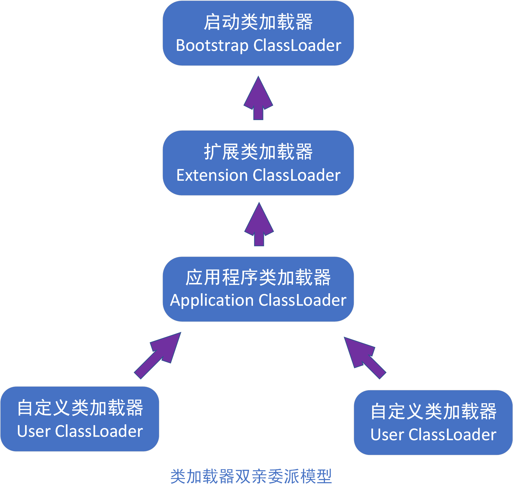
</p>

**工作过程**
如果一个类收到了类加载的请求，它首先不会自己尝试加载这个类，而是把这个请求委派给父加载器去完成，每一个层次的类加载器都是如此。因此所有的加载请求最终都应该传送到顶层的启动类加载器中，只有当父加载器反馈自己无法完成该加载请求(其搜索内没有找到所需的类)时，子类加载器才会尝试自己去加载。即搜索是从顶层加载器到发出加载请求的加载器各自维护的搜索范围依次进行搜索的。
实现双亲委派模型的代码集中在 java.lang.ClassLoader 的 loadClass() 中，具体流程：先检查是否已经加载过该类，若没有，则调用父加载器的 loadClass()，若父加载器为 null，则默认使用启动类加载器作为父加载器。如果父加载器加载失败，抛出 ClassNotFoundException 后，调用自身 findClass() 进行加载。
<p align = "left">
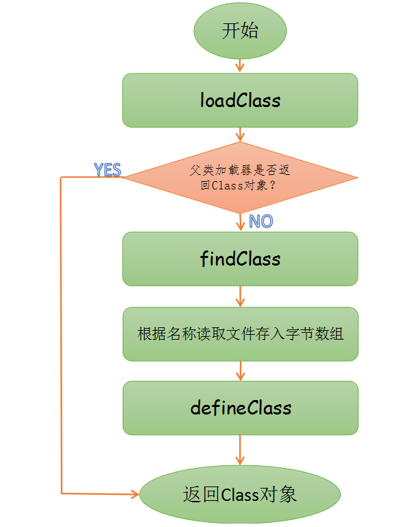
</p>

**意义**
java 类随着它的类加载器一起，具备了一种带有优先级的层次关系。例如 java.lang.Object 类，它存放在 rt.jar 中，无论哪个类加载器请求加载这个类，最终都是委派给处于模型顶层的启动类加载器进行加载，因此 Object 类在程序的各种类加载器环境中都是同一个类。相对地，如果不使用双亲委派模型，而是由各个类加载器自行加载请求类的话，如果开发者编写了一个名为 java.lang.Object 的类，并把它放在程序的 ClassPath 中，那么系统将会出现多个不同的 Object 类，这会导致 java 类型体系中最基础的行为也无法保证，应用程序也将变得非常混乱。
内存模型中，判断一个对象是否为某个类型时，前提是比较对象与被比较对象都来自同一个类加载器，否则没有对比的意义——返回 false。

**打破**
双亲委派模型只是一个推荐实现，而非强制约束，这就意味着有可能(有意/无意)不被遵循。
[两类打破场景](https://juejin.cn/post/7090932342012772389)
Tomcat

JDBC


# JMM
jvms定义的[java内存模型(Java Memory Model，JMM)](https://mp.weixin.qq.com/s/ME_rVwhstQ7FGLPVcfpugQ)
试图屏蔽掉各种硬件和OS的内存访问差异，以实现让java程序在各种平台下都能达到一致的内存访问效果。
为保证共享内存的正确性(原子性、可见性、有序性)，内存模型定义了共享内存系统中多线程读写规范。其解决并发问题主要采用两种方式：限制处理器优化和使用内存屏障。

## 背景
目前，CPU的运算速度比计算机存储设备有几个数量级的差距，所以现代计算机都有一层(三层)读写速度尽可能接近处理器的高速缓存来作为内存与处理器之间的缓冲：将运算需要使用到的数据复制到缓存中，让运算能快速进行，当运算结束后再从缓存同步回内存之中，这样处理器就无须等待缓慢的内存读写了。
基于高速缓存的存储交互很好地解决了处理器与内存之间的矛盾，但也为计算机体系架构设计带来了更高的复杂度，因为引入了一个新的问题：缓存一致性(Cache Coherence)：
在多处理器系统中，每个处理器都有自己的高速缓存，而它们又共享同一主存(Main Memory)，当多个处理器的运算任务都涉及到同一块主内存区域时，将可能导致各自的缓存数据不一致，此时，同步回主存的数据以谁为准呢？
为解决这种不一致，需要各个处理器访问缓存时都遵循一些协议来保证读写操作的正确性。这类协议有 MSI、MESI、MOSI、Synapse、Firefly、Dragon Protocol 等。而 **内存模型**，即可以理解为在特定的操作协议下，对特定的内存/高速缓存进行读写访问的过程抽象。
不同架构的物理机器可以有不同的内存模型，JVM 拥有自己的内存模型。
<p align = "left">
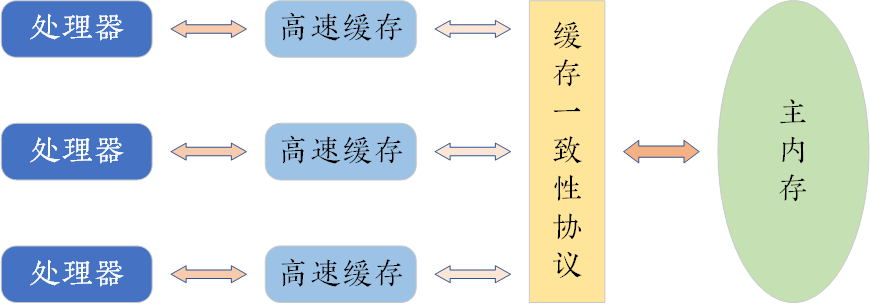
</p>

JMM规定了所有的变量都存储在主内存(Main Memory)中(此处的主内存与上述物理硬件的主内存名字一样，两者也可以互相类比，但此处仅是jvm内存的一部分)。每条线程还有自己的工作内存(Working Memory，可与前面讲的处理器高速缓存类比)，线程的工作内存中保存了被该线程使用到的变量的主内存副本拷贝，线程对变量的所有操作(读取、赋值等)都必须在工作内存中进行，而不能直接读写主内存中的变量。不同的线程之间也无法直接访问对方工作内存中的变量，线程间变量值的传递均需要通过主内存来完成。
<p align = "left">
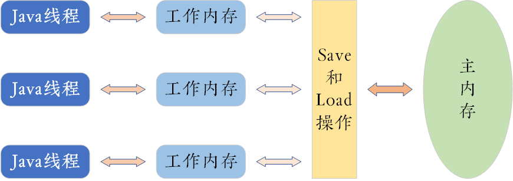
</p>

这里的主内存、工作内存，和java内存区域中的 堆、栈、方法区等并不是同一个层次的内存划分，这两者基本上是没有关系的，如果两者一定要勉强对应起来，那从变量、主内存、工作内存的定义来看，主内存主要对应于java堆中的对象实例数据部分，而工作内存则对应于虚拟机栈中的部分区域。从更低层次上说，主内存就直接对应于物理硬件的内存，而为了获取更好的运行速度，虚拟机(甚至是硬件系统本身的优化措施)可能会让工作内存优先存储于寄存器和高速缓存中，因为程序运行时主要访问读写的是工作内存。

## 原子性 Atomicity
JMM保证基本数据类型(64位的姑且也可以包含在内)的读写访问(read、load、assign、use、store、write)具备原子性。如果场景需要更大范围的原子性保证(经常发生)，JMM提供lock、unlock操作来满足这种需求。JVM并没有把这两个操作直接暴露给用户，而是提供了更高层次的字节码指令：monitorenter 和 monitorexit来隐式使用这两个操作。这两个字节码指令反映到java代码中就是同步块——synchronized关键字，因此在synchronized块之间的操作也具备原子性。

## 可见性 Visibility
当一个线程修改了共享变量的值，其他线程能够立即得知这个修改。**JMM通过在变量修改后将新值同步回主内存，在变量读取前从主内存刷新变量值这种依赖主内存作为传递媒介的方式来实现可见性**。无论普通变量还是 volatile 变量都是如此，不同在于：volatile 的特殊规则保证了新值能够立即同步到主内存并且每次使用前立即从主内存刷新，从而保证了多线程操作中变量的可见性。
除了 volatile 之外，synchronized 和 final也能保证可见性。同步块的可见性由“对一个变量执行 unlock 操作之前，必须把它同步回主内存中(执行 store、write 操作)”这条规则获得的；而 final 关键字的可见性是指：被 final 修饰的字段在构造器中一旦初始化完成，并且构造器没有把“this”的引用传递出去(this 引用逃逸是危险操作，其他线程有可能通过这个引用访问到”初始化了一半”的对象)，那么在其他线程中就能看见 final 字段的值，并且无须同步就能被线程正确访问。

## 有序性 Ordering
如果在本线程观察，所有的操作都是有序的；如果在一个线程中观察另一个线程，所有的操作都是无序的。前半句是指“线程内表现为串行的语义(Within-Thread As-If-Serial Semantics)”，后半句是指“指令重排序”现象和“工作内存与主内存同步延迟”现象。这是 java 程序中天然的有序性。
java 语言提供了 volatile 和 synchronized 关键字来保证线程之间操作的有序性，volatile 本身就包含了禁止对指令重排序的语义，而 synchronized 由“一个变量在同一个时刻只允许一条线程对其进行 lock 操作”这条规则获得有序性保证——该规则决定了持有同一个锁的两个同步块只能串行地进入。

可见，synchronized 关键字在需要以上3种特性的时候都可以作为一种解决方案，事实上也是如此：大部分并发控制操作都可以使用它来完成。但滥用以及本可以考虑其他更优的方式而仍然选择使用synchronized，也将导致性能和效率的不同程度降低。

## 重排序问题
为处理器内部运算单元尽量被充分利用，处理器可能会对输入代码进行乱序执行(Out-of-Order Execution)优化，处理器会在计算之后将乱序执行的结果重组，保证该结果与顺序执行的结果是一致的，但**不保证程序中各个语句计算的先后顺序与输入代码中的顺序一致**。因此，如果存在一个计算任务依赖另外一个计算任务的中间结果，那么其顺序性并不能靠代码的先后顺序来保证。与处理器的乱序执行优化类似，jvm的即时编译器也有类似的指令重排优化。

## Happen-Before 原则
先行发生原则，JMM 定义的两项操作之间的偏序关系，是判断数据是否存在竞争、线程是否安全的主要依据：如果操作 A 先行发生于操作 B，i.e. 操作 A 发生在操作 B 之前，那么操作 A 产生的影响(应该保证)能被操作 B 观察到，“影响”包括修改了共享内存中变量的值、发送了消息、调用了方法等。
以下为 JMM 天然存在的 Happen-Before 关系，这些先行发生关系无须任何同步器协助就能正常执行，即在编码过程中直接使用，并且如果两个操作之间的关系不在下述范围之列，或者无法从下述条目推导得出，那么它们就没有顺序性保证，jvm 就可以对它们进行重排序：
* 程序次序规则(Program Order Rule)：在一个线程内，按照程序代码顺序，书写在前面的操作先行发生于书写在后面的操作(更准确的说法是控制流顺序而不是代码顺序，因为有分支、循环等结构)；
* 监视器锁规则(Monitor Lock Rule)：一个 unlock 操作先行发生于后面对同一个锁的 lock 操作。这里强调同一个锁，而“后面”是指时间上的先后顺序；
* volatile 变量规则(Volatile Variable Rule)：对一个 volatile 变量的写操作先行发生于后面对这个变量的读操作。这里的“后面”同样是指时间上的先后顺序；
* 传递性(Transitivity)：如果操作 A 先行发生于操作 B，操作 B 先行发生于操作 C，那么可以得出结论：操作 A 先行发生于 操作 C。
* 线程启动规则(Thread Start Rule)：Thread 对象的 start() 方法先行于此线程的每一个动作；
* 线程终止规则(Thread Termination Rule)：线程中的所有操作都先行发生于对此线程的终止检测，可以通过 Thread.join()方法的结束、Thread.isAlive()的返回值等手段检测到线程是否已经终止；
* 线程中断规则(Thread Interruption Rule)：对线程 interrupt()方法的调用先行发生于被中断线程的代码检测到中断事件的发生，可以通过 Thread.interrupted()方法检测到线程是否有中断发生；
* 对象终结规则(Finalizer Rule)：一个对象的初始化完成(构造函数执行结束)先行发生于它的 finalize()方法的开始；

可以根据以上规则判定一段代码是否可以保持线程安全，即是否需要采取线程安全的措施。


# 类文件结构
**各种不同平台的 VM 与所有平台统一使用的程序存储格式——字节码(ByteCode)是构成平台无关性的基石。**
然而，VM 的目标显然不止于平台无关，其语言无关性也同样在发展：目前已经有 Groovy、Jython、JRuby、Scala 等语言同样能够运行在 JVM 上。而实现语言无关性的基础仍然是 VM 和字节码存储格式。JVM 不和包括 java 在内的任何语言绑定，它只和“class 文件”这种特定格式的二进制文件格式所关联，其中包含了 JVM 指令集和符号表以及若干其他辅助信息。任何其他语言同样可以使用合适的编译器将其代码编译为 class 文件从而在 JVM 上执行，JVM 本身不关心 class 文件来源于何种语言——只要该 class 文件符合 jvms 的语法和结构化约束即可。
字节码所能提供的语义描述能力强于 java 语言。

**class 类文件的结构/字节码**
<p align = "left">
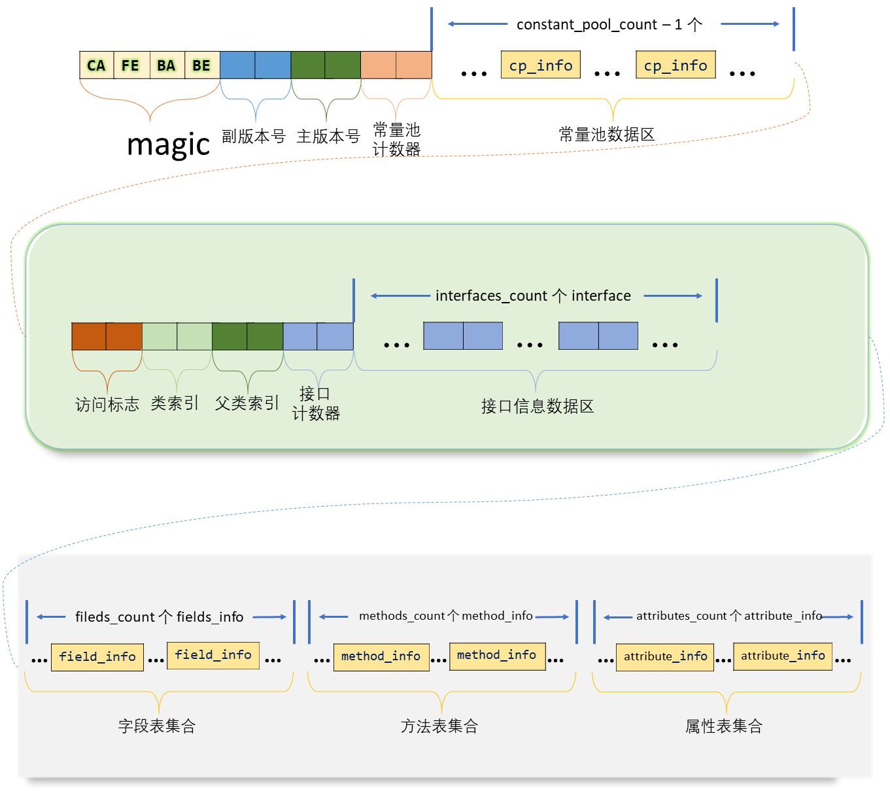
</p>

以 8-byte 为单位紧凑排列，大端字节序方式，不含任何分隔符，格式是严格定义的：数据项顺序、数量，字节序，哪个字节代表什么含义等等，都不允许改变。
文件格式采用类似于 C 语言结构体的伪结构，只含有两种数据类型：**无符号数和表**。
* 无符号数：基本数据类型，以 u1、u2、u4、u8 表示 1/2/4/8 个字节的无符号数。可以用来描述数字、索引引用、数量值或按照 UTF-8 编码构成字符串值；
* 表是由多个无符号数或其他表作为数据项构成的复合数据类型。所有表习惯性以“\_info”结尾。用于描述有层次关系的复合结构的数据。整个 class 文件本质上就是一张表。数据项：
<p align = "left">
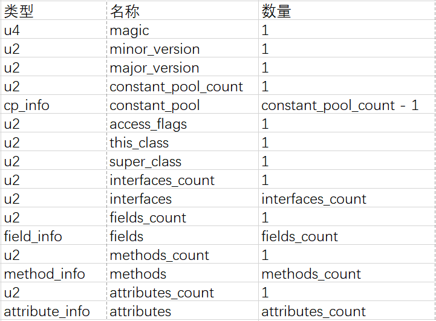
</p>

无论是无符号数还是表，当需要描述同一类型但数量不定的多个数据时，经常使用一个前置的容量计数器加若干个连续的数据项的形式，这时称这一系列连续的某一类型的数据为某一类型的集合。

## 魔数与 class 文件版本
每个 class 文件前 4 个字节称为魔数(Magic Number)，唯一作用是确定该文件是不是一个能被 JVM 接受的 class 文件。_很多文件存储标准中都是用魔数进行身份识别，如图片格式(gif、jpeg等都在头文件中存有魔数)，魔数值可以由文件制定者自由选取，但要避免引起混淆_。使用魔数而非扩展名是基于安全性方面的考虑：扩展名可随意改动。class 文件的魔数值为：0xCAFEBABE(咖啡宝贝？)，这个值在 java 还称作“Oak”语言的时候(1991年前后)就已经确定下来了。
紧接着魔数的 4 个字节存储的是 class 文件的版本号：5~6 字节是次版本号(Minor Version)，7~8 字节是主版本号(Major Version)。Java 的版本号是从 45 开始的(JDK 1.xxx 为 45.xxx，而 JDK 1.8 为 52.xxx)，JDK 1.1 之后的每个 JDK 大版本发布时，主版本号向上 +1(JDK 1.0~1.1 使用了 45.0~45.3 的版本号)，高版本的 JDK 能向下兼容以前版本的 class 文件，但不能运行以后版本的 class 文件，即使文件格式未发生任何变化，JVM 也必须拒绝执行超过其版本号的 class 文件。

## 常量池(Constant Pool)
紧接着主次版本号之后的是常量池入口，常量池可以理解为 class 文件中的资源仓库，是 class 文件结构中与其他项目关联最多的数据类型，也是占用 class 文件空间最大的数据项之一，也是 class 文件中第一个出现的表类型数据项目。
与 java 语言习惯不一样的是，常量池的容量计数器是从 1 而不是 0 开始的：为了满足某些索引在特定情况下需要表达“不引用任何一个常量池项目”的含义时，可以将索引值置 0。故总数量为 计数器值 - 1。class 文件中只有常量池的容量计数器是从 1 开始的。
常量池主要存放两大类常量：
* 字面量(Literal)：接近于 java 语言层面的常量概念，如文本字符串、声明为 final 的常量值等；
* 符号引用(Symbolic References)：属于编译原理方面的概念，包含以下 3 类常量：
> 类和接口的全限定名(Fully Qualified Name)
> 字段的名称和描述符(Descriptor)
> 方法的名称和描述符

class 文件中不保存各个方法、字段的内存布局信息，当 JVM 运行时，需要从常量池获取对应的符号引用，再在类创建时或运行时解析、翻译到具体的内存地址中。

常量池中每一项常量都是一个表。目前(JDK1.8)共有 14 种结构各异的表数据结构(有 3 种新增于 JDK1.7，为更好地支持动态语言调用)。
<p align = "left">
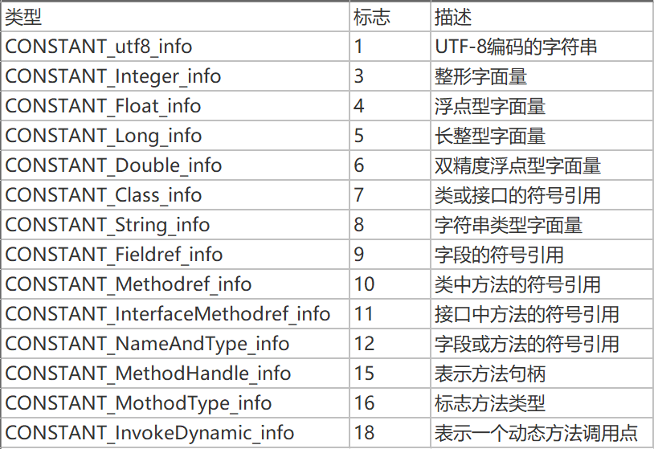
</p>

这 14 种 表都有一个共同特点：起始位置的 u1 标志位，代表当前这个常量属于哪种常量类型。每种常量项目的结构表如下：
<p align = "left">
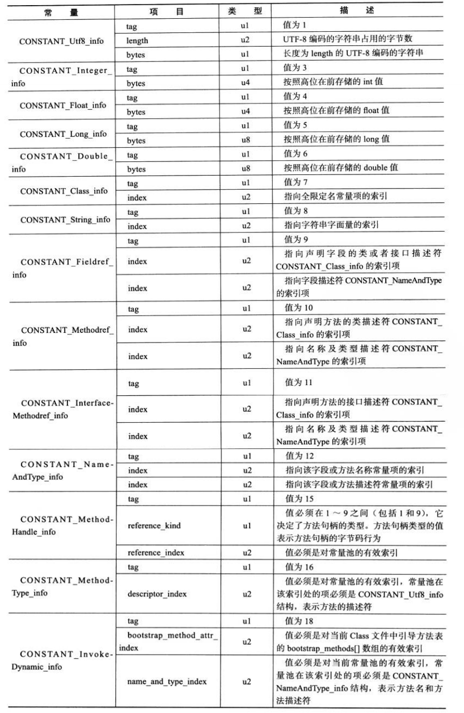
</p>

## 访问标志(Access flags)
常量池结束之后，紧接着的是 2 字节的访问标志，用于识别一些类或者接口层次的访问信息，包括：这个 Class 是类还是接口；是否定义为 public 类型；是否定义为 abstract 类型；如果是类的话，是否被声明为 final 等。当前已使用了 8 位，其余位置 0：
<p align = "left">
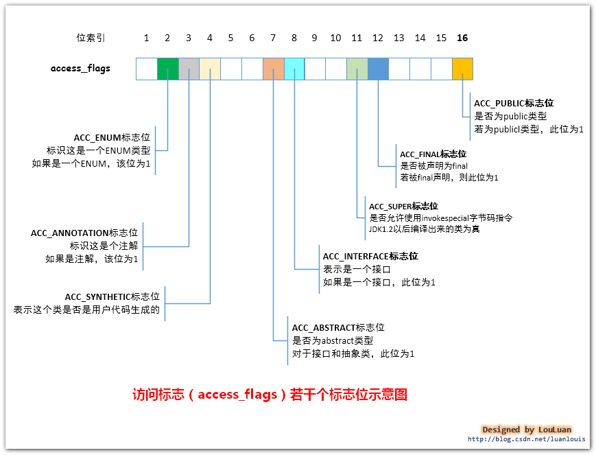
</p>

## 类索引 父类索引 接口索引集合
类索引(this_class)、父类索引(super_class)是 2 字节，各自指向一个类型为 CONSTANT_Class_info 的类描述符常量；接口索引集合(interfaces)是一组 2 字节类型的数据的集合，入口是 u2 类型的接口计数器，如果该类没有实现任何接口，则置 0，后面的接口索引表不再占用任何字节。
这 3 项数据用来确定这个类的继承关系：
* 类索引：确定该类的全限定名；
* 父类索引：确定该类的父类的全限定名(java 不允许多继承，故只有一个，除了 Object 类，其余都有父类)；
* 接口索引集合：描述该类实现了哪些接口，按 implements(如果这个类本身是接口，则是 extends)语句后的接口顺序排列。

## 字段表(field_info)集合
用于描述接口/类中声明的变量。字段包括类级变量和实例级变量，但不包括在方法内部声明的局部变量。一个字段可以包括的信息有：字段的作用域(public、private、protected)，实例变量还是类变量(static)，可变性(final)，并发可见性(volatile，是否强制从主内存读写)，可否被序列化(transient)，字段数据类型(基本类型、对象、数组)、字段名称。字段表结构如下：
<p align = "left">
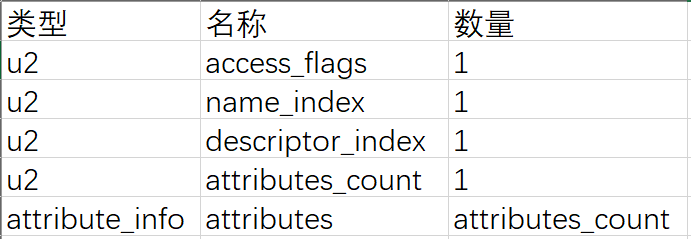
</p>

其中，**字段访问标志(access_flags)** 与类中的 access_flags 类似：
<p align = "left">
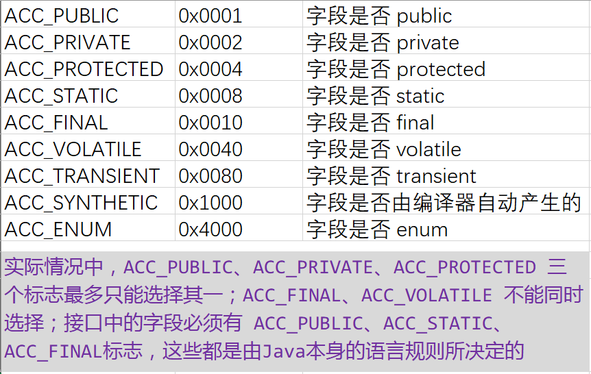
</p>

跟随在 access_flags 的是两项索引值：**name_index 和 descriptor_index**，它们是对常量池的引用，分别代表着字段的简单名称、字段和方法的描述符。

```java
package io.neil.hust;
public class HelloWorld {
    private String str = "Hello, World";
    public void sayHello(String str) {
        System.out.println(str);
    }
}
```

* 全限定名：“io/neil/hust/HelloWorld”是"HelloWorld"类的全限定名(仅仅是把类全名“io.neil.hust.HelloWorld”的“.”换成了“/”)；
* 简单名称：没有类型和参数修饰的方法或字段名称：sayHello()方法和 str 字段的简单名分别为“sayHello”和“str”；
* 字段和方法的描述符：描述字段的数据类型、方法的参数列表(数量、类型、顺序)和返回值。其标识字符含义如下：
<p align = "left">
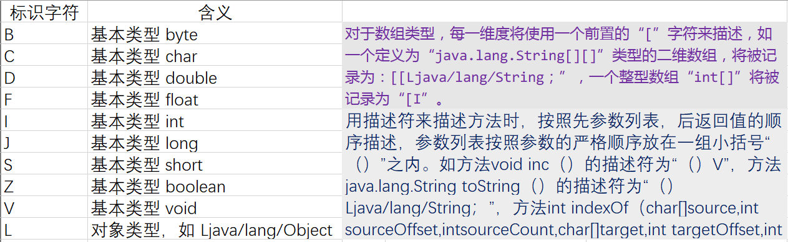
</p>

字段表都包含的固定数据项目到descriptor_index为止，之后跟随一个 **属性表(attribute_info)集合** 用于存储一些额外的信息，字段都可以在属性表中描述零至多项的额外信息。

字段表集合中不会列出从超类或者父接口中继承而来的字段，但有可能列出原本Java代码之中不存在的字段，譬如在内部类中为了保持对外部类的访问性，会自动添加指向外部类实例的字段。另外，在Java语言中字段是无法重载的，两个字段的数据类型、修饰符不管是否相同，都必须使用不一样的名称，但是对于字节码来讲，如果两个字段的描述符不一致，那字段重名就是合法的。

## 方法表(method_info)集合
class 文件格式对方法的描述和对字段的描述几乎完全一致，仅在访问标志和属性表集合的可选项中有所区别。
**方法表访问标志**
<p align = "left">
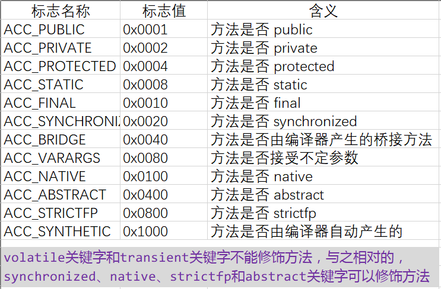
</p>

## 属性表(attribute_info)集合
class 文件、字段表、方法表都可以携带自己的属性表集合，用以描述某些场景专有的信息。
与 class 文件中其他数据项要求严格的顺序、长度和内容不同，属性表集合的限制稍微宽松：不要求各个属性表之间遵循严格顺序，只要不和已有属性名重复，任何自定义编译器都可以自定义属性信息。而 JVM 运行时会忽略它不认识的属性。为了能正确解析 class 文件，jvms 7 预定义了 21 项属性(目前的 jvms 10 为 26 项)，这里以 jvms 10 为例。
<p align = "left">
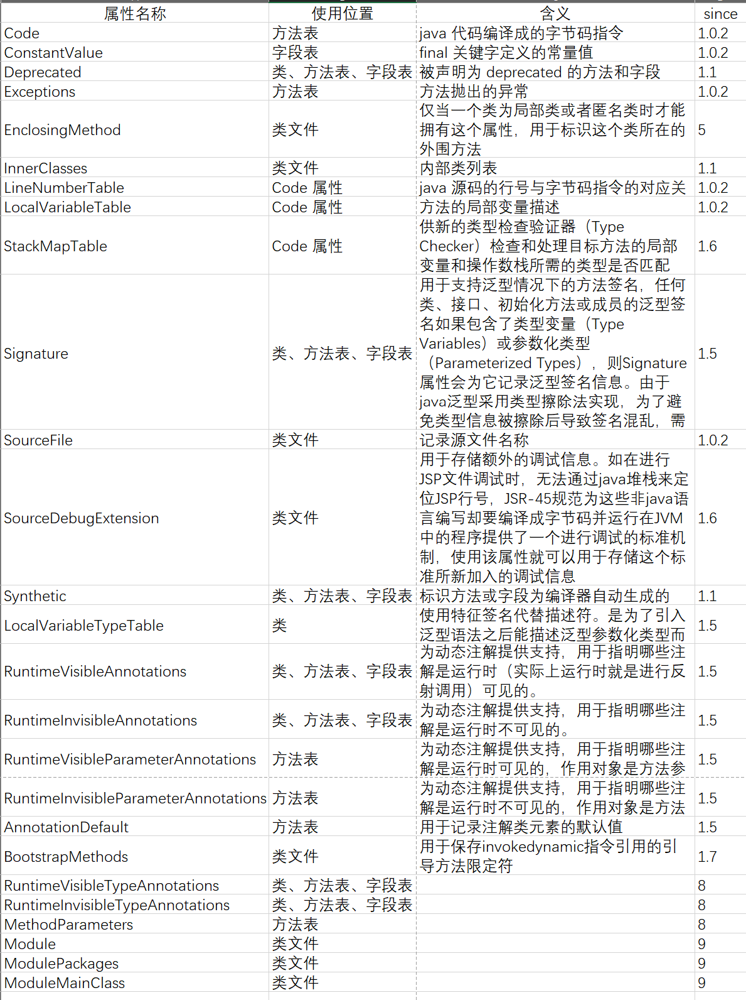
</p>

对每个属性，它的名称需要从常量池中引用一个 CONSTANT_UTF8_info 类型的常量来表示，而属性值的结构则完全是自定义的，只需要通过一个 u4 的长度属性说明所占用的位数即可：
<p align = "left">
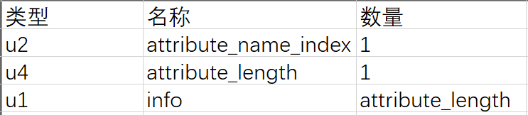
</p>

## 对象头
64位：
<p align = "left">

</p>

32位：
<p align = "left">

</p>