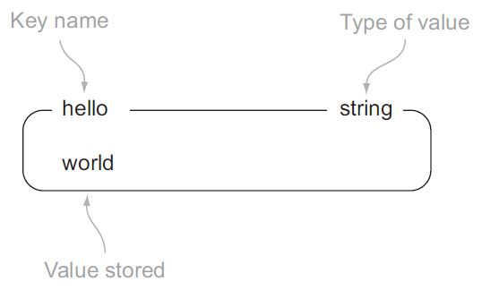
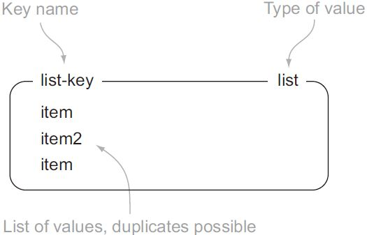
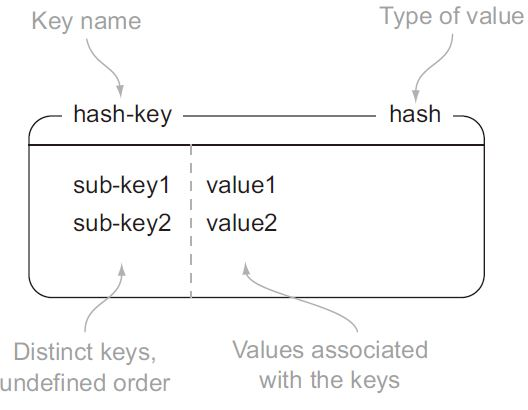
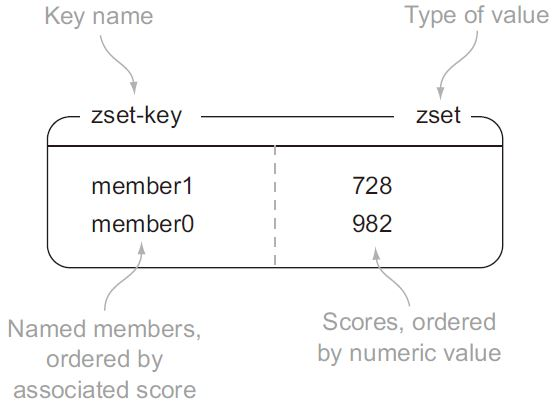

# X
## 雪崩
大量缓存突然失效或消失，导致所有请求都直接打到DB：同时过期、系统重启、redis服务宕机等场景，甚至热点key消失，也可能导致大量请求直接落到DB，造成局部雪崩。
* 过期策略改进：随机过期时间，避免同时失效；
* 热点数据不过期；
* 请求限流；

## 穿透
用户不断发起请求在缓存和DB都没有的数据。
* 接口层校验
* key-null缓存起来，防止攻击；

## 击穿
缓存中没有但DB有的数据，一般是缓存时间到期。如果并发用户特别多，缓存没读到数据，又同时去DB取数据，引起DB压力瞬间增大。
* 热点数据不过期；
* 接口限流与熔断，降级；
* 布隆过滤器；

## 热key
* 使用二级缓存
* 将热key分散到不同的服务器中，redis是根据key分配哈希槽，可以将key拼接上随机尾缀，生成的多个备份key散落在各个redis节点上，查询的时候也是随机拼接成这多个备份key中的一个；
* 热key拆分，比如秒杀活动场景，不同用户根据人群规则命中的活动策略ID可能是不同的；
* 将核心/非核心业务做Redis的隔离；

## 大key
某个key对应的value很大，占用的redis空间很大，本质上是大value问题。
可能造成内存增大、阻塞请求、阻塞网络、影响主从同步、主从切换等问题。
使用redis自带的命令可以识别，redis-cli加上--bigkeys参数。
* String类型的Key，值为5MB(数据过大)；
* List类型的Key，列表数量为20000个(列表数量过多)；
* ZSet类型的Key，成员数量为10000个(成员数量过多)；
* Hash格式的Key，成员数量虽然只有1000个但这些成员的value总大小为100MB(成员体积过大)；

解决：
* 拆分，拆分为多个key-value这样的小Key，并确保每个key的成员数量或者大小在合理范围内，然后再进行存储，通过get不同的key或者使用mget批量获取；
* 压缩value，注意序列化、反序列化都会带来一定的消耗；
* 清理，定期清理失效数据，自4.0起提供UNLINK命令，能够以非阻塞方式缓慢逐步清理传入的Key，可以安全删除大Key；


# redis
**re**mote **di**ctionary **s**erver, redis, 用作：**数据库、缓存和消息中间件**。采用 **单进程单线程** 方式运行。支持多种类型的数据结构，如字符串(Strings)，散列(Hash)，列表(List)，集合(Set)，有序集合(Sorted Set或者是ZSet)与范围查询。采用基于内存的、单进程单线程模型的 KV 数据库，由 C 语言编写。可以达到 10w+ QPS。
* 纯内存操作，绝大部分请求是纯粹的内存操作，非常快速。数据存在内存中，类似于 HashMap，HashMap 的优势就是查找和操作的时间复杂度都是O(1)；
* 数据结构简单，对数据操作也简单，Redis 中的数据结构是专门进行设计的；
* 采用单线程，避免了不必要的上下文切换和竞争条件，也不存在多进程或者多线程导致的切换而消耗 CPU，不用去考虑各种锁的问题，不存在加锁释放锁操作，没有因为可能出现死锁而导致的性能消耗；
* 使用多路 I/O 复用模型，非阻塞 IO；
* 底层模型，Redis 直接构建了专用的 VM 机制，因为一般的系统调用系统函数的话，会浪费一定的时间去移动和请求。

## 单线程
首先要明确，这里单线程是指，读写主线程。7.x版本已经全面支持了多线程，包括工作线程(主线程)这一个线程内，也维护着io多路复用(epoll)，可以并发的处理工作流程中的网络io部分，但键值读写部分，仍然是单线程。其他诸如持久化RDB、AOF、异步删除、集群数据同步等，其实是由额外线程执行。

## 淘汰策略
* no-envicition: 默认是策略，对写请求不再提供服务，直接返回错误；
* allkeys-random: 针对所有key，随机淘汰；
* allkeys-lru: 针对所有key，使用最近最少使用算法进行淘汰；
* allkeys-lfu: 针对所有key，使用最不经常使用算法进行淘汰；
* volatile-random: 针对设置了过期时间的key，随机淘汰；
* volatile-lru: 针对设置了过期时间的key，使用最近最少使用算法进行淘汰；
* volatile-lfu: 针对设置了过期时间的key，使用最不经常使用算法进行淘汰；
* volatile-ttl: 针对设置了过期时间的key，选取即将过期的key进行淘汰；

其中，LRU是基于采样的近似LRU，主要出于性能和内存占用等考虑；

## 一致性哈希
### 哈希环
它是一个0-2^32次方的圆，主要操作步骤：将每一个服务节点进行hash(如ip)，让其落在这个闭合的圆环上；当我们进行数据存储或访问时，计算key的hash值，让其也落在这个闭合圆环之中；那么它顺时针找到的第一个服务节点就是处理key的节点。增删节点伴随数据的重分配。有循环崩溃现象和数据倾斜现象，虚拟节点可一定程度解决这些问题。

### 哈希槽
redis 使用数据分片的hash槽来应对数据存储和读取。redis集群共有2^14次方16384个hash槽，当操作数据时，使用CRC16算法计算key的hash值，然后与16384取模从而确定该数据是属于哪一个slot槽。集群中，每个服务节点都被分配一些hash槽，只要确定了数据属于哪一个槽，就可以确定该数据是在哪一个节点之上。

## 持久化
redis提供不同的持久化选项：
### RDB
将内存中的数据集快照写入磁盘。
* 手动触发：
  * save命令：阻塞Redis服务器，直到RDB过程完成为止，对于内存比较大的实例会造成长时间阻塞，线上环境不建议使用；
  * bgsave命令：Redis进程执行fork操作创建子进程，RDB持久化过程由子进程负责，完成后自动结束。阻塞只发生在fork阶段，一般时间很短；
* 自动触发。触发的也都是bgsave命令，场景包括：
  * redis.conf中配置save m n，即在m秒内有n次修改时，自动触发bgsave生成rdb文件；
  * 主从复制时，从节点要从主节点进行全量复制时也会触发bgsave操作，生成当时的快照发送到从节点；
  * 执行debug/reload命令重新加载redis时也会触发bgsave操作；
  * 默认情况下执行shutdown命令时，如果没有开启aof持久化，也会触发bgsave操作；

**优点**
RDB文件是某个时间节点的快照，默认使用LZF算法进行压缩，压缩后的文件体积远远小于内存大小，适用于备份、全量复制等场景；
Redis加载RDB文件恢复数据远远快于AOF方式；

**缺点**
RDB方式实时性不够，无法做到细粒度的持久化；
每次调用bgsave都需要fork子进程，fork子进程属于重量级操作，频繁执行成本较高；
RDB文件是二进制的，没有可读性，AOF文件在了解其结构的情况下可以手动修改或者补全；
存在一些版本兼容RDB文件问题；


> *📝* 大多数数据库采用的是写前日志(WAL)，例如MySQL，通过写前日志和两阶段提交，实现数据和逻辑的一致性。Redis是“写后”日志，先执行命令，把数据写入内存，然后才记录日志。日志里记录的是Redis收到的每一条命令，这些命令是以文本形式保存。

### AOF
(append only file): 将server接收到的每个操作日志以追加的方式写入文件。步骤分为：
1. 命令追加(append)： AOF持久化功能打开，服务器在执行完一个写命令之后，会以协议格式将被执行的写命令追加到服务器的 aof_buf 缓冲区；
2. 文件写入(write)和文件同步(sync)：将 aof_buf 缓冲区的内容写入AOF文件中，提供三种配置策略:

| 配置项 | 写回时机 | 优点 | 缺点 |
| :-----: | :----: | :---- | :---- |
| always | 同步写回 | 可靠性高，数据基本不会丢失 | 每个写命令都要落盘，性能影响大 |
| everysec | 同步写回 | 性能适中 | 宕机丢失最多1s的数据 |
| no | 操作系统控制写回 | 性能好 | 宕机丢失的数据较多 |

**AOF重写**
为解决AOF文件体积随时间膨胀的问题，Redis提供AOF文件重写机制来对AOF文件进行“瘦身”。Redis通过创建一个新的AOF文件来替换现有的AOF，新旧两个AOF文件保存的数据相同，但新AOF文件没有冗余命令。

### RDB混合AOF
since 4.0。简单来说，RDB以一定频率执行，在两次快照之间，使用 AOF 日志记录期间所有命令操作。这样一来，快照不用很频繁地执行，从而避免频繁 fork 对主线程的影响。而且，AOF 日志也只用记录两次快照间的操作，也就是说，不需要记录所有操作，因此，就不会出现文件过大的情况，也可以避免重写开销。


## 数据结构
### string
类似于其他编程语言中字符串的概念。
redis 中的 string 类型是二进制安全的，i.e. 可以包含任何数据，比如一张 .jpg 格式的图片。一个键最大存储量为 512 MB。
<p align = "left">

</p>

### list
按照插入顺序有序存储多个字符串，相同元素可重复，双向操作(LPHSH、LPOP、RPUSH、RPOP)。
每个 list 最多存储元素数量：2^32 - 1。
<p align = "left">

</p>

### set
集合和列表都可以存储多个字符串，不同之处在于：列表可以存储多个相同的字符串，集合通过 **散列表来保证存储的每个字符串都是不相同的**。
redis 的集合使用无序(unordered)方式存储元素，不支持像列表一样将元素从某一端 push/pop 的操作，相应地，使用 SADD/SREM 添加/移除元素。由于是通过哈希表实现的，所以添加/移除/查找的时间复杂度为 O(1)。
每个 set 最多存储元素数量：2^32 - 1。


### hash
可以存储多个键值对之间的映射。**官方推荐：尽可能使用hash存储数据。**
每个 hash 最多存储键值对数量：2^32 - 1。
<p align = "left">

</p>

### zset
有序集合(zset)和散列一样，都用于存储键值对，不支持重复元素。不同之处在于：有序集合的键被称为成员(member)，每个成员都是各不相同的；值被称为分值(score)，必须为浮点数(分值可重复)。zset 既可以根据成员访问元素(和散列一样)，又可以根据分值以及分值的排列顺序来访问元素的结构。
每个 zset 最多存储键值对数量：2^32 - 1。
<p align = "left">

</p>

### Stream
类似kafka的一种消息队列。支持发布订阅 (pub/sub)。有以下特性：
* 持久化；
* 消费者组；
* 阻塞读取；
* 历史数据查询；

### Probabilistic 概率
* [HyperLogLogs](https://www.cnblogs.com/tera/p/15840118.html)
用来做基数统计的算法，优点是，在输入元素的数量或者体积非常大时，计算基数所需的空间总是固定的，只需要花费12 KB内存，就可以计算接近2^64个不同元素的基数。只会根据输入元素来计算基数，而不会储存输入元素本身。
* Bloom filter
* Top-K

### BitMaps/Bitfields
位图不是特殊的数据结构，内容实际就是普通的字符串，也就是byte数组。可以使用普通的get/set直接获取和设置整个位图的内容，也可以使用位图操作getbit/setbit等将byte数组看成位数组来处理。位数组是自动扩展的。
可以用于 用户访问统计 在线用户统计 用户一段时间内签到次数等场景。

### Geospatial

# mq
## RocketMQ
### 生产端重试
RocketMQ 在客户端SDK中内置请求重试逻辑，尝试通过重试发送达到最终调用成功的效果。生产者在初始化时设置消息发送最大重试次数，生产者客户端会按照设置的重试次数一直重试发送消息，直到消息发送成功或达到最大重试次数重试结束，并在最后一次重试失败后返回调用错误响应。分为：
* 同步发送：调用线程会一直阻塞，直到某次重试成功或最终重试失败，抛出错误码和异常。
* 异步发送：调用线程不会阻塞，但调用结果会通过异常事件或者成功事件返回。

注意，重试可能导致消息重复或消息丢失问题。

### 定时消息
基于TimerWheel、TimerLog的时间轮算法。

### 消费端重试
把需要重试的消息放入一个延时队列中，用类似定时消息的方式触发。消费者在消费某条消息失败后，服务端会根据重试策略重新消费该消息，超过一定次数后若还未消费成功，则该消息将不再继续重试，直接被发送到死信队列中。

## kafka
### ack机制
ack机制核心就是副本同步策略。
**request.required.acks=1**
默认值，producer在ISR中的leader已成功收到的数据并得到确认。如果leader宕机，则会丢失数据。

**request.required.acks=0**
producer无需等待来自broker的确认就可以继续发送下一批消息，数据传输效率最高，但是数据可靠性确最低。此时retries参数失效，客户端无法判断是否失败，也就无法做重试。(至多一次语义)

**request.required.acks=-1/all**
producer需要等待ISR中的所有follower都确认接收到数据后才算一次发送完成，可靠性最高。是这样也不能保证数据不丢失，比如当ISR中只有leader时，这样就变成了acks=1的情况。

### 有序性
由于Kafka的一个Topic可以分为了多个Partition，Producer发送消息的时候，是分散在不同 Partition的。当Producer按顺序发消息给Broker，但进入Kafka之后，这些消息就不一定进到哪个Partition，会导致顺序是乱的。
**全局有序**
1个Topic只能对应1个Partition。

**局部有序**
需要在发消息的时候指定Partition Key，Kafka对其进行Hash计算，根据计算结果决定放入哪个Partition。这样Partition Key相同的消息会放在同一个Partition。此时，Partition的数量仍然可以设置多个，提升Topic的整体吞吐量。

**消息重试与有序性问题**
对于一个有着先后顺序的消息A、B，正常情况下应该是A先发送完成后再发送B，但是在异常情况下，在A发送失败的情况下，B发送成功，而A由于重试机制在B发送完成之后重试发送成功了。这时对于本身顺序为AB的消息顺序变成了BA。
针对这种问题，严格的顺序消费还需要max.in.flight.requests.per.connection参数的支持。该参数指定了生产者在收到服务器响应之前可以发送多少个消息。它的值越高，就会占用越多的内存，同时也会提升吞吐量。把它设为1就可以保证消息是按照发送的顺序写入服务器的。该参数在某些场景会严重降低吞吐量。

### 恰好一次语义
kafka对生产者和消费者之间提供的语义保证：
Exactly once—this is what people actually want, each message is delivered once and only once.
At most once—Messages may be lost but are never redelivered.
At least once—Messages are never lost but may be redelivered.

**生产端的恰好一次**
1. 幂等消息：保证producer在一次会话内写入一个partition内的消息具有幂等性，可以通过重试来确保消息发布的Exactly Once语义。producer每次启动后，首先向broker申请一个全局唯一的pid，用来标识本次会话，持久化在broker。同时生产者用sequence number字段标识消息批次，每生成一批待发送消息，值就+1。broker在内存维护(pid,seq)映射，收到消息后检查seq：
```new_seq=old_seq+1: 正常消息；new_seq<=old_seq: 重复消息；new_seq>old_seq+1: 消息丢失；```
在生产端配置”enable.idempotence=true”开启幂等功能，配合acks=-1配置。
注意：当producer重启后，broker分配的PID会发生变化。

2. 事务消息：使用类似事务的语义将消息发送到多个主题分区的能力：即 要么所有消息均已成功写入，要么均未成功写入。可以配置参数isolation.level=read_committed，表示事务提交后可获取，另外一个可选值是read_uncommitted，表示不等待事务提交，正常通过offset order读取。

**消费端的恰好一次**
kafka目前没有保证consumer幂等消费的措施，如果确实需要保证consumer的幂等，可以
* 对每条消息维持一个全局的id，每次消费进行加锁去重；
* 利用offset偏移量的值进行幂等校验；
* 引入事务机制，比如两阶段提交；


# rpc
