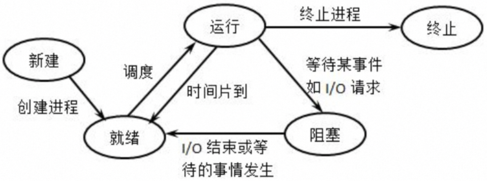

# X
## 为什么产生死锁？
死锁发生于多道程序设计环境中，若干进程需要共享一些资源，而一个进程所需要的资源可能有多种类型，如打印机、内存块等，因此就有可能出现多个进程对相同资源的竞争和等待，不合理的推进顺序会导致这种竞争和等待会无限循环地僵持下去，形成环路，这种状态就是进程死锁。
死锁产生的条件：
1. 互斥条件：一个资源每次只能被一个进程使用；
2. 占有并等待：一个进程因请求资源而阻塞时，对已获得的资源保持不放；
3. 不可抢占：进程已获得的资源，在末使用完之前，不能强行剥夺；
4. 循环等待：若干进程之间形成一种头尾相接的循环等待资源关系。

## 如何检测死锁
死锁一旦出现，业务是可感知的，因为无法继续提供服务，这时候通过将线程信息dump出(通过jstack 或 vmvisual等工具)，可以查看哪个线程出现了类似“Blocked”信息，即有可能该线程出现了死锁。

## 避免死锁的常用方法
* 避免一个线程同时获得多个锁；
* 避免一个线程在锁内同时占用多个资源，尽量保证每个锁只占用一个资源；
* 尝试使用定时锁，使用 lock.tryLock(timeout)来代替使用内部锁机制；
* 对于数据库锁，加锁和解锁必须在同一个数据库连接里，否则会出现解锁失败的情况。


# IO
[BIO NIO AIO](https://www.cnblogs.com/twoheads/p/10712094.html)
**BIO 同步阻塞**
服务端 accept 一个请求后，在 recv 或 send 调用时阻塞。

**NIO 同步非阻塞**
服务端 accept 一个请求后，加入 fds 集合，每次轮询一遍 fds 集合 recv (非阻塞)数据，没有数据则立即返回错误。

## IO多路复用
同步IO模型

### select
接受3个文件描述符数组，分别监听读取(readfds)，写入(writefds)和异常(expectfds)事件。
```int select(int nfds, fd_set *readfds, fd_set *writefds, fd_set *exceptfds, struct timeval *timeout);```
调用select后，程序会Block住，直到一个事件发生，或者等到最大1秒钟(tv定义了这个时间长度)就返回。之后，需要遍历所有注册的fd，挨个检查哪个fd有事件到达(FD_ISSET返回true)。如果是，就说明数据已经到达，可以读取fd。读取后就可以进行数据的处理。

问题：
* 能够支持的最大的fd数组的长度是1024，这对要处理高并发的web服务器是不可接受的；
* fd数组按照监听的事件分为了3个数组，为了这3个数组要分配3段内存去构造，而且每次调用select前都要重设；调用select后，这3数组要从用户态复制一份到内核态；事件到达后，要遍历这3数组；
* 返回后要挨个遍历fd，找到被“SET”的那些进行处理，比较低效；
* 是无状态的，即每次调用select，内核都要重新检查所有被注册的fd的状态。select返回后，这些状态就被返回了，内核不会记住它们；到了下一次调用，内核依然要重新检查一遍。查询的效率很低。

### poll
与select类似：
```int poll(struct pollfd *fds, nfds_t nfds, int timeout);```
本质上都是轮询。poll优化了select的一些问题。比如不再有3个数组，而是1个polldfd结构的数组，并且也不需要每次重设。数组的个数也没有了1024的限制。但其他的问题依旧：
* 依然是无状态的，性能的问题与select差不多一样；
* 仍然无法很方便的拿到那些“有事件发生的fd“，还是需要遍历所有注册的fd。

目前来看，高性能的web服务器都不会使用select和poll。它们存在的意义仅仅是“兼容性”，因为很多操作系统都实现了这两个系统调用。

### epoll
Linux下的IO多路复用的实现。
与select和poll不同，要使用epoll需要先创建：
```int epfd = epoll_create(10);```
在内核层创建了一个数据表，记录要注册的fd，返回一个“epoll的文件描述符”指向这个表。参数是一个表达要监听事件列表的长度的数值，内部随后会根据事件注册和事件注销动态调整这个值。

其次是注册要监听的事件：
```int epoll_ctl(int epfd, int op, int fd, struct epoll_event *event);```
通过epoll_ctl就可以灵活的注册/取消注册/修改注册某个fd的某些事件。

第三步是使用epoll_wait等待事件的发生。
```int epoll_wait(int epfd, struct epoll_event *evlist, int maxevents, int timeout);```
这一步是"block"的。只有当注册的事件至少有一个发生，或者timeout达到时，该调用才会返回。这与select和poll几乎一致。但不一样的地方是evlist，它是epoll_wait的返回数组，里面只包含那些被触发的事件对应的fd，而不是像select和poll那样返回所有注册的fd。

基于IO多路复用的代码都会遵循这样的写法：注册——监听事件——处理——再注册，循环。

### 水平触发 边沿触发
* 水平触发(LT)只关心文件描述符中是否还有没完成处理的数据，如果有，epoll_wait就会返回。代表一种“状态”
* 边沿触发(ET)只关心文件描述符是否有新的事件产生，如果有，则返回；如果返回过一次，不管程序是否已处理，只要没有新的事件产生，epoll_wait不会再认为这个fd被“触发”了。代表一个“事件”

边沿触发把如何处理数据的控制权完全交给了开发者，提供了巨大的灵活性。比如，读取一个http的请求，开发者可以决定只读取http中的headers数据就停下来，然后根据业务逻辑判断是否要继续读(比如需要调用另外一个服务来决定是否继续读)。而不是次次被socket尚有数据的状态烦扰；写入数据时也是如此。比如希望将一个资源A写入到socket。当socket的buffer充足时，epoll_wait会返回这个fd是准备好的。但是资源A此时不一定准备好。如果使用水平触发，每次经过epoll_wait也总会被打扰。在边沿触发下，开发者有机会更精细的定制这里的控制逻辑。


# 进程&线程&协程
线程(Thread)是操作系统进行运算调度的最小单位。

## 进程

### 状态
* 创建状态：创建进程时拥有PCB(进程控制块)但其它资源尚未就绪。
* 就绪状态：其它资源(进程控制块、内存、栈空间、堆空间等)都准备好、只差CPU的状态。
* 执行状态：进程获得CPU，其程序正在执行。
* 阻塞状态：进程因某种原因放弃CPU的状态，阻塞进程以队列的形式放置。
* 终止状态：进程结束由系统清理或者归还PCB的状态。
<p align = "left">

</p>

### kill
* 9 (SIGKILL): 立即结束进程，不能被捕获或忽略；
* 15 (SIGTERM): 正常结束进程，可以被捕获或忽略；
* 2 (SIGINT): 通常是Ctrl+C产生的信号，可以被进程捕获或忽略；
* 19 (SIGSTOP): 暂停进程，不能被捕获、忽略或结束；
* 18 (SIGCONT): 继续执行被暂停的进程，与18相反；

## 进程vs线程
* 一个进程可以有一个或并发多个线程，每个线程执行不同的任务。
* 进程的线程共享进程资源；
* 线程包含在进程之中，是进程中实际运行工作的单位；

## 协程
微线程，虚拟线程，纤程。不需要进行系统内核上下文切换，用户态即可完成协程切换，可以认为是用户态线程。


# 零拷贝
https://xiaolincoding.com/os/8_network_system/zero_copy.html#传统的文件传输有多糟糕