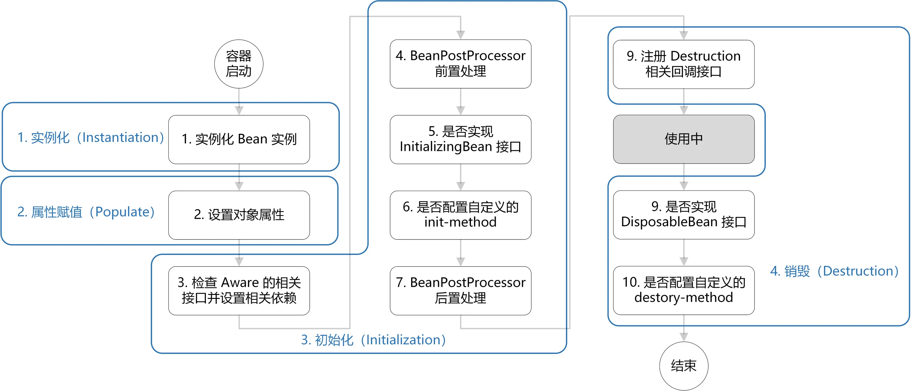
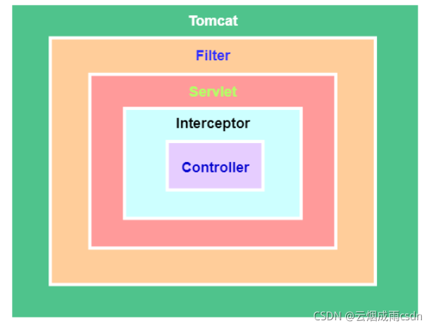
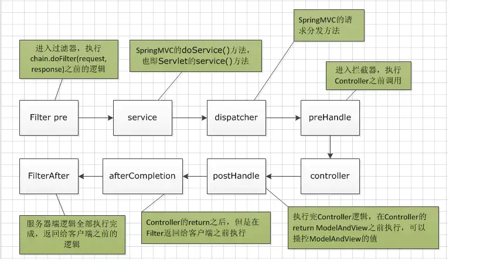
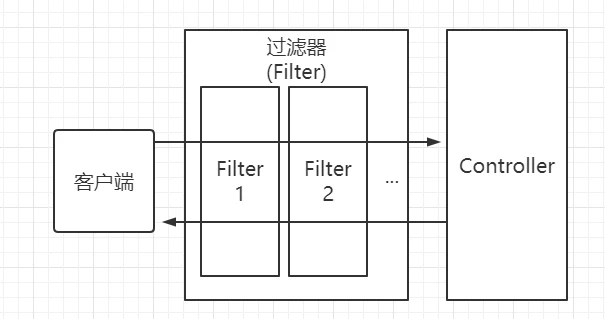

# X
## 所谓三级缓存
本质上是为了解决“循环依赖”问题。
能解决的情况：
* field属性注入(@Autowired/setter方法注入)循环依赖

不能解决的情况：
* 构造器注入循环依赖
* prototype field属性注入循环依赖

其实就是三个map：
```java
// 用于存放完全初始化好的 bean，从该缓存中取出的 bean 可以直接使用
private final Map<String, Object> singletonObjects = new ConcurrentHashMap<>(256);
// 提前曝光的单例对象的cache，存放原始的 bean 对象(尚未填充属性)，用于解决循环依赖
private final Map<String, Object> earlySingletonObjects = new HashMap<>(16);
// 单例对象工厂的cache，存放 bean 工厂对象，用于解决循环依赖
private final Map<String, ObjectFactory<?>> singletonFactories = new HashMap<>(16);
```

1. 先从一级缓存singletonObjects中去获取，如果获取到就直接return；
2. 如果获取不到或者对象正在创建中(isSingletonCurrentlyInCreation())，那就再从二级缓存earlySingletonObjects中获取，如果获取到就直接return；
3. 如果还是获取不到，且允许singletonFactories(allowEarlyReference=true)通过getObject()获取。就从三级缓存singletonFactory.getObject()获取。此时如果获取到了就从singletonFactories中移除，并且放进earlySingletonObjects——也就是从三级缓存移动到了二级缓存。

加入singletonFactories三级缓存的前提是执行了构造器，所以构造器的循环依赖没法解决。

从2.6.x版本，spring.main.allow-circular-references 配置项默认改为了false，似乎终于意识到，循环依赖本身才是问题，要解决的是循环依赖本身，而非通过hack的方式掩盖这个问题。


# 核心模块
包括Bean、Context、Core。
<p align = "left">

</p>

## bean
spring的核心思想常常被称作BOP(Bean Oriented Programming)，面向Bean编程。Bean模块解决以下问题：
1. bean的定义；
2. bean的创建；
3. bean的解析；

作为业务开发通常只需要关心bean的创建，其他两个过程由spring内部完成。
Bean的整体架构是典型的工厂模式，最上层的接口是BeanFactory。子类包括ListableBeanFactory、HierarchicalBeanFactory和AutowireCapableBean等。

### 作用域
[Spring定义了多种作用域](https://docs.spring.io/spring-framework/reference/core/beans/factory-scopes.html)：
* singleton(单例)  在整个应用中，只创建bean的一个实例，默认值。
* prototype(原型)  每次注入或者通过Spring应用上下文获取的时候，都会创建一个新的bean实例。
* request(请求)  在web应用中，为每个请求创建一个bean实例。
* session(会话)  在web应用中，为每个会话创建一个bean实例。
* application(全局)  在web应用中，在一个 http servlet Context 中，定义一个 Bean 实例。
* websocket(HTTP WebSocket)  在web应用中，在一个 HTTP WebSocket 的生命周期中，定义一个 Bean 实例。

### 实例化
创建Bean对象的过程，在Spring容器中，当Bean需要被使用时，会通过Bean的定义信息创建Bean对象，这个过程也叫做Bean的实例化。

### 初始化
在Bean对象被创建之后，Spring容器会执行一些额外的操作来准备Bean对象，使其可以被使用。这个过程也叫做Bean的生命周期。

### 生命周期
[概要流程](https://juejin.cn/post/6844904065457979405)
1. 实例化(Instantiation)  实例化一个bean对象；
2. 属性赋值(Populate)  为bean设置相关属性和依赖；
3. 初始化(Initialization)  步骤较多，第 3、4 步为在初始化前执行，其中第 5、6 步为初始化操作，第 7 步在初始化后执行，该阶段结束，才能被用户使用；
4. 销毁(Destruction)  第8步在使用前注册销毁的相关调用接口，为后面第9、10步真正销毁 bean 时执行相应的方法。
<p align = "left">

</p>

## context
Bean包装的是一个个Object，Object中存储着业务所需的数据。如何给这些数据以及它们之间的关系提供生存、运行环境——即保存对象的状态，就是Context要解决的问题。Context就是bean关系的集合，即IoC容器。
ApplicationContext是Context最上层的接口，能够标识一个应用环境的基本信息，继承了5个接口，用于拓展Context的功能，其中BeanFactory用于创建Bean，同时继承了ResourceLoader接口，用于访问任何外部资源。
子类主要包括：
* ConfigurableApplicationContext: 可动态配置和修改信息的Context，其下AbstractRefreshableApplicationContext最为常用。
* WebApplicationContext: 为Web应用准备的Context，可以直接访问ServletContext。

作为Ioc容器，Context是Spring其他大部分功能的基础，ApplicationContext必须完成的功能包括：
* 标识一个应用环境；
* 利用BeanFactory创建Bean对象；
* 保存对象关系表；
* 捕获各种事件。


## core
Spring发现、建立和维护Bean之间关系的一系列工具，实际上就是各种util。
Resource：core最重要的组成部分，定义资源的访问方式，所有资源都抽象到了Resource接口中，主要作用：
* 资源包装。Resource向上继承了InputStreamSource接口，所有的资源都通过InputStream来获取，从而屏蔽资源提供者；
* 资源加载。Resource下的ResourceLoader接口，所有资源加载者统一实现该接口就能加载所有的资源，例如之前的ApplicationContext。
* 与Context建立关系：ApplicationContext通过ResourcePatternResolver接口与ResourceLoader进行交互，来进行资源的加载、解析和描述。ResourcePatternResolver将资源封装整合，便于其他模块使用。


# IoC
## 容器结构
IoC容器用于创建并管理Spring Bean对象以及Bean属性注入。通过ResourceLoader/Resolver读取Bean的配置文件并转换成统一资源对象(Resource)，然后通过BeanDefinitionReader转换成pring内部对Bean的描述对象(BeanDefinition)，然后将其注册(BeanRegister)到容器中(BeanFactory)，供以后转换成Bean对象使用。spring项目源代码很好地把它们划分到了不同的模块中。而从资源读取、描述对象转换、注册使用这些阶段，从源码中可以抽出以下6个组件：
* 资源组件：Resource，对资源文件的描述，不同资源文件如xml、properties文件等，格式不同，最终都将被ResourceLoader加载获得相应的Resource对象；
* 资源加载组件：ResourceLoader/Resolver：加载xml、properties等各类格式文件，解析文件，并生成Resource对象；
* Bean容器组件：BeanFactory体系，IoC容器的核心。这里装着Bean对象以及所需的各种数据。其中BeanFactory是纯粹的Bean容器，用来存储描述Bean，无关其他环境，而像ApplicationContext，也是Bean容器，但它和应用环境息息相关，所以被称为应用上下文(环境)更恰当，从继承关系可见，ApplicationContext不仅有着BeanFactory“血统”，同时也继承了EnvironmentCapable、MessageSource、ApplicationEventPublisher，即扩展了其许多额外功能，而其实现类则是和具体应用类型相关；
* Bean描述组件：BeanDefinition体系，Spring内部对Bean描述的基本数据结构；
* Bean注册组件：SingletonBeanRegister/AliasRegister，将BeanDefinition对象注册到BeanFactory(BeanDefinition Map)中去；
* Bean构造组件：BeanDefinitionReader体系，读取Resource并将其数据转换成一个个BeanDefinition对象。就是将统一资源数据对象读取转换成相应内部对象。

## BeanFactory vs FactoryBean
首先，它们都是spring framework里比较顶层的接口：BeanFactory可以看做最简版的容器形式，也给具体的IOC容器实现提供规范，比如ApplicationContext；FactoryBean为IOC容器中的Bean创建提供更加灵活的方式，通过给Bean的实现加上一个简单的工厂模式和装饰器模式，使得对Bean的配置更加便捷灵活。
从另一个角度讲，两者都是工厂，FactoryBean本身也是一个Factory，并且归BeanFactory管理。

# SpringBoot
Spring框架提供了IOC容器、依赖注入以及一些模块，简化大量的代码，节省了开发时间，提高了效率。Spring Boot是一个微服务框架，延续了Spring框架的核心思想IOC和AOP，集成了很多常用依赖，比如只需要spring-boot-starter-web这一个依赖就可以完成一个简单的Web应用，简化了很多配置化的东西，并内嵌Tomcat容器，极大提效应用的开发和部署。

## 启动过程
1. 启动main方法，会new一个SpringApplication对象，进入run方法；
2. 初始化配置。通过类加载器，读取classpath下所有spring.factories配置文件，创建一些初始配置对象；通知监听者应用程序启动开始，创建环境对象environment，用于读取环境配置 如 application.yml；
3. 创建应用程序上下文。创建beanFactory对象；
4. 刷新上下文(核心步骤)
    1. 配置工厂对象，包括上下文类加载器，对象发布处理器，beanFactoryPostProcessor；
    2. 注册并实例化bean工厂发布处理器，并且调用这些处理器，对包扫描解析(主要是class文件)；
    3. 注册并实例化bean发布处理器beanPostProcessor；
    4. 初始化一些与上下文有关系的bean对象(创建tomcat服务器)；
    5. 实例化所有bean工厂缓存的bean对象(剩下的)；
    6. 发布通知-通知上下文刷新完成(启动tomcat服务器)；
5. 通知监听者-启动程序完成


## 核心注解@SpringBootApplication
组合注解，包括三个注解：
* @EnableAutoConfiguration  根据应用所声明的依赖来对Spring框架进行自动配置；
* @SpringBootConfiguration(内部为@Configuration)  在spring的XML配置文件中(applicationContext.xml)，装配所有bean事务，提供一个spring上下文环境；
* @ComponentScan  组件扫描，自动扫描和装配Bean，扫描SpringApplication run方法中的启动类所在包路径下的文件，寻找带有@Component注解的类，创建bean。

## 请求处理过程
以典型的web应用为例：
1. Tomcat线程接受到请求，filterChain.doFilter()之前的执行(过滤器在Server容器中)；
2. interceptorChain.preHandle()执行；
3. 路径映射、参数绑定(解析、转换、校验)；
4. Controller的具体方法执行；
5. 返回值处理(含信息转换)；
6. interceptorChain.postHandle()执行；
7. 异常解析器处理异常(@ControllerAdvice、自定义异常解析器都在这里执行)；
8. 视图解析渲染；
9. interceptorChain.afterCompletion()执行；
10. filterChain.doFilter()之后的执行；
<p align = "left">

</p>


# 过滤器和拦截器
这张图解释了典型spring应用常用组件及触发顺序：
<p align = "left">

</p>

过滤器在请求进入容器之后、进入servlet之前就被触发，此时还没有进入spring的管辖范围。拦截器是spring提供并管理的，所以它能获取IoC容器信息，比如拿到容器里的bean。

这张图解释了常用组件具体方法的执行顺序：
<p align = "left">

</p>

## filter
Filter是JavaEE中Servlet规范的一个组件，它可以在http请求到达Servlet之前，被N个Filter处理：
<p align = "left">

</p>
过滤器的实现是基于函数回调。

### 应用场景
* 过滤敏感词汇(防止sql注入)
* 设置字符编码
* URL级别的权限访问控制
* 压缩响应信息

## interceptor
用于拦截Controller方法的执行，可以在方法执行、后添加自定义逻辑，类似于AOP编程思想。其实现是基于反射机制——动态代理。

### 应用场景
拦截器本质上是面向切面编程(AOP)，符合横切关注点的功能都可以放在拦截器中来实现，主要的应用场景包括：
* 登录验证，判断用户是否登录。
* 权限验证，判断用户是否有权限访问资源，如校验token
* 日志记录，记录请求操作日志(用户ip，访问时间等)，以便统计请求访问量。
* 处理cookie、本地化、国际化、主题等。
* 性能监控，监控请求处理时长等。
* 通用行为：读取cookie得到用户信息并将用户对象放入请求，从而方便后续流程使用，还有如提取Locale、Theme信息等，只要是多个处理器都需要的即可使用拦截器实现


# AOP
AOP是一种编程思想。  
日志、安全、事务管理、缓存等，在软件系统中都是非常重要的功能，但它们与软件本身所关注的“功能”即业务逻辑，从概念上讲(应该)是分离的，然而它们散布嵌入在业务逻辑之中，需要在业务逻辑功能执行的过程中被动地触发。这些功能通常被称为横切关注点(cross-cutting concern)。把这些横切关注点与业务逻辑相分离就是面向切面编程(AOP，Aspect Oriented Programming)，实现横切关注点与它们所影响的对象之间的解耦。  
重用通用功能的方案一般为继承或委托，而切面是另一种实现该目标的方案。在使用面向切面编程时，仍然在一个地方定义通用功能，但是可以通过声明的方式定义这个功能要以合何种方式在何处应用，而无需修改受影响的类。横切关注点可以被模块化为特殊的类，这些类被称为切面(aspect)。有两个好处：
1. 每个关注点都集中在一个地方，而不是分散在多处代码中；
2. 服务模块更加简洁，因为它们都只包含主要关注点(核心功能)的代码，而次要关注的代码被转移到切面中。

## 相关术语
**增强 advice**
切面的工作被称为增强。  
增强定义了切面是什么以及何时使用(what and when)。除了描述切面要完成的工作，增强还解决了何时执行这个工作的问题：它应该应用在某个方法被调用之前、之后还是只在方法抛出异常时，等。  
Spring切面支持5种类型的增强：
1. 前置增强(Before)：在目标方法被调用之前调用增强功能；
2. 后置增强(After)：在目标方法完成之后调用增强，此时不会关心方法的输出是什么；
3. 环绕增强(Around)：在被增强方法调用前后都执行自定义的行为；
4. 返回增强(After-returning)：在目标方法成功执行之后调用增强；
5. 异常增强(After-throwing)：在目标方法抛出异常之后调用增强。

**连接点 join point**
应用增强的时机，被称为连接点。连接点是在应用执行过程中能够插入切面的一个点，这个点可以是调用方法时、抛出异常时、甚至修改一个字段时，切面代码可以利用这些点插入到应用的正常流程之中，并添加新的行为。

**切点 pointcut**
增强定义了切面的“what”和“when”，切点定义了切面的“where”，切点的定义会匹配增强所要织入的一个或多个连接点。通常使用明确的类和方法名，或利用正则表达式定义所匹配的类和方法名来指定这些切点。

**切面 aspect**
切面是增强和切点的结合。增强和切点共同定义了切面的全部内容——它是什么，在何时何处完成其功能。 

**引入 introduction**
引入允许向现有的类添加新方法或属性，从而在无需修改现有类的情况下，让这些类具有新的行为和状态。是一种特殊的增强。

**织入 weaving**
把切面应用到目标对象并创建新的代理对象的过程。切面在指定的连接点被织入到目标对象中，在目标对象的生命周期里有多个点可以进行织入：
* 编译期：切面在目标类编译时被织入。这种方式需要特殊的编译器。AspectJ的织入编译器就是以这种方式织入切面的。
* 类加载期：切面在目标类加载到JVM时被织入。这种方式需要特殊的类加载器，它可以在目标类被引入应用之前增强该目标类的字节码。AspectJ 5的加载时织入(load-time weaving，LTW)就支持以这种方式织入切面。
* 运行期：切面在应用运行的某个时刻被织入。一般，在织入切面时，AOP容器会为目标对象动态地创建一个代理对象。Spring AOP就是以这种方式织入切面的。

## Spring中的AOP
AOP框架在连接点模型上有强弱之分，比如有些允许在字段修饰符级别应用增强，有些只支持与方法调用相关的连接点。此外，框架织入切面的方式和时机也有所不同。但无论如何，**创建切点来定义切面所织入的连接点是AOP框架的基本功能。**

Spring提供4种类型的AOP支持：
* 基于代理的经典Spring AOP(现在来看笨重且复杂)；
* 纯POJO切面(需要xml配置)；
* @AspectJ注解驱动的切面(本质上依然是基于代理的AOP)；
* 注入式AspectJ切面(基本的方法调用级别切面满足不了需求时)。

前三种都是Spring AOP实现的变体。Spring AOP构建在**动态代理**基础之上，因此，Spring对AOP的支持局限于方法拦截。

### 运行时增强对象
通过在代理类中包裹切面，Spring在运行期把切面织入到Spring管理的bean中。代理类封装了目标类，拦截被增强方法的调用，再把调用转发给真正的目标bean。即代理类处理方法的调用，执行额外的切面逻辑，并调用目标方法。
<p align = "left">

</p>
Spring运行时才创建代理对象。

### 切点类型
Spring提供6种类型的切点：
* 静态方法切点：org.springframework.aop.support.StaticMethodMatcherPointcut是静态方法切点的抽象基类，默认情况下它可以匹配所有的类。包含两个主要的子类：NameMatchMethodPointcut & AbstractRegexpMethodPointcut，前者提供简单的字符串匹配方法签名，后者使用正则表达式匹配方法签名；
* 动态方法切点：org.springframework.aop.support.DynamicMethodMatcherPointcut是动态方法切点的抽象基类，默认情况下匹配所有的类；
* 注解切点：org.springframework.aop.support.annotation.AnnotationMatchingPointcut的实现类表示注解切点，支持在Bean中直接通过java5.0注解标签定义的切点；
* 表达式切点：org.springframework.aop.support.ExpressionPointcut接口主要是为了支持AspectJ切点表达式语法而定义的接口；
* 流程切点：org.springframework.aop.support.ControlFlowPointcut实现类表示控制流程切点。ControlFlowPointcut是一类特殊的切点，它根据程序执行堆栈的信息查看目标方法。